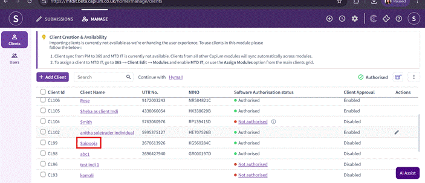
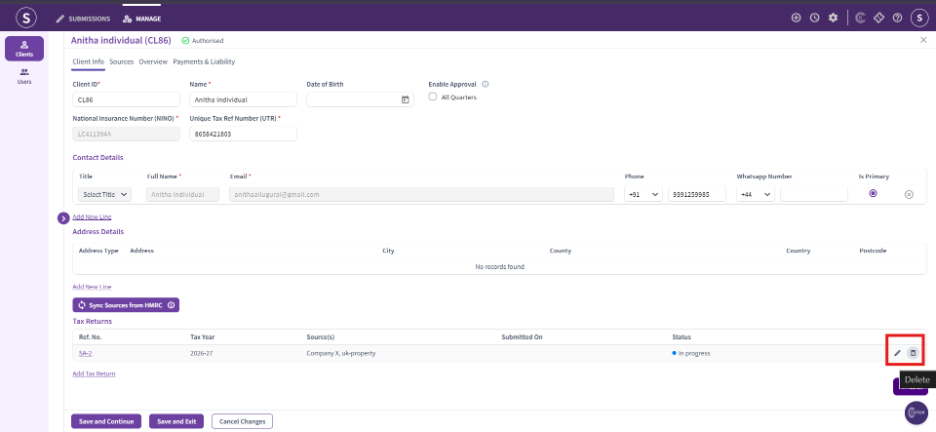
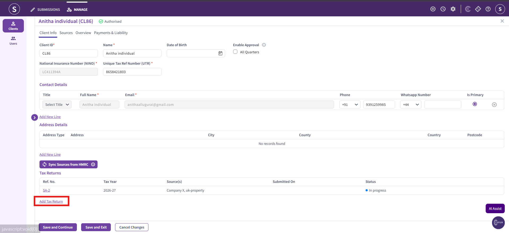
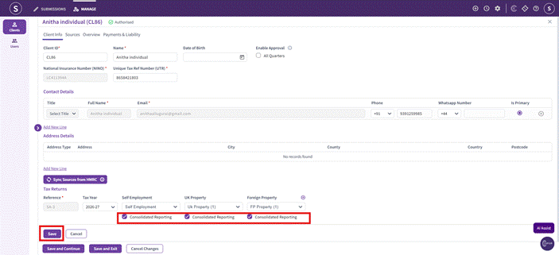
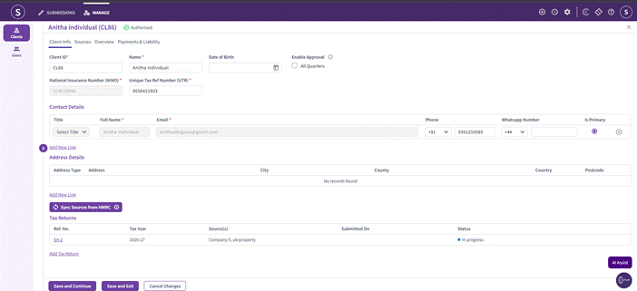

# How to Change Tax return from Detailed Report to Consolidated Report
	 	
			
			Print

- **Category:** MTD IT
- **Folder:** MTD IT
- **Source URL:** [https://capium.freshdesk.com/support/solutions/articles/9000277890-how-to-change-tax-return-from-detailed-report-to-consolidated-report](https://capium.freshdesk.com/support/solutions/articles/9000277890-how-to-change-tax-return-from-detailed-report-to-consolidated-report)
- **Article ID:** 9000277890

## Content

Solution home 
		MTD IT
		MTD IT

### How to Change Tax return from Detailed Report to Consolidated Report

			Print

	Modified on: Thu, 30 Jul, 2026 at 10:15 AM

### How to Change Tax return from Detailed Report to Consolidated Report

This article explains how to change a tax return from a Detailed Report to a Consolidated Report, or vice versa. As the system does not allow you to switch the report type on an existing return, this can only be done by deleting the current return and creating a new one with the correct type selected.

During the financial year, you should review your client’s expected turnover and make a reasonable estimate of whether they are likely to remain below the £90k threshold. Based on this assessment, you can set up the appropriate return type.

If your client’s circumstances change during the financial year. For example, if their turnover increases and they are expected to exceed the £90k threshold the return type can be updated by following the required process.

Step 1: Navigate to the MTD IT module and open the relevant client's record.

You will now see the existing tax return listed, with the option to delete it from the Actions column.

Please Note:

As part of switching to a consolidated return, the existing individual return will need to be deleted and a new one created.

Step 2: Create the Consolidated Return

Once the existing return has been deleted, click Add Tax Return to start a new one for the client.

Complete Consolidated Reporting Setup

Select the relevant Self Employment, UK Property and Foreign Property sources for the client
Tick the Consolidated Reporting checkbox against each source
Click Save to confirm

Once saved, the client's return will now show as a Consolidated Return.

Note: If a quarterly submission has already been made, the return cannot be deleted. In this case, please contact our support team or raise a ticket. 

										Did you find it helpful?
								Yes
								No

Send feedback	Sorry we couldn't be helpful. Help us improve this article with your feedback.

## Screenshots & Diagrams (5)

