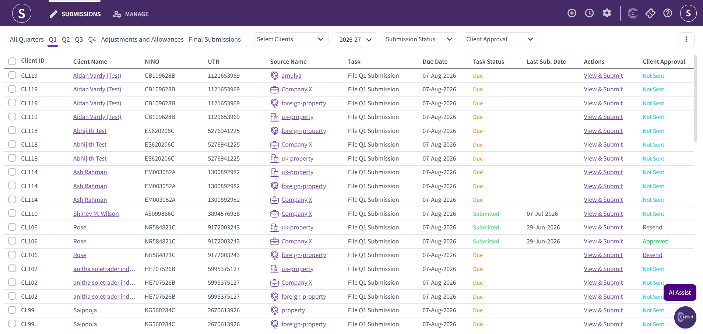
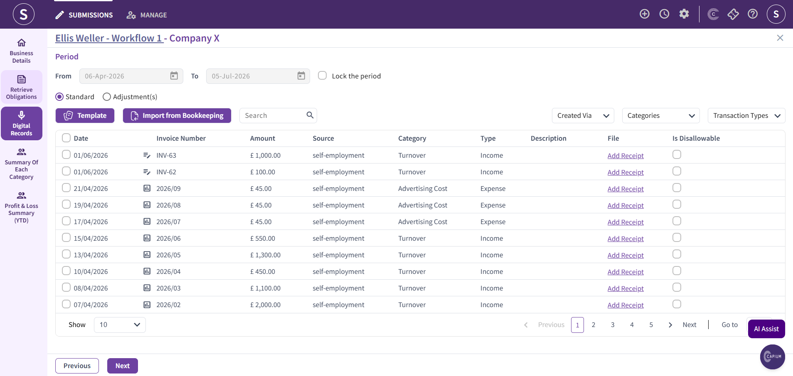
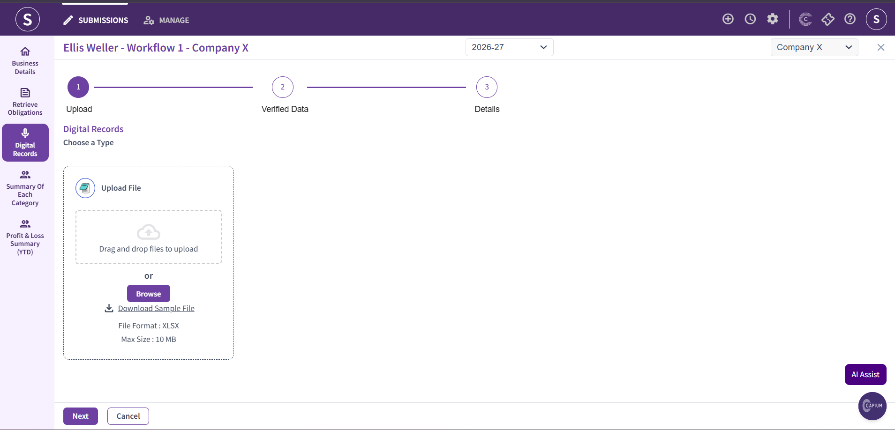
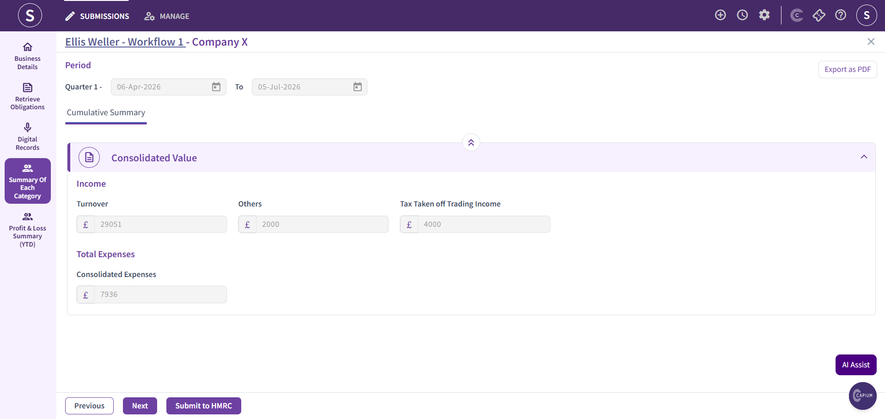

# How to Add Additional Transactions in MTD IT
	 	
			
			Print

- **Category:** MTD IT
- **Folder:** MTD IT FAQs
- **Source URL:** [https://capium.freshdesk.com/support/solutions/articles/9000277948-how-to-add-additional-transactions-in-mtd-it](https://capium.freshdesk.com/support/solutions/articles/9000277948-how-to-add-additional-transactions-in-mtd-it)
- **Article ID:** 9000277948

## Content

Solution home 
		MTD IT
		MTD IT FAQs

### How to Add Additional Transactions in MTD IT

			Print

	Modified on: Thu, 23 Jul, 2026 at 12:50 PM

		Welcome to this quick guide on how to add additional transactions in MTD IT. This guide will walk you through the essential steps.  

If you have already added your transactions to the system and submitted your quarterly update, you can still add additional transactions at any time. Once the new transactions have been entered, you can resubmit the quarterly update to ensure the latest information is sent to HMRC. 

Navigation: MTDIT > Submissions > Client Specific > View and Submit

Firstly, navigate to the Submissions section. Locate the source of income you want to add additional transactions to, then click View & Submit.

Navigate to the Digital Records section. Here, you will see all the transactions that have already been added to the system.

Click the Template icon to download the sample file. Enter the relevant new transactions into the template, save the file, and then upload it back into the system. The newly added transactions will be imported into your digital records section. 

Once the data has been uploaded, navigate to the Summary of Each Category. When you are satisfied that the information is correct, click Submit to HMRC to resubmit the quarterly update with the newly added transactions.

										Did you find it helpful?
								Yes
								No

Send feedback	Sorry we couldn't be helpful. Help us improve this article with your feedback.

## Screenshots & Diagrams (4)

