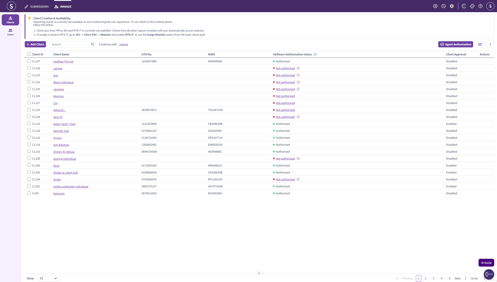
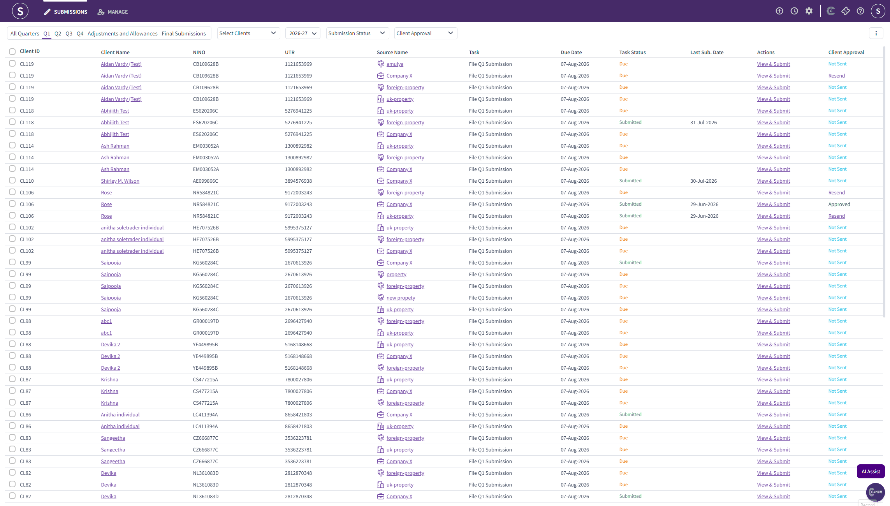
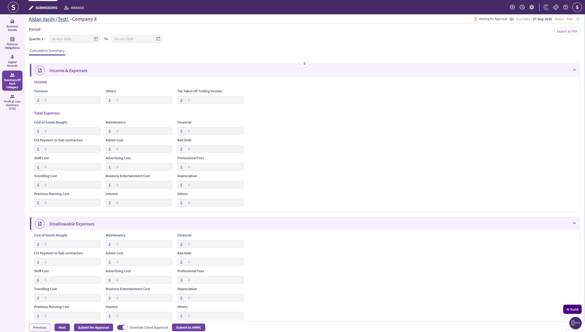
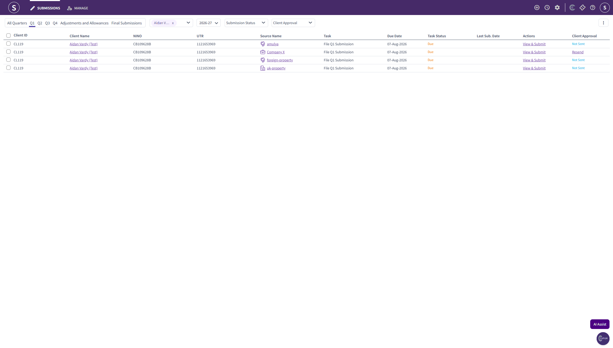

# MTD IT: Requesting Quarterly Client Approval
	 	
			
			Print

- **Category:** MTD IT
- **Folder:** MTD IT
- **Source URL:** [https://capium.freshdesk.com/support/solutions/articles/9000278130-mtd-it-requesting-quarterly-client-approval](https://capium.freshdesk.com/support/solutions/articles/9000278130-mtd-it-requesting-quarterly-client-approval)
- **Article ID:** 9000278130

## Content

Solution home 
		MTD IT
		MTD IT

### MTD IT: Requesting Quarterly Client Approval

			Print

	Modified on: Mon, 3 Aug, 2026 at  3:06 PM

		Quarterly approval is enabled per client. Until it is switched on, the approval options will not appear in the submission screens for that client.

Navigation > MTD IT > Manage > Select a client > Client Info

Go to the Manage section and select the client you want to enable approval for.
On the Client Info page, find the All Quarters section.
Tick the box next to Enable Approval.
Click Save & Continue or Save & Exit at the bottom of the screen.

Please Note:

If the box is left unticked, the quarterly approval workflow is not active for that client and quarterly submissions can be made without requesting approval.

Once quarterly approval has been enabled for a client, you can send the cumulative summary to them for approval before the quarterly submission is sent to HMRC. 

### 
Requesting approval

The process is the same regardless of which of the four MTD IT workflows you use to prepare the figures.

Navigation > MTD IT > Submissions > Select a client > View & Submit > Summary of Each Category

Open the client's submission and go to the Summary of Each Category screen.
Click Submit for Approval at the bottom of the screen.

### 
The approval email

Clicking Submit for Approval opens a pop up showing the email that will be sent to your client.

The recipient is shown on screen. You can add CC and BCC recipients and change the subject line.
The cumulative summary report is attached automatically. This attachment cannot be changed and no other files can be added.
You can edit the body text of the email.
Please Note:
Do not remove the approval button from the email, as your client uses this to confirm their approval. We also recommend you leave the formatting as it is and only amend the wording.

When you are happy with the email, click Send.

### 
After your client approves

Your client opens the email and clicks the approval button. You will then receive an email confirming the approval, and the submission can be sent to HMRC.

Once submitted, the year to date figures on the source summary will update. For more detail on how cumulative figures work, see MTD IT: Cumulative Summary.

### 
Overriding client approval

There will be occasions where your client approves a quarter verbally or in writing outside the software, or where you need to proceed without using the approval email for a particular quarter.

Navigation > MTD IT > Submissions > Select a client > View & Submit > Summary of Each Category

Click Override Client Approval, shown next to the Submit for Approval option. This allows you to send the data to HMRC without an approval being recorded in the module.

Where you use the override, keep your own record of how approval was obtained.

### Related articles

MTD IT: Enabling Client Approval
MTD IT: Year End Client Approval
MTD IT: How to Make Quarterly Submissions
MTD IT: Cumulative Summary
MTD IT: Consolidated vs Detailed Submission
MTD IT: Choosing the Right Workflow

										Did you find it helpful?
								Yes
								No

Send feedback	Sorry we couldn't be helpful. Help us improve this article with your feedback.

## Screenshots & Diagrams (4)

