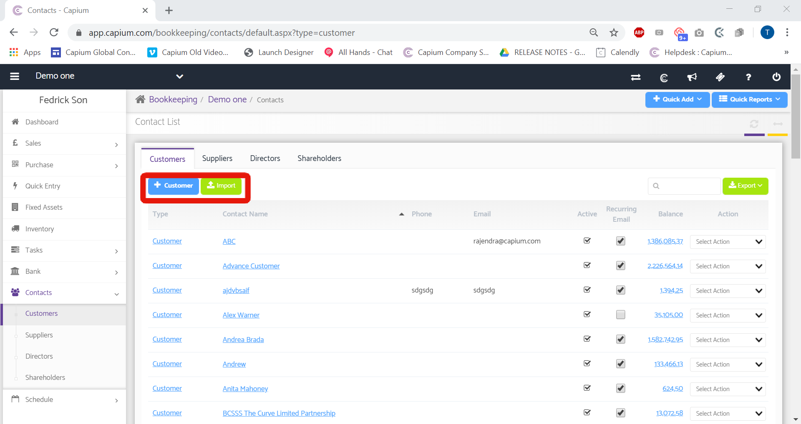
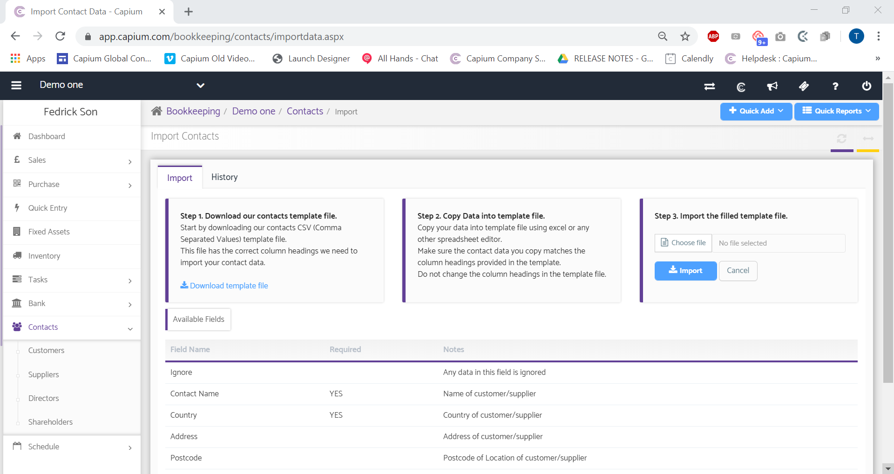

# Customer import (contacts)
	 	
			
			Print

- **Category:** Onboarding
- **Folder:** Importing data
- **Source URL:** [https://capium.freshdesk.com/support/solutions/articles/9000149747-customer-import-contacts-](https://capium.freshdesk.com/support/solutions/articles/9000149747-customer-import-contacts-)
- **Article ID:** 9000149747

## Content

Solution home 
		Onboarding
		Importing data

### Customer import (contacts)

			Print

	Modified on: Tue, 17 Mar, 2020 at  5:11 PM

		Navigation - Bookkeeping >> Select Client >> Contacts >> Customers >> Import 

Refer to the link

Help/Guide

This guide will provide you with the step-by-step process for importing Customers as part of Contacts within the Bookkeeping module. 

Navigate to the Customers page by following the navigation above or click the link to take you straight there (you need to be logged in to your account)

Once there click the green Import button as displayed below and you will be redirected to the Customer Import page. You can also manually add a Customer by clicking +Customer button. 

Once you click on 'Import' you will be directed to the Customer import screen - there you will need to follow the guidance provided on the left panel of the page;

1. Download the CSV template provided

2. Populate the file with your client data

3. Upload the file back into Capium

Also take note of the 'Available Fields' section on the bottom of the page as that will provide clear guidance as to what data is mandatory and what isn't when importing Customers.

After uploading the CSV template back into the platform, you will be presented with the data in a tabular format, press 'Continue' to finalise the import. 

Click here to watch How to import Customers

		 pdf  customer imp... (273 KB) 

										Did you find it helpful?
								Yes
								No

Send feedback	Sorry we couldn't be helpful. Help us improve this article with your feedback.

## Screenshots & Diagrams (4)

