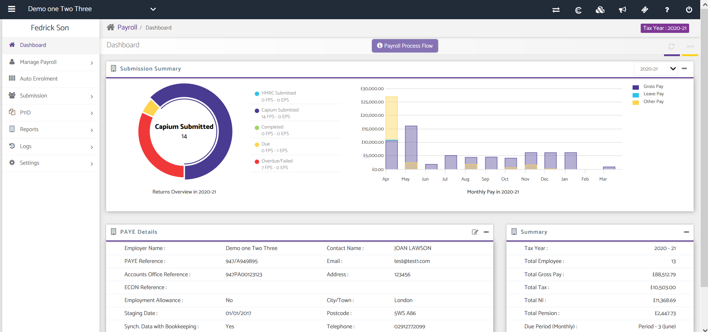
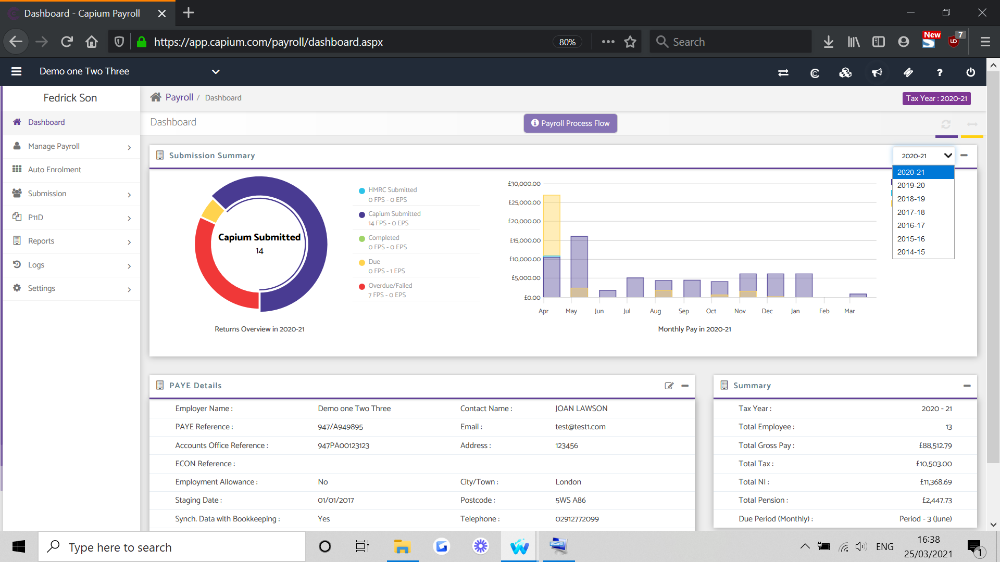
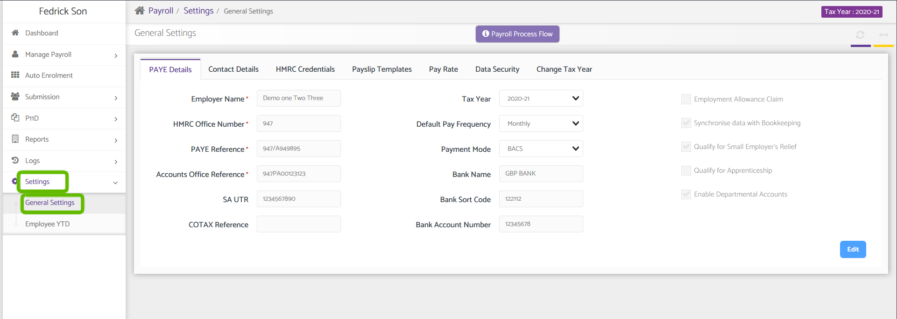
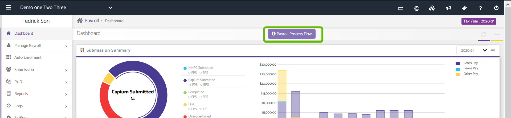
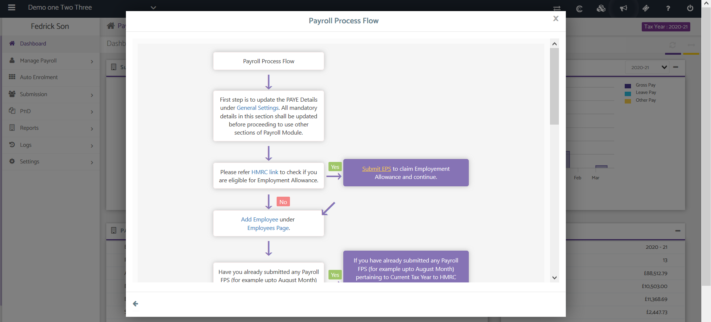

# Payroll Dashboard
	 	
			
			Print

- **Category:** Payroll
- **Folder:** Payroll Help Guide
- **Source URL:** [https://capium.freshdesk.com/support/solutions/articles/9000165406-payroll-dashboard](https://capium.freshdesk.com/support/solutions/articles/9000165406-payroll-dashboard)
- **Article ID:** 9000165406

## Content

Solution home 
		Payroll
		Payroll Help Guide

### Payroll Dashboard

			Print

	Modified on: Thu, 9 Sep, 2021 at  2:40 PM

### Location:

### 

### Payroll module > Client specific

### 

### Video Tutorial:

Watch a video here for a Payroll introduction

Click here to watch how to change pay dates

Click here to watch how to update your payroll tax year

Help Guide:

### 
The dashboard is the Home page which provides you with four sections such as the PAYE Submission summary, Monthly Pay, PAYE details and Summary of all your clients.

### 

### 

### 

### Submission Summary: This Section on dashboard provides you with a Donut Chart. It shows you a summary of various submissions made to HMRC and Capium regarding FPS and EPS.

Payroll Summary: This Section contains a Bar diagram which presents a summary of Gross Pay, Leave Pay and Other Pay per Month.

PAYE Details:

This Section maintains basic details regarding the Employer such as:

Employer Name

PAYE Reference

Address and Email

Payment Mode

Employment Allowance, etc.

Summary:

This Section presents a summary of various Year to Date (YTD) figures:

Tax Year

Total Employee

Total Gross Pay

Total Tax

Total NI

Total Pension

Due Period (Monthly).

Select Year:

You can select a different year by selecting one from the drop-down highlighted in the red box to the left.

Editing PAYE Details:

To edit the PAYE Details navigate to Settings>>General Settings page. Edit PAYE Details screen is further divided into 7 tabs which can be seen below in the screenshot.

Note: The General Settings Page will be the landing page whenever a Payroll is set up for the first time for a Client. On the page, you may fill details regarding PAYE, Contact, HMRC Credentials, Pay slip Templates and Change Tax Year.

### Payroll Process Flow:

Capium has Payroll process flow on the top of the page in payroll, it gives the end to end knowledge about payroll process, please find below screenshot to open the Process flow.

										Did you find it helpful?
								Yes
								No

Send feedback	Sorry we couldn't be helpful. Help us improve this article with your feedback.

## Screenshots & Diagrams (5)

