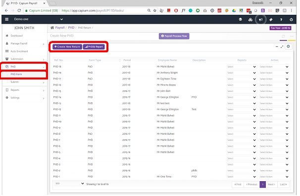
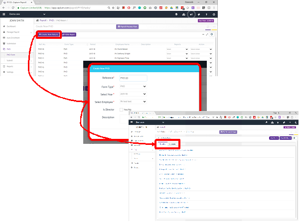
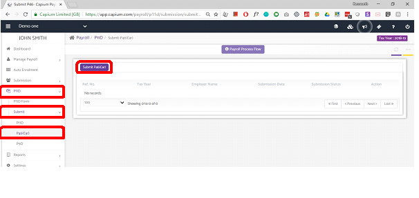
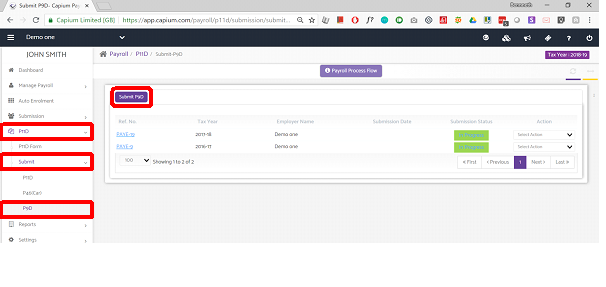

# P11D / P9D / P46 Forms
	 	
			
			Print

- **Category:** Payroll
- **Folder:** Payroll Help Guide
- **Source URL:** [https://capium.freshdesk.com/support/solutions/articles/9000165419-p11d-p9d-p46-forms](https://capium.freshdesk.com/support/solutions/articles/9000165419-p11d-p9d-p46-forms)
- **Article ID:** 9000165419

## Content

Solution home 
		Payroll
		Payroll Help Guide

### P11D / P9D / P46 Forms

			Print

	Modified on: Fri, 29 Oct, 2021 at  2:50 PM

		Location:

Payroll module > Client specific > P11D

Refer to the link

Video Tutorial: 

Watch the video to know about P11D & P9Watch the video to know about the P11D Submissions

Click here to watch how to enter car benefit details

Help Guide:

Note: P11D will be accessible only by the Accountant users who have Advance Payroll under their subscription.

P11D is a statutory form which is required to be filed to HMRC regarding the Expenses and Benefits provided to their Employees and Directors for a particular Tax year who are earning at the rate of £8500 or more per year.

To each director who has earned less than this amount, unless they are a full-time working director with no material interest in the company or a director of a charity or non-profit making organisation.

A P9D form submission can be made to HMRC as it is available for those Employers who have provided benefits and expenses to the lower paid employees i.e. whose earnings are less than £8500. Also, P11D (b) can be submitted to report the Class 1A National Insurance Contributions due on the expenses and benefits along with the P11D. Through Capium you may file a P11D or a P9D for your Employees and Directors as per your requirement.

### 

### P11D and P9D Dashboard:

To add a P11D and P9D form you may simply click on +Create New return available on the top left navigation of the page.

### 

### Create New Return

To create one you need to click on this button and a Pop-up will appear where desired details have to be provided.

A P9D form submission can be made to HMRC as it is available for those Employers who have provided benefits and expenses to the lower paid employees i.e. whose earnings are less than £8500. Also, P11D (b) can be submitted to report the Class 1A National Insurance Contributions due on the expenses and benefits along with the P11D. Through Capium you may file a P11D or a P9D for your Employees and Directors as per your requirement.

### 

### P46(Car)

You need to send a P46 (Car) form to HM Revenue and Customs (HMRC) if you provide company cars to your employees. You may add the same information under the P46 (Car) Section.

### P9D 

A P9D Form has to be completed by an Employer if he has not submitted a P11D form in case the Employer has made any payments for the expenses or provided any benefits to the Employees who have a lower earning than £8500 per year.

										Did you find it helpful?
								Yes
								No

Send feedback	Sorry we couldn't be helpful. Help us improve this article with your feedback.

## Screenshots & Diagrams (4)

