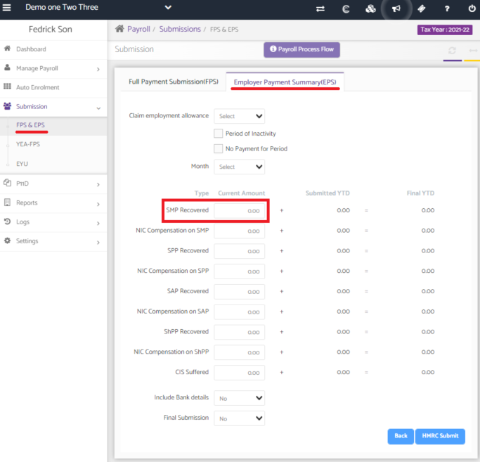

# How to settle an incorrect SMP submission
	 	
			
			Print

- **Category:** Payroll
- **Folder:** Payroll FAQs
- **Source URL:** [https://capium.freshdesk.com/support/solutions/articles/9000165658-how-to-settle-an-incorrect-smp-submission](https://capium.freshdesk.com/support/solutions/articles/9000165658-how-to-settle-an-incorrect-smp-submission)
- **Article ID:** 9000165658

## Content

Solution home 
		Payroll
		Payroll FAQs

### How to settle an incorrect SMP submission

			Print

	Modified on: Mon, 22 Nov, 2021 at  3:59 PM

		Location:

Submissions > FPS & EPS > Click on the Employer Payment Summary tab > Click on 'Add Submission' 

Help Guide:

If you've previously submitted some incorrect SMP figures, you can submit an EPS to make the corrected adjustments. 

First, you must submit an EPS with the SMP YTD as the negative amount this is required to make the total 0.

Once this has been submitted, you must submit another EPS with the correct amount of SMP YTD 

Please refer below screenshot for more help.

										Did you find it helpful?
								Yes
								No

Send feedback	Sorry we couldn't be helpful. Help us improve this article with your feedback.

## Screenshots & Diagrams (1)

