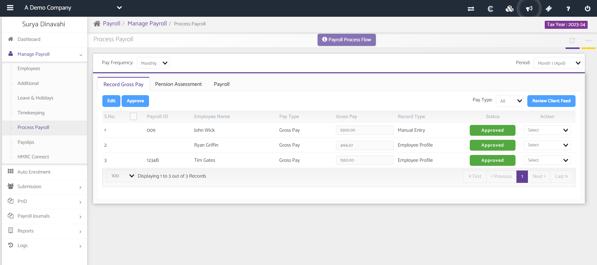
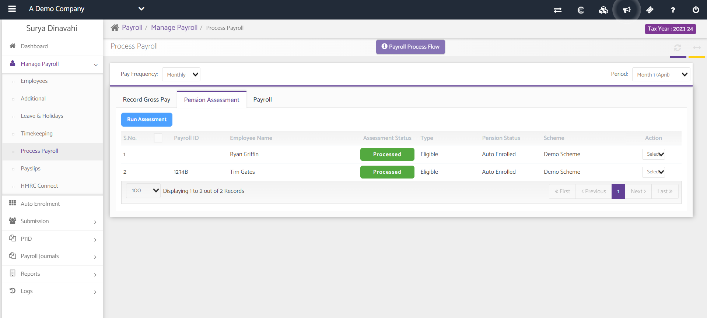
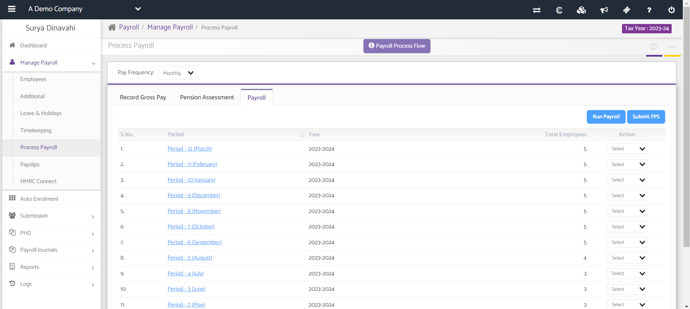
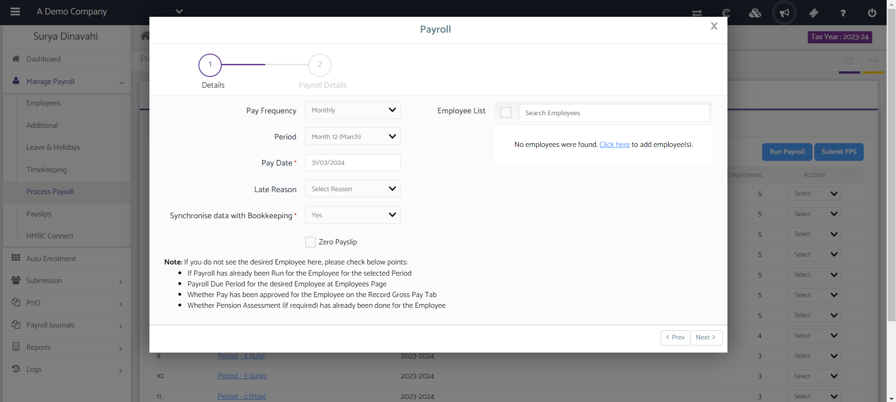
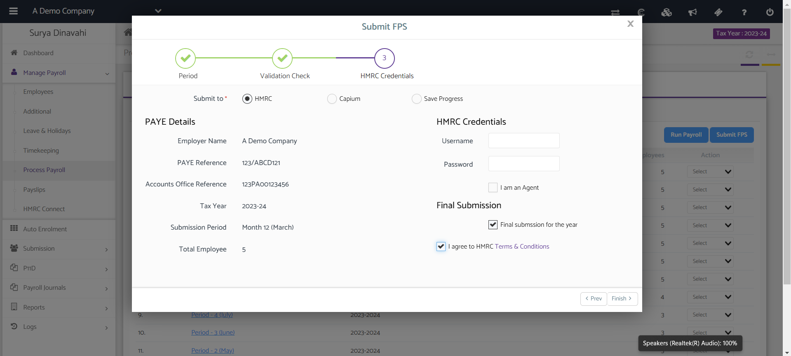
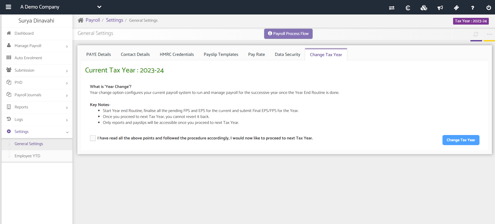

# How to process year end payroll and change the tax year
	 	
			
			Print

- **Category:** Payroll
- **Folder:** Payroll FAQs
- **Source URL:** [https://capium.freshdesk.com/support/solutions/articles/9000165661-how-to-process-year-end-payroll-and-change-the-tax-year](https://capium.freshdesk.com/support/solutions/articles/9000165661-how-to-process-year-end-payroll-and-change-the-tax-year)
- **Article ID:** 9000165661

## Content

Solution home 
		Payroll
		Payroll FAQs

### How to process year end payroll and change the tax year

			Print

	Modified on: Mon, 8 Apr, 2024 at  2:08 PM

		Navigation

Payroll Dashboard > Select Client > Manage Payroll > Process Payroll 

Refer to the link

Video Tutorial

Help/Guide

There are two checkpoints when processing your year end Payroll in Capium;

1. Processing the Payroll

2. Submitting Final FPS

1 - Process Payroll

Head to the Process Payroll section from the navigation above or click 'Refer to the link' to to be directed to the page (you will need to logged in)

Once there, approve the relevant Gross Pay for the employees by ticking the checkbox, then click 'Approve'. Once approved, click 'Pension Assessment' tab to run the Pension if applicable.

Once approved, click 'Pension Assessment' tab to run the Pension if the employees are eligible.

Next, click the 'Payroll' tab and click Run Payroll.

Go through both steps in the wizard below to run the Payroll. 

2 - Submit Final FPS

After running March Payroll using the above guidance, you can now submit the final FPS. On the same page where you clicked 'Run Payroll', click the 'Submit FPS' button.

Follow the 3 steps in the wizard and on the final step 'HMRC Credentials', ensure you tick the checkbox below the 'Final Submission' heading to say this is your final submission for the year.

Once you have completed all these and wish to change the tax year you simply navigate to 

Settings > General Settings > Change Tax Year

										Did you find it helpful?
								Yes
								No

Send feedback	Sorry we couldn't be helpful. Help us improve this article with your feedback.

## Screenshots & Diagrams (6)

