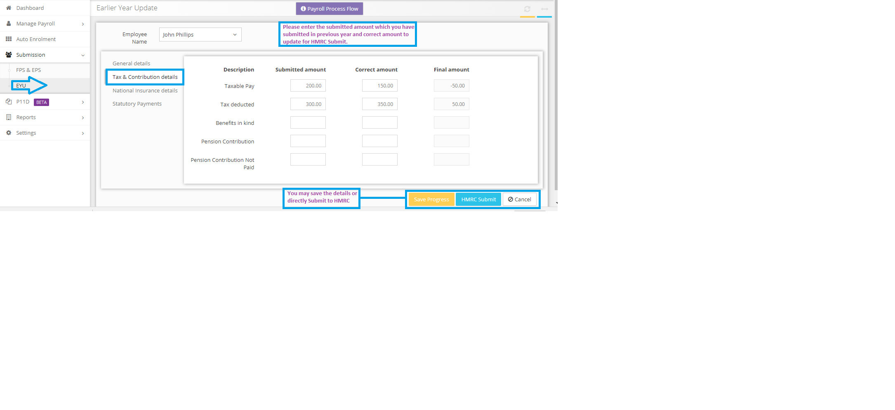
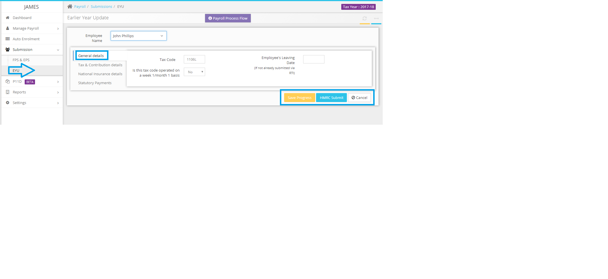

# How can we submit the EYU for previous tax year?
	 	
			
			Print

- **Category:** Payroll
- **Folder:** Payroll FAQs
- **Source URL:** [https://capium.freshdesk.com/support/solutions/articles/9000165668-how-can-we-submit-the-eyu-for-previous-tax-year-](https://capium.freshdesk.com/support/solutions/articles/9000165668-how-can-we-submit-the-eyu-for-previous-tax-year-)
- **Article ID:** 9000165668

## Content

Solution home 
		Payroll
		Payroll FAQs

### How can we submit the EYU for previous tax year?

			Print

	Modified on: Tue, 26 Mar, 2019 at 10:25 AM

		1. Please navigate to Submissions>>EYU section.

2. Select the tax year and click on "+Submit EYU".

3. Please select the employee from the drop down and make the necessary changes and submit the EYU to HMRC.

Please refer below screenshots for more help.

										Did you find it helpful?
								Yes
								No

Send feedback	Sorry we couldn't be helpful. Help us improve this article with your feedback.

## Screenshots & Diagrams (2)

