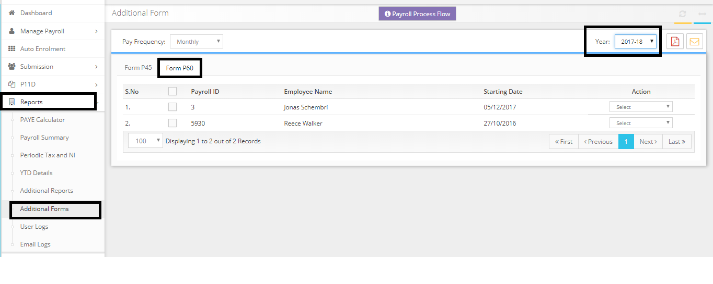

# Month 12 final pay we’ve done and they are closing the company. How do I do the year end?
	 	
			
			Print

- **Category:** Payroll
- **Folder:** Payroll FAQs
- **Source URL:** [https://capium.freshdesk.com/support/solutions/articles/9000165669-month-12-final-pay-we-ve-done-and-they-are-closing-the-company-how-do-i-do-the-year-end-](https://capium.freshdesk.com/support/solutions/articles/9000165669-month-12-final-pay-we-ve-done-and-they-are-closing-the-company-how-do-i-do-the-year-end-)
- **Article ID:** 9000165669

## Content

Solution home 
		Payroll
		Payroll FAQs

### Month 12 final pay we’ve done and they are closing the company. How do I do the year end?

			Print

	Modified on: Tue, 26 Mar, 2019 at  1:14 PM

		You have submitted the final submission for the year in the March month FPS. 

Now you may simply download the Form P60 from the Reports>> Additional Forms>> P60.

Please refer to the below link to navigate the same.

Reports>> Additional Forms>> P60

Please refer below screenshot for more help.

Click here to watch how to print a P60 formClick here to watch ho to submit final FPS payroll for the year

										Did you find it helpful?
								Yes
								No

Send feedback	Sorry we couldn't be helpful. Help us improve this article with your feedback.

## Screenshots & Diagrams (1)

