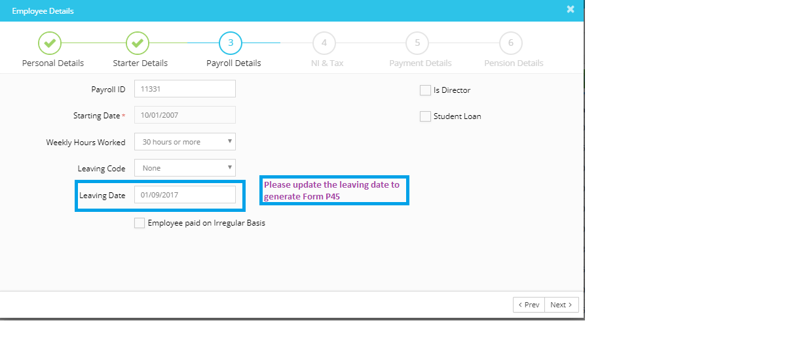

# How do we record an employee as leaving and does the software generate p45?
	 	
			
			Print

- **Category:** Payroll
- **Folder:** Payroll FAQs
- **Source URL:** [https://capium.freshdesk.com/support/solutions/articles/9000165671-how-do-we-record-an-employee-as-leaving-and-does-the-software-generate-p45-](https://capium.freshdesk.com/support/solutions/articles/9000165671-how-do-we-record-an-employee-as-leaving-and-does-the-software-generate-p45-)
- **Article ID:** 9000165671

## Content

Solution home 
		Payroll
		Payroll FAQs

### How do we record an employee as leaving and does the software generate p45?

			Print

	Modified on: Tue, 26 Mar, 2019 at 12:28 PM

		Please follow the below procedure to process a Leaver and generate the Form P45:

1. Input the leaving date of the employee under employee details, refer attached.

2. Run and submit the payroll to HMRC to update them. It is necessary to run at least a single payroll to notify the Leaver to HMRC and generate the Form P45.

3. Once done you may download the P45 by following the below link:

Reports>>Additional Forms>> P45

Please refer below screenshot for more help.

Watch here how to record an employee as leaving and generate P45

										Did you find it helpful?
								Yes
								No

Send feedback	Sorry we couldn't be helpful. Help us improve this article with your feedback.

## Screenshots & Diagrams (1)

