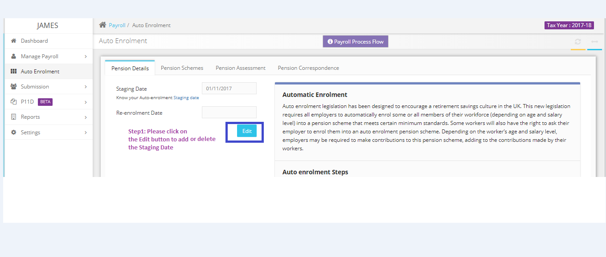

# How can I move on and process payroll for the employee who work for me before May?
	 	
			
			Print

- **Category:** Payroll
- **Folder:** Payroll FAQs
- **Source URL:** [https://capium.freshdesk.com/support/solutions/articles/9000165673-how-can-i-move-on-and-process-payroll-for-the-employee-who-work-for-me-before-may-](https://capium.freshdesk.com/support/solutions/articles/9000165673-how-can-i-move-on-and-process-payroll-for-the-employee-who-work-for-me-before-may-)
- **Article ID:** 9000165673

## Content

Solution home 
		Payroll
		Payroll FAQs

### How can I move on and process payroll for the employee who work for me before May?

			Print

	Modified on: Tue, 26 Mar, 2019 at 10:33 AM

		We have checked and found that you have updated the pension staging date under the auto-enrollment section hence the problem. 

Please remove the staging date by clicking on the Edit option available then you may process payroll for the month of May as desired.

Please refer below screenshot for more help.

										Did you find it helpful?
								Yes
								No

Send feedback	Sorry we couldn't be helpful. Help us improve this article with your feedback.

## Screenshots & Diagrams (1)

