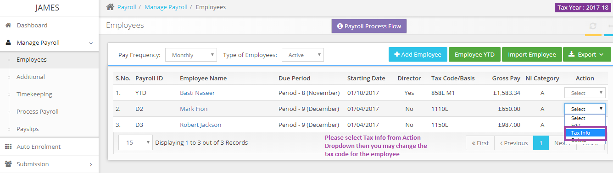

# I am trying to change employee tax codes requested by HMRC, but I can&#39;t
	 	
			
			Print

- **Category:** Payroll
- **Folder:** Payroll FAQs
- **Source URL:** [https://capium.freshdesk.com/support/solutions/articles/9000165677-i-am-trying-to-change-employee-tax-codes-requested-by-hmrc-but-i-can-t](https://capium.freshdesk.com/support/solutions/articles/9000165677-i-am-trying-to-change-employee-tax-codes-requested-by-hmrc-but-i-can-t)
- **Article ID:** 9000165677

## Content

Solution home 
		Payroll
		Payroll FAQs

### I am trying to change employee tax codes requested by HMRC, but I can&#39;t

			Print

	Modified on: Tue, 26 Mar, 2019 at  1:25 PM

		The Tax code of an employee can be updated by selecting "Tax Info" under "Action" drop-down under Manage Payroll >> Employee section.

Please refer below screenshot for more help.

Click here how to change the tax code for an employee

										Did you find it helpful?
								Yes
								No

Send feedback	Sorry we couldn't be helpful. Help us improve this article with your feedback.

## Screenshots & Diagrams (1)

