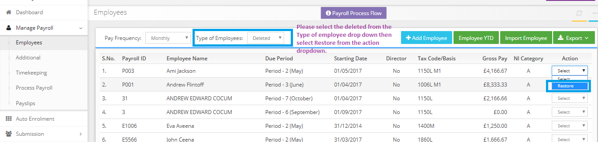

# Could you please suggest that how can we restore the employee?
	 	
			
			Print

- **Category:** Payroll
- **Folder:** Payroll FAQs
- **Source URL:** [https://capium.freshdesk.com/support/solutions/articles/9000165679-could-you-please-suggest-that-how-can-we-restore-the-employee-](https://capium.freshdesk.com/support/solutions/articles/9000165679-could-you-please-suggest-that-how-can-we-restore-the-employee-)
- **Article ID:** 9000165679

## Content

Solution home 
		Payroll
		Payroll FAQs

### Could you please suggest that how can we restore the employee?

			Print

	Modified on: Tue, 26 Mar, 2019 at  1:20 PM

		Please follow the below steps to restore the deleted employee.

1. Please select the Type of Employees as Deleted from the drop down.

2. Please choose the restore from the action drop down for the employee.

Please refer below screenshot for more help.

Click here to watch how to restore a deleted employee

										Did you find it helpful?
								Yes
								No

Send feedback	Sorry we couldn't be helpful. Help us improve this article with your feedback.

## Screenshots & Diagrams (1)

