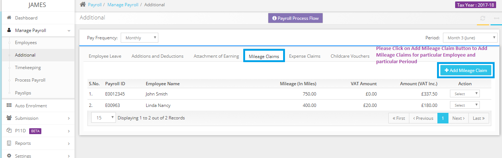

# Where in Capium I can add mileage?
	 	
			
			Print

- **Category:** Payroll
- **Folder:** Payroll FAQs
- **Source URL:** [https://capium.freshdesk.com/support/solutions/articles/9000165683-where-in-capium-i-can-add-mileage-](https://capium.freshdesk.com/support/solutions/articles/9000165683-where-in-capium-i-can-add-mileage-)
- **Article ID:** 9000165683

## Content

Solution home 
		Payroll
		Payroll FAQs

### Where in Capium I can add mileage?

			Print

	Modified on: Tue, 26 Mar, 2019 at  1:09 PM

		Navigate to Manage Payroll>> Additional>>Mileage Claims to add the Mileage Claims. 

Please refer below screenshot for more help.

Click here to watch a guide on attachment of earnings, mileage & expense claims

Click here to watch how to add mileage claim

										Did you find it helpful?
								Yes
								No

Send feedback	Sorry we couldn't be helpful. Help us improve this article with your feedback.

## Screenshots & Diagrams (1)

