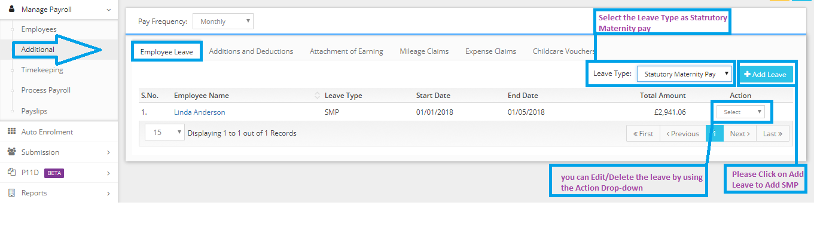

# How to add leave for the employee?
	 	
			
			Print

- **Category:** Payroll
- **Folder:** Payroll FAQs
- **Source URL:** [https://capium.freshdesk.com/support/solutions/articles/9000165684-how-to-add-leave-for-the-employee-](https://capium.freshdesk.com/support/solutions/articles/9000165684-how-to-add-leave-for-the-employee-)
- **Article ID:** 9000165684

## Content

Solution home 
		Payroll
		Payroll FAQs

### How to add leave for the employee?

			Print

	Modified on: Tue, 26 Mar, 2019 at 12:54 PM

		Please navigate to the Manage Payroll>> Additional>> Employee Leave.

Please refer below screenshot for more help.

Click here to watch how to add sick leave and SMP

										Did you find it helpful?
								Yes
								No

Send feedback	Sorry we couldn't be helpful. Help us improve this article with your feedback.

## Screenshots & Diagrams (1)

