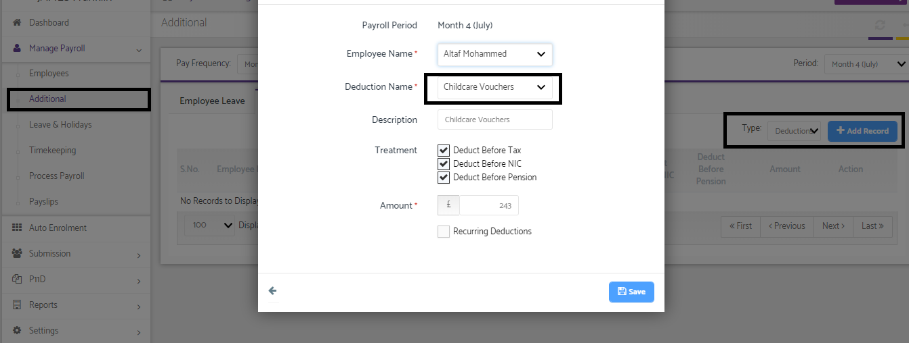

# How can we run the childcare vouchers?
	 	
			
			Print

- **Category:** Payroll
- **Folder:** Payroll FAQs
- **Source URL:** [https://capium.freshdesk.com/support/solutions/articles/9000165685-how-can-we-run-the-childcare-vouchers-](https://capium.freshdesk.com/support/solutions/articles/9000165685-how-can-we-run-the-childcare-vouchers-)
- **Article ID:** 9000165685

## Content

Solution home 
		Payroll
		Payroll FAQs

### How can we run the childcare vouchers?

			Print

	Modified on: Tue, 26 Mar, 2019 at 10:54 AM

		Please navigate to the Additional>> Additions & Deductions section. You may select the Deductions and add the deductions as a Childcare Vouchers.

Please refer below screenshot for more help.

										Did you find it helpful?
								Yes
								No

Send feedback	Sorry we couldn't be helpful. Help us improve this article with your feedback.

## Screenshots & Diagrams (1)

