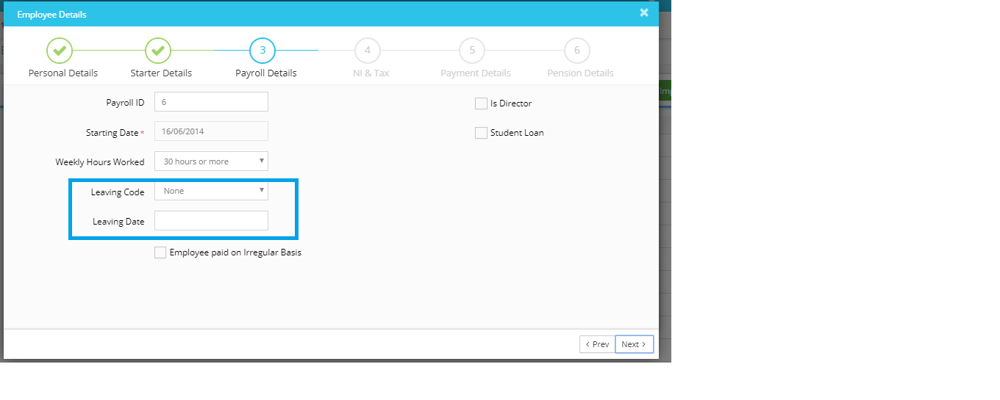

# How can we change the Pay Frequency?
	 	
			
			Print

- **Category:** Payroll
- **Folder:** Payroll FAQs
- **Source URL:** [https://capium.freshdesk.com/support/solutions/articles/9000165687-how-can-we-change-the-pay-frequency-](https://capium.freshdesk.com/support/solutions/articles/9000165687-how-can-we-change-the-pay-frequency-)
- **Article ID:** 9000165687

## Content

Solution home 
		Payroll
		Payroll FAQs

### How can we change the Pay Frequency?

			Print

	Modified on: Tue, 26 Mar, 2019 at 10:58 AM

		We cannot change the pay frequency of the employee. However, if you want to change the pay frequency for the next fiscal year:

Once you are done with the current fiscal year payroll, you may add new employees with the same details except for the pay frequency (i.e. Monthly) and you may run the payroll on the monthly basis from the April.

Please make sure that from the April month you do not make any Submissions for the old Employee (Weekly Frequency). You may input the leaving date of the employee who is on Weekly pay frequency so that no payroll will be processed mistakenly for that employee.

Please refer below screenshot for more help.

										Did you find it helpful?
								Yes
								No

Send feedback	Sorry we couldn't be helpful. Help us improve this article with your feedback.

## Screenshots & Diagrams (1)

