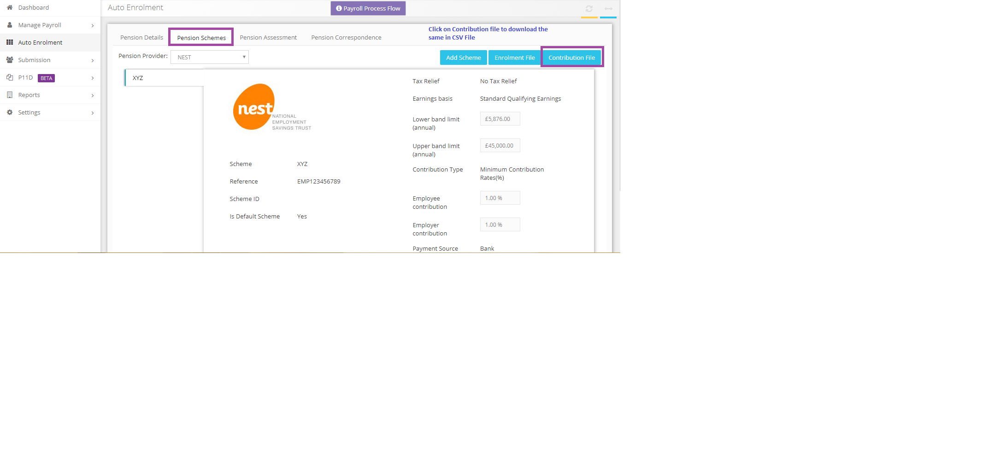

# How to submit the pension contributions to the Pension provider?
	 	
			
			Print

- **Category:** Payroll
- **Folder:** Payroll FAQs
- **Source URL:** [https://capium.freshdesk.com/support/solutions/articles/9000165697-how-to-submit-the-pension-contributions-to-the-pension-provider-](https://capium.freshdesk.com/support/solutions/articles/9000165697-how-to-submit-the-pension-contributions-to-the-pension-provider-)
- **Article ID:** 9000165697

## Content

Solution home 
		Payroll
		Payroll FAQs

### How to submit the pension contributions to the Pension provider?

			Print

	Modified on: Tue, 26 Mar, 2019 at 12:26 PM

		Use the direct submission from the Auto Enrollment >> Pension Schemes >> Contribution File. Also, you may download the file and upload at the pension provider website.

Please refer below screenshot for more help.

Click here to watch how to add a new Pension Scheme

Click here to watch how to download Pension contribution / Employer contribution reports

Click here to watch how to change pension rates

										Did you find it helpful?
								Yes
								No

Send feedback	Sorry we couldn't be helpful. Help us improve this article with your feedback.

## Screenshots & Diagrams (1)

