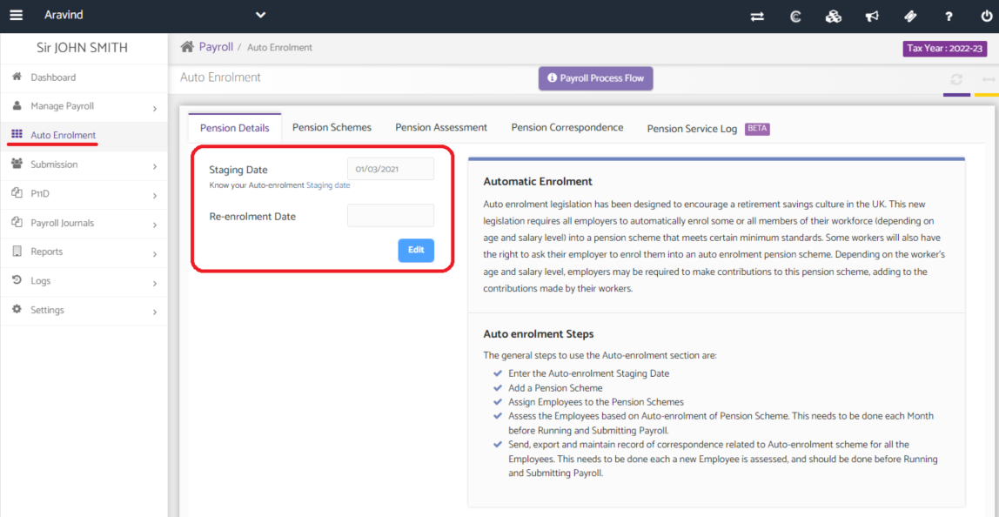
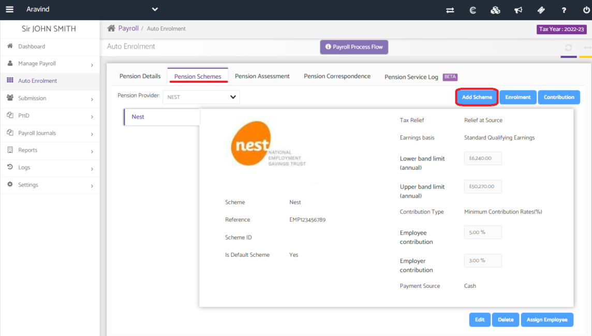
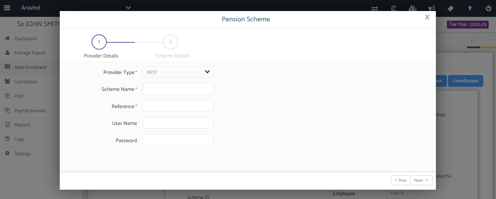
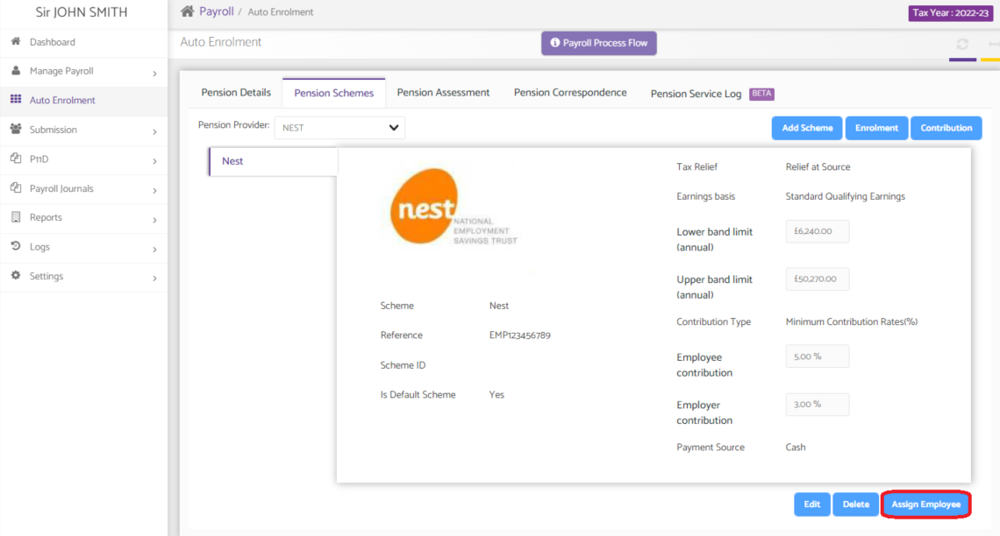
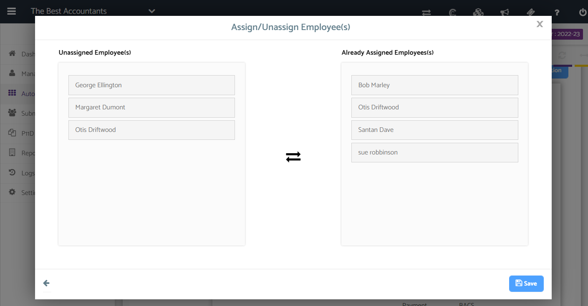

# How to Add the Pension Scheme from the Auto Enrolment section?
	 	
			
			Print

- **Category:** Payroll
- **Folder:** Payroll FAQs
- **Source URL:** [https://capium.freshdesk.com/support/solutions/articles/9000165699-how-to-add-the-pension-scheme-from-the-auto-enrolment-section-](https://capium.freshdesk.com/support/solutions/articles/9000165699-how-to-add-the-pension-scheme-from-the-auto-enrolment-section-)
- **Article ID:** 9000165699

## Content

Solution home 
		Payroll
		Payroll FAQs

### How to Add the Pension Scheme from the Auto Enrolment section?

			Print

	Modified on: Wed, 25 May, 2022 at  2:31 PM

		Location: 

Select client from payroll dashboard > Auto Enrolment > Pension Schemes > Add Scheme

Video Tutorial: 

Help Guide: 

Select a client from the payroll dashboard and navigate into Auto Enrolment. 

Begin by adding either the Staging date or Re-enrolment date. 

Navigate into 'Pension Schemes' and click on 'Add Scheme'. 

Enter the pension details as required. 

Once the pension has been added click on 'Assign employee' to allocate the employees to the particular pension provider.

Helpful articles: 

Click here to watch how to change pension rates

										Did you find it helpful?
								Yes
								No

Send feedback	Sorry we couldn't be helpful. Help us improve this article with your feedback.

## Screenshots & Diagrams (5)

