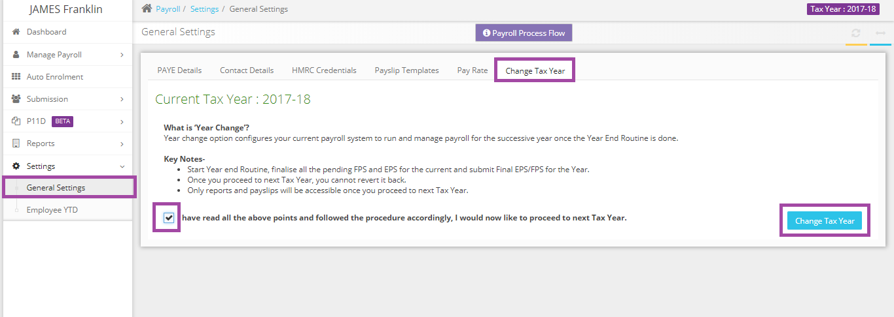

# Can you please advise how I can update the tax year to the next tax year.
	 	
			
			Print

- **Category:** Payroll
- **Folder:** Payroll FAQs
- **Source URL:** [https://capium.freshdesk.com/support/solutions/articles/9000165704-can-you-please-advise-how-i-can-update-the-tax-year-to-the-next-tax-year-](https://capium.freshdesk.com/support/solutions/articles/9000165704-can-you-please-advise-how-i-can-update-the-tax-year-to-the-next-tax-year-)
- **Article ID:** 9000165704

## Content

Solution home 
		Payroll
		Payroll FAQs

### Can you please advise how I can update the tax year to the next tax year.

			Print

	Modified on: Thu, 28 Mar, 2019 at 12:17 PM

		You may change the tax year from the Settings>> General Settings>> Change Tax Year.

Please refer below screenshot for more help.

Click here to watch how to update your payroll tax year

Here's a link to see how to explain payroll year end process

										Did you find it helpful?
								Yes
								No

Send feedback	Sorry we couldn't be helpful. Help us improve this article with your feedback.

## Screenshots & Diagrams (1)

