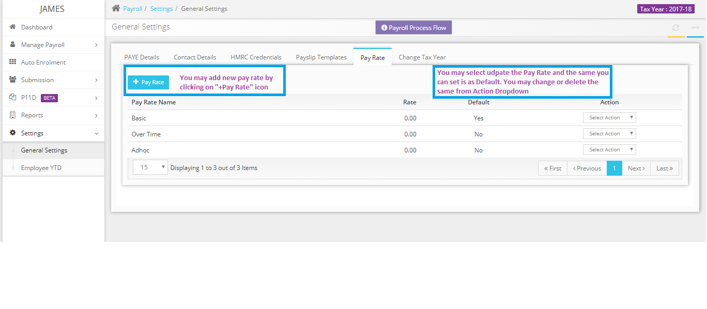

# Can you please advise how to handle variable pay rate in the payroll?
	 	
			
			Print

- **Category:** Payroll
- **Folder:** Payroll FAQs
- **Source URL:** [https://capium.freshdesk.com/support/solutions/articles/9000165706-can-you-please-advise-how-to-handle-variable-pay-rate-in-the-payroll-](https://capium.freshdesk.com/support/solutions/articles/9000165706-can-you-please-advise-how-to-handle-variable-pay-rate-in-the-payroll-)
- **Article ID:** 9000165706

## Content

Solution home 
		Payroll
		Payroll FAQs

### Can you please advise how to handle variable pay rate in the payroll?

			Print

	Modified on: Tue, 26 Mar, 2019 at 11:43 AM

		You may add the variable pay rate under Settings>> General Settings>> Pay Rate section. While adding the timekeeping record you may choose the pay rate as desired.

Please refer below screenshot for more help.

										Did you find it helpful?
								Yes
								No

Send feedback	Sorry we couldn't be helpful. Help us improve this article with your feedback.

## Screenshots & Diagrams (1)

