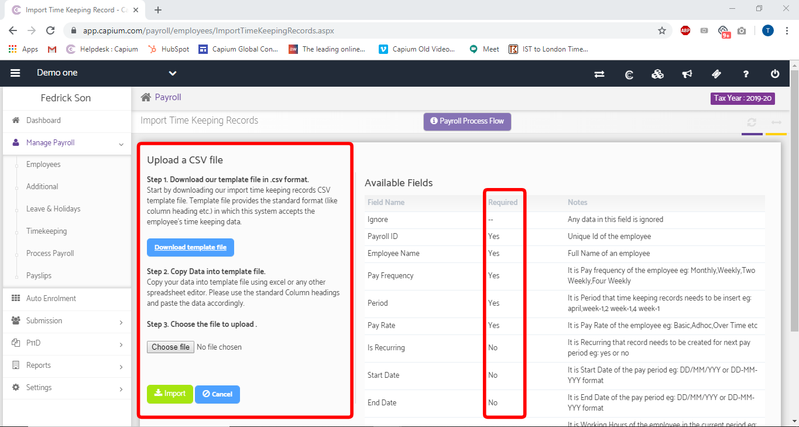

# How to perform a Bulk Import of Employee Hours
	 	
			
			Print

- **Category:** Payroll
- **Folder:** Payroll Help Guide
- **Source URL:** [https://capium.freshdesk.com/support/solutions/articles/9000205365-how-to-perform-a-bulk-import-of-employee-hours](https://capium.freshdesk.com/support/solutions/articles/9000205365-how-to-perform-a-bulk-import-of-employee-hours)
- **Article ID:** 9000205365

## Content

Solution home 
		Payroll
		Payroll Help Guide

### How to perform a Bulk Import of Employee Hours

			Print

	Modified on: Fri, 13 Aug, 2021 at 11:39 AM

		Location: Payroll Module > Client Dashboard > Manage Payroll > Timekeeping > Import Time Record

Refer to the link

Video Tutorial:

Click here to watch how to perform a bulk upload of employee hours 

Note: Before importing any employee hours, ensure the Employees and Payroll ID have been set up under Manage Payroll > Employees.

Help/Guide:

Once you click on Import Time Record, you will directed to the CSV Import page. The first step is to download the template by clicking the 'Download Template File' button.

Secondly, populate the CSV template with your data and as mentioned above, ensure the Payroll ID and Employee name on Capium are both identical to what's on your CSV file. 

For step 3, Import the CSV file back into Capium by using the 'Choose file' button then click Import just below.

										Did you find it helpful?
								Yes
								No

Send feedback	Sorry we couldn't be helpful. Help us improve this article with your feedback.

## Screenshots & Diagrams (1)

