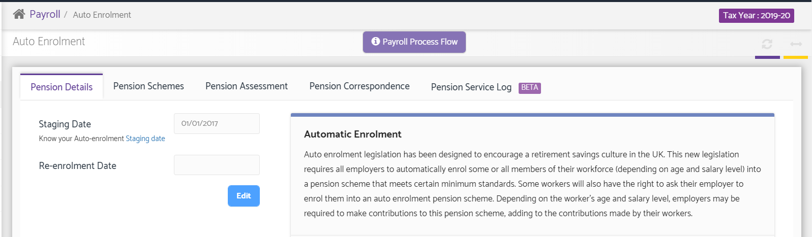
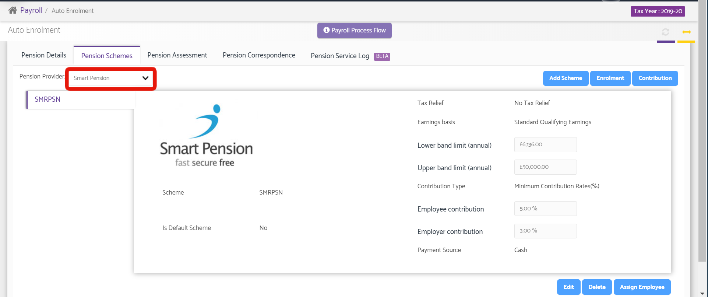
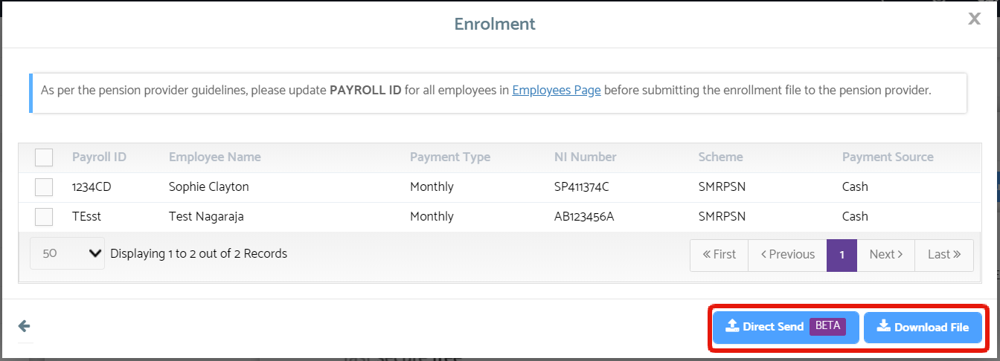
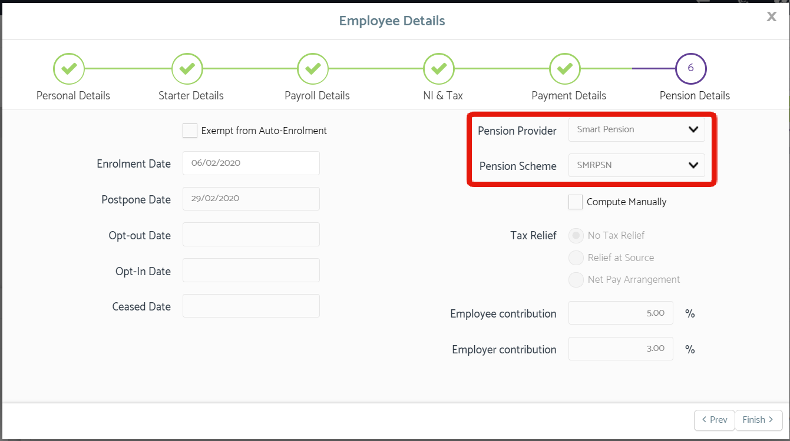
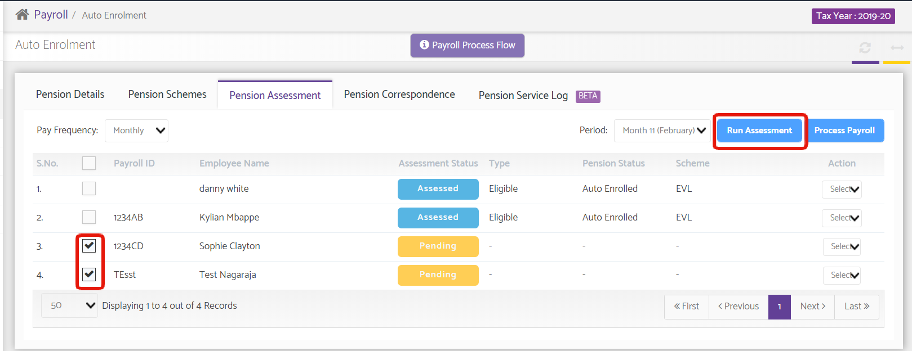
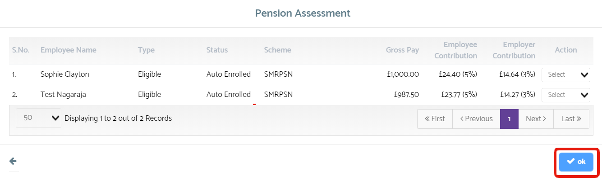
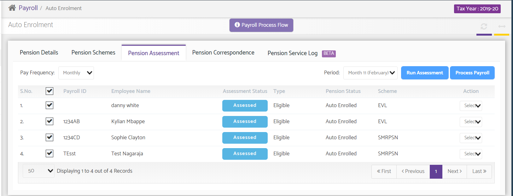
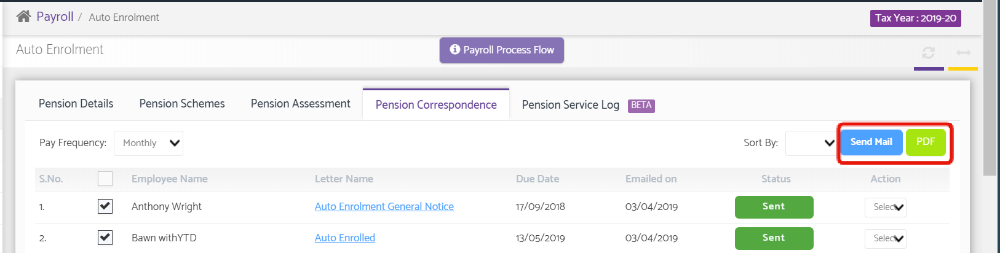

# Smart Pension
	 	
			
			Print

- **Category:** Payroll
- **Folder:** Payroll Help Guide
- **Source URL:** [https://capium.freshdesk.com/support/solutions/articles/9000206109-smart-pension](https://capium.freshdesk.com/support/solutions/articles/9000206109-smart-pension)
- **Article ID:** 9000206109

## Content

Solution home 
		Payroll
		Payroll Help Guide

### Smart Pension

			Print

	Modified on: Fri, 10 Sep, 2021 at  3:34 PM

		Location:

Navigation: Payroll Dashboard > Client Dashboard > Auto-Enrolment

Help Guide:

Steps to setup Smart Pension and run Pension through Capium Auto-Enrolment:

1. Enter the Auto-enrolment Staging Date
2. Setup/Add Pension Scheme (Smart Pension)
3. Assign Employees to the Pension Schemes
4. Assess the Employees based on Auto-enrolment of Pension Scheme. This needs to be done each Month before Running and Submitting Payroll.
5. Send, export and maintain record of correspondence related to Auto-enrolment scheme for all the Employees. This needs to be done each time a new Employee is assessed, and should be done before Running and Submitting Payroll.
1. Staging date

The Staging Date is the date that an employer takes on their employee(s) for the first time.

Staging Date - enter date here. Use this tool to know your staging date. 
 - Re-enrolment Date - This can be left blank. Only fill this in if you haven't assessed your staff within 6 weeks of the third year of the staging date.

2.  Setup/Add Pension Scheme

Smart Pension will be among the default providers from the drop-down menu as highlighted below

2.1 Direct Enrolment & Contribution

The benefits of being integrated with Smart Pension include being able to directly Enrol from Capium. Once you've setup Smart Pension as the provider, simply click the Enrolment button from the above screen.

Here you have two options; 'Direct Send' & 'Download File'. Direct send will send the Enrolment details directly to Smart Pension and if the request is successful, you will receive the status code 201, while you can download the Enrolment File using the Download button.

3. Assign Employees to the Pension Schemes

Navigation: Manage Payroll > Employees > Add/Edit Employee > Tab 6 (Pension Details)

Once in this screen, select Smart Pension from the Pension Provider and select the Pension Scheme along with that. You can also choose to 'Compute Manually' - doing this will allow you to choose the type of Tax Relief and manually enter the Employee & Employer contributions. 

To the left of the screen you also have the Postpone Date, Opt-out Date, Opt-In Date and Ceased Date - all of which you can come back later to input.

4. Pension Assessment

Before running and submitting Payroll through Capium, you need to run the Pension Assessment. Head to Auto Enrolment > Pension Assessment tab. Once here, select the employee(s) you wish to run the Pension Assessment for using the checkbox to the left of the Payroll ID, then click Run assessment.

Once you click Run Assessment, you will see the below screen where you simply need to confirm and run by clicking 'OK'.

5. Pension Correspondence 

All Correspondence are automatically generated in the Pension Correspondence tab but need to manually sent. Once in the tab, select the checkbox(s) to the left of the Employees' name and either 'Email' or 'PDF' to export as a PDF and send separately

										Did you find it helpful?
								Yes
								No

Send feedback	Sorry we couldn't be helpful. Help us improve this article with your feedback.

## Screenshots & Diagrams (8)

