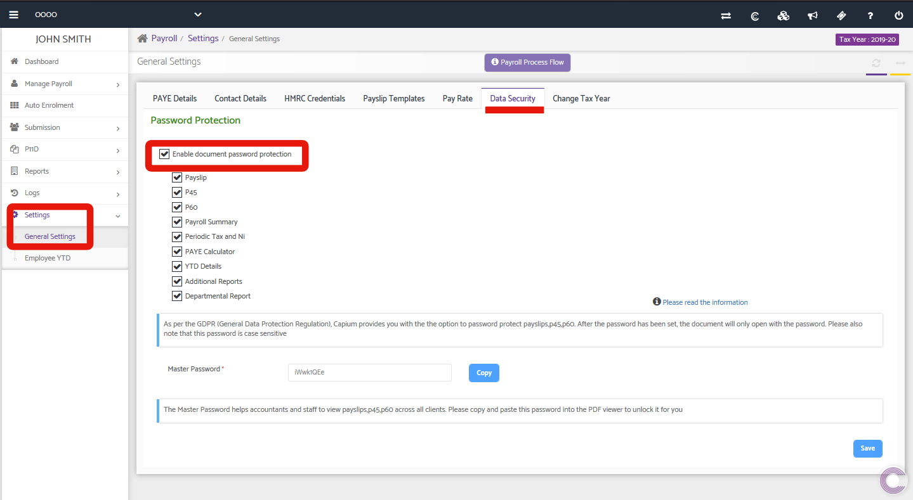

# Document/Report Password Protection - Payroll
	 	
			
			Print

- **Category:** Payroll
- **Folder:** Payroll Help Guide
- **Source URL:** [https://capium.freshdesk.com/support/solutions/articles/9000206175-document-report-password-protection-payroll](https://capium.freshdesk.com/support/solutions/articles/9000206175-document-report-password-protection-payroll)
- **Article ID:** 9000206175

## Content

Solution home 
		Payroll
		Payroll Help Guide

### Document/Report Password Protection - Payroll

			Print

	Modified on: Tue, 14 Sep, 2021 at  3:10 PM

		Location:

Payroll > Select Client > Settings > General Settings > Data Security 

Video Tutorial:

Click here to watch how to setup Document Password Protection

Help/Guide

Head to the Payroll module and follow the navigation above. Once there, you will first need to enable document password protection if this isn't done already. Upon enabling it, you will see a list of reports which you can choose to password protect.

Simply use the check boxes to the left of each report/document name to enable password protection - ensure to save after making any changes so they take effect.

Master PasswordHere, you are able to setup a master password which will allow access to any document using that password. The system automatically generates a random password but this can be changed at any time.

										Did you find it helpful?
								Yes
								No

Send feedback	Sorry we couldn't be helpful. Help us improve this article with your feedback.

## Screenshots & Diagrams (1)

