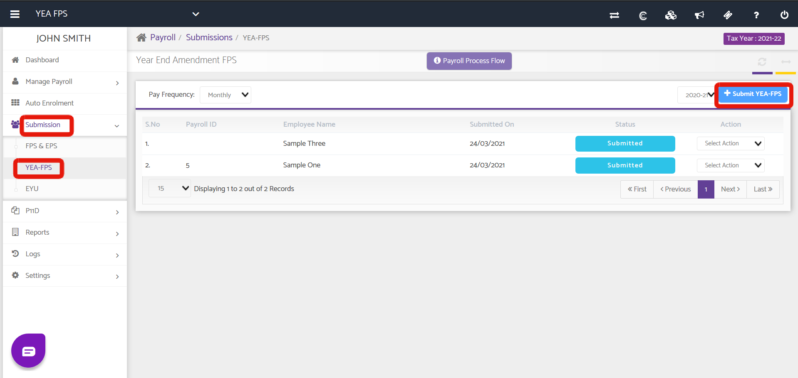
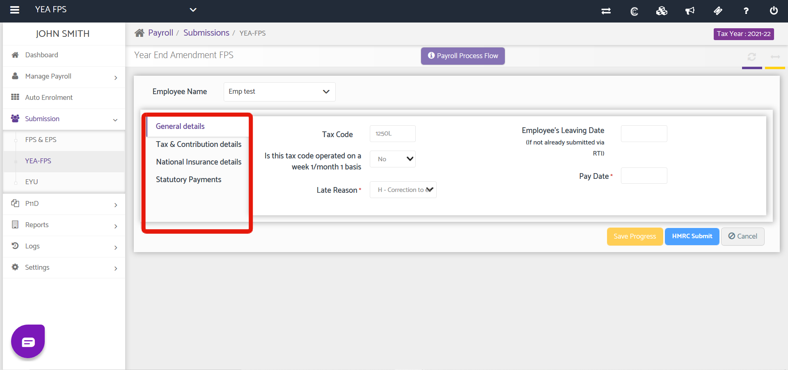
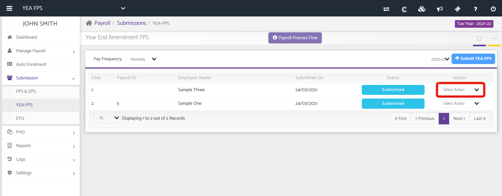

# Year End Amendment - FPS
	 	
			
			Print

- **Category:** Payroll
- **Folder:** Payroll Help Guide
- **Source URL:** [https://capium.freshdesk.com/support/solutions/articles/9000206213-year-end-amendment-fps](https://capium.freshdesk.com/support/solutions/articles/9000206213-year-end-amendment-fps)
- **Article ID:** 9000206213

## Content

Solution home 
		Payroll
		Payroll Help Guide

### Year End Amendment - FPS

			Print

	Modified on: Wed, 15 Sep, 2021 at  4:07 PM

		Location:

Payroll > Select Client/Employer > Submissions > YEA-FPS

Video Tutorial:

Click here to watch how to use YEA FPS

Help Guide:

As of the new Financial Tax Year (2021 - 2022), HMRC will decommission the ability to submit previous year amendments through EYU. Instead, they will be done through YEA FPS (Year End Amendment - FPS)

Click the +Submit YEA FPS button as highlighted above to begin, then input your amended values where applicable in the various tabs. Once done, proceed with submission by clicking the HMRC Submit button.

Once submitted you can download HMRC's response using the action drop-down menu

										Did you find it helpful?
								Yes
								No

Send feedback	Sorry we couldn't be helpful. Help us improve this article with your feedback.

## Screenshots & Diagrams (3)

