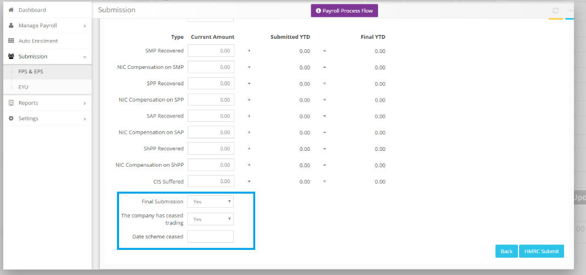

# How do I cease PAYE scheme?
	 	
			
			Print

- **Category:** Payroll
- **Folder:** Payroll FAQs
- **Source URL:** [https://capium.freshdesk.com/support/solutions/articles/9000206290-how-do-i-cease-paye-scheme-](https://capium.freshdesk.com/support/solutions/articles/9000206290-how-do-i-cease-paye-scheme-)
- **Article ID:** 9000206290

## Content

Solution home 
		Payroll
		Payroll FAQs

### How do I cease PAYE scheme?

			Print

	Modified on: Fri, 17 Sep, 2021 at  4:04 PM

		Location:

Payroll > Client Workspace > Submission > FPS & EPS > EPS Tab

Refer to the link

Help/Guide:

To cease the PAYE scheme, you first need to submit an EPS (Employer Payment Summary) - follow the navigation above to head to the EPS page.

Click 'Add Submission' button to create a new report, fill the details in the fields provided then select the 'Final Submission' drop down and switch to Yes. This will Un-hide an additional field to indicate whether or not the company has ceased trading, and if so, to state the date.

										Did you find it helpful?
								Yes
								No

Send feedback	Sorry we couldn't be helpful. Help us improve this article with your feedback.

## Screenshots & Diagrams (1)

