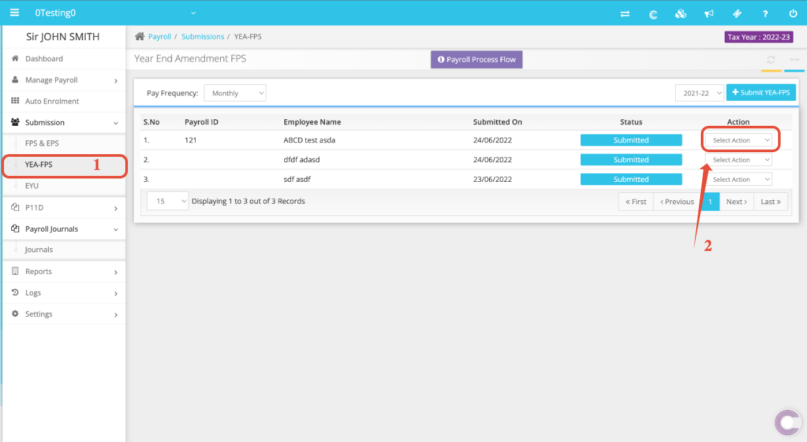
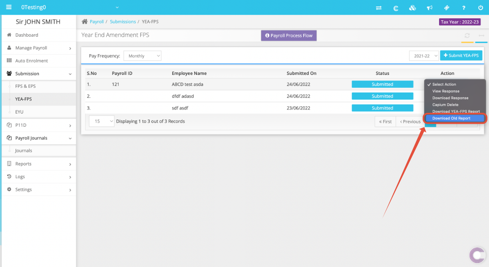
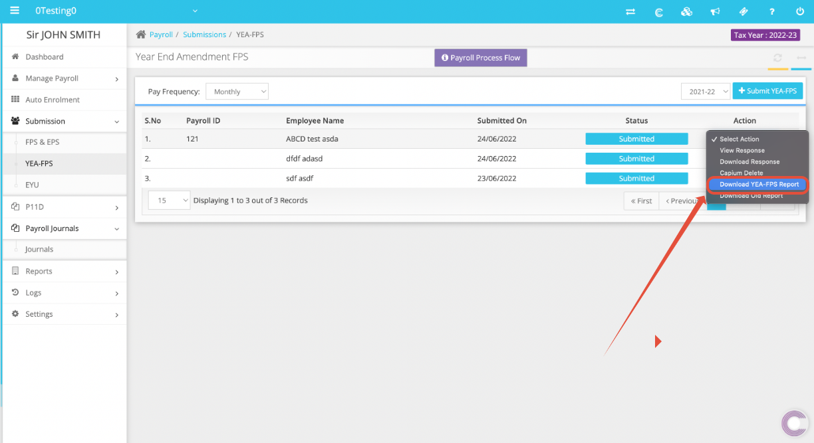
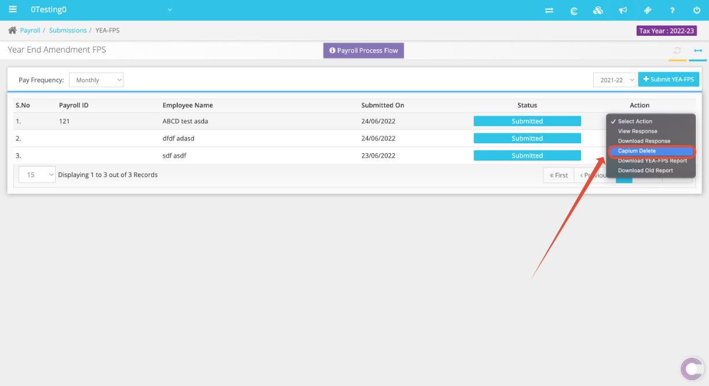

# How to amend YEA-FPS Submission
	 	
			
			Print

- **Category:** Payroll
- **Folder:** Payroll Help Guide
- **Source URL:** [https://capium.freshdesk.com/support/solutions/articles/9000216760-how-to-amend-yea-fps-submission](https://capium.freshdesk.com/support/solutions/articles/9000216760-how-to-amend-yea-fps-submission)
- **Article ID:** 9000216760

## Content

Solution home 
		Payroll
		Payroll Help Guide

### How to amend YEA-FPS Submission

			Print

	Modified on: Wed, 29 Jun, 2022 at  4:13 PM

		Location: Payroll>> Select a client >> Submissions >> YEA-FPS >> Action >> Capium Delete.

Alternatively, please click on this link to get redirected to the page. Once this is done you will land on the following page. 

On this page click on YEA-FPS. Then click on the action drop down menu and follow the steps below:

Step 1: Download Old Report

Step 2: Download YEA-FPS Report

Step 3: Capium Delete

Please download the reports before deleting the YEA-FPS as this data can't be retrieved once deleted. 

Once deleted you can make another submission to HMRC which will overwrite the earlier submission values.

Related Articles:

How to do Year End Amendment - FPS

										Did you find it helpful?
								Yes
								No

Send feedback	Sorry we couldn't be helpful. Help us improve this article with your feedback.

## Screenshots & Diagrams (4)

