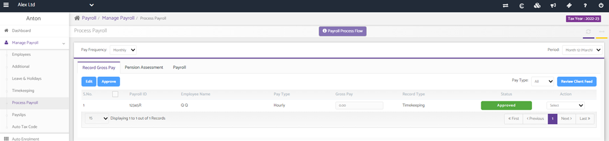
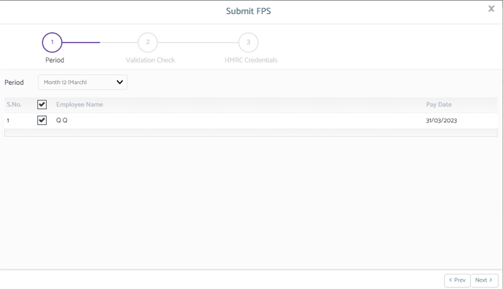
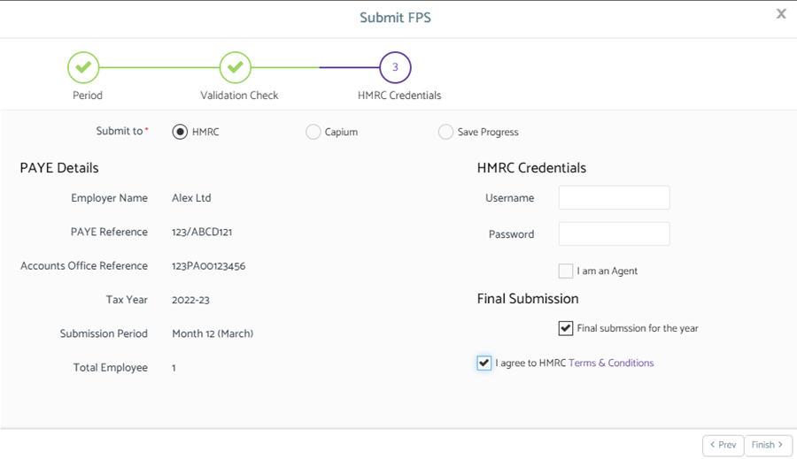

# How to run and submit the final FPS
	 	
			
			Print

- **Category:** Payroll
- **Folder:** Payroll Help Guide
- **Source URL:** [https://capium.freshdesk.com/support/solutions/articles/9000225984-how-to-run-and-submit-the-final-fps](https://capium.freshdesk.com/support/solutions/articles/9000225984-how-to-run-and-submit-the-final-fps)
- **Article ID:** 9000225984

## Content

Solution home 
		Payroll
		Payroll Help Guide

### How to run and submit the final FPS

			Print

	Modified on: Thu, 30 Mar, 2023 at 10:03 AM

		To run and submit the final FPS within Payroll. 

Navigation: Payroll > Manage Payroll > Process Payroll

Following the navigation process, a user is able to run payroll before submitting a final FPS.

Once it has been performed, a user is able to submit a final FPS to HMRC by following a three-step process.

On the final part of the process, a user is able to tick the relevant box stating the ‘Final submission for the year’ and agree to the ‘HMRC Terms and Conditions’ to perform the final FPS submission. 

										Did you find it helpful?
								Yes
								No

Send feedback	Sorry we couldn't be helpful. Help us improve this article with your feedback.

## Screenshots & Diagrams (3)

