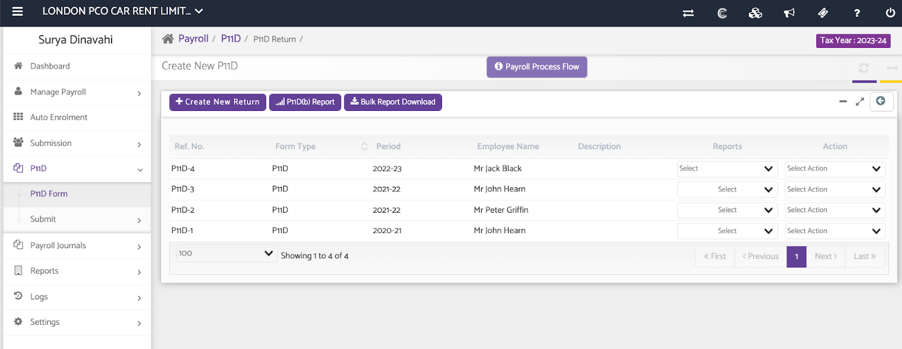
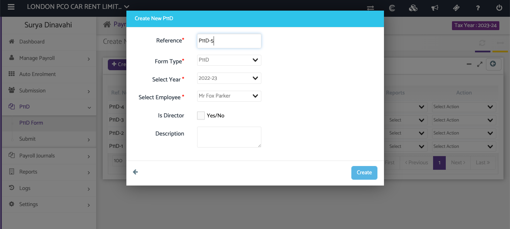
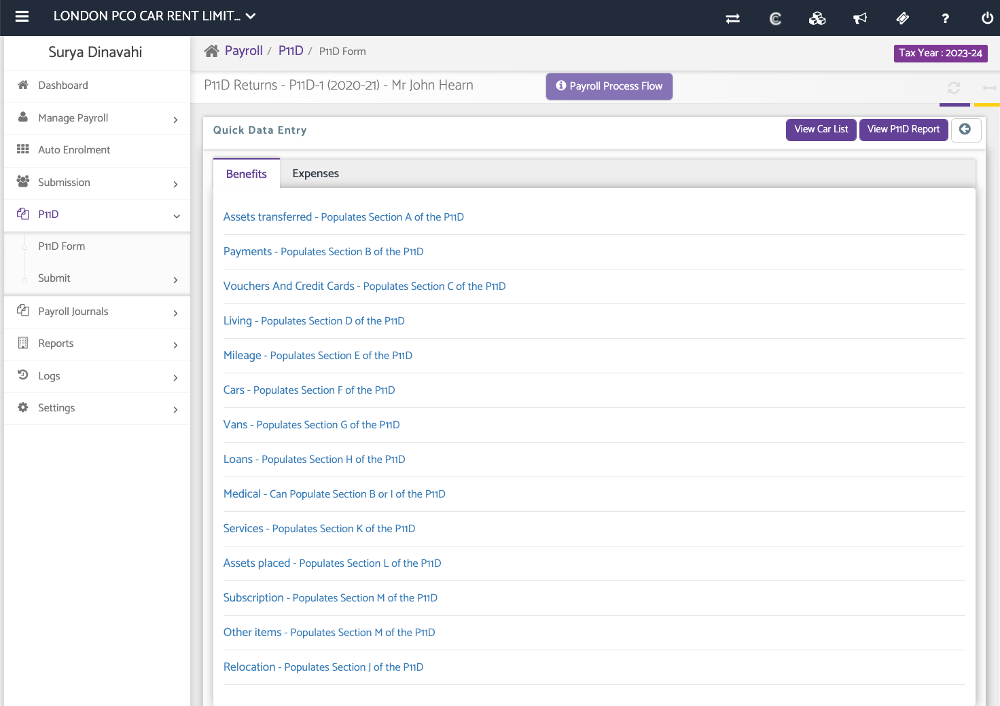
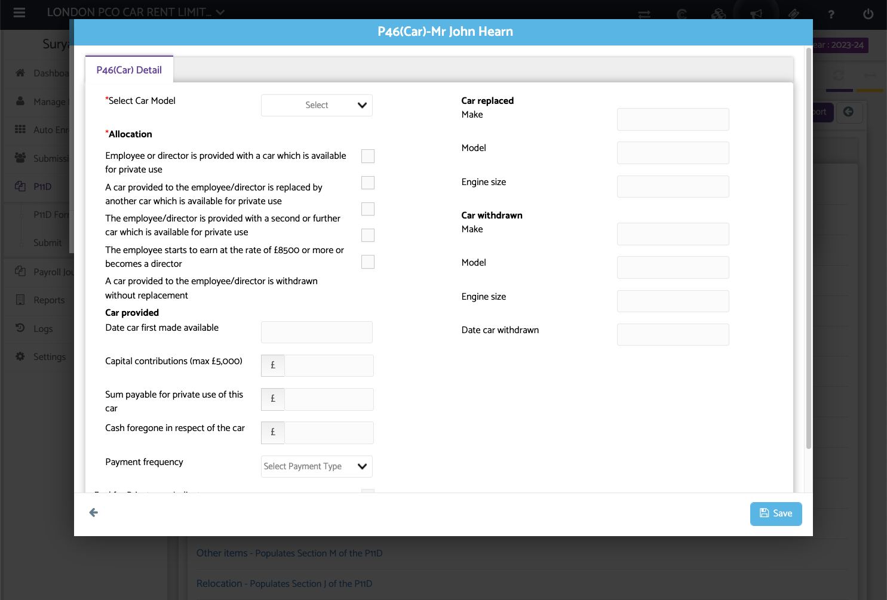
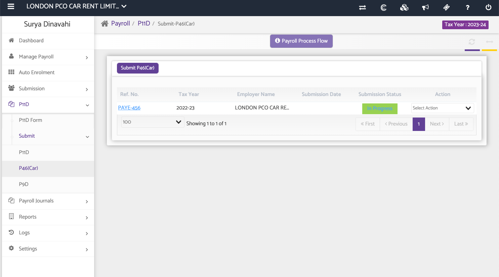
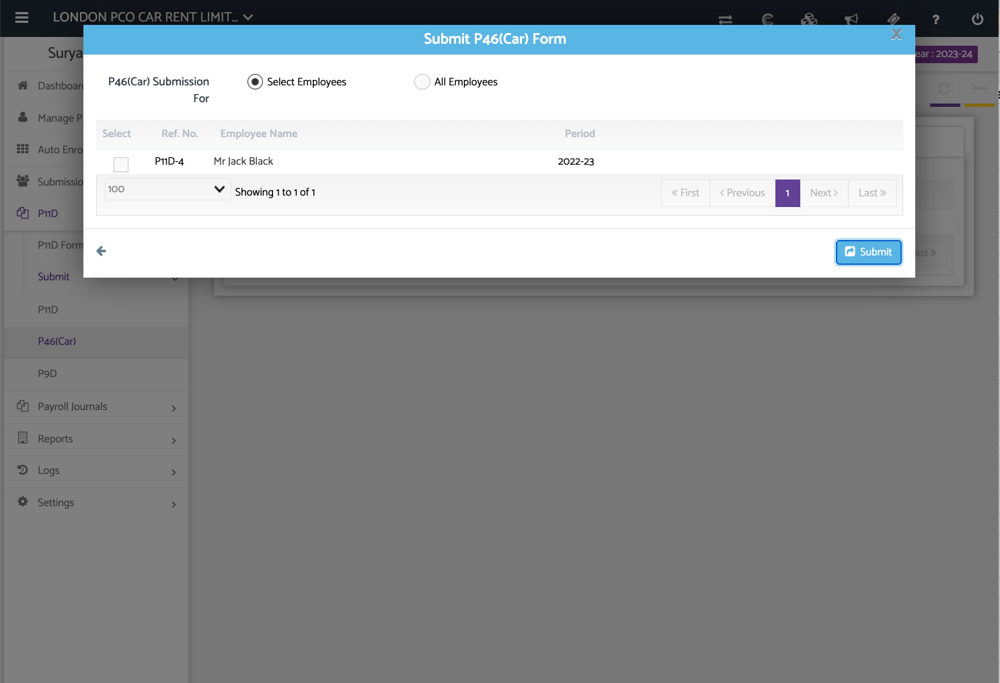
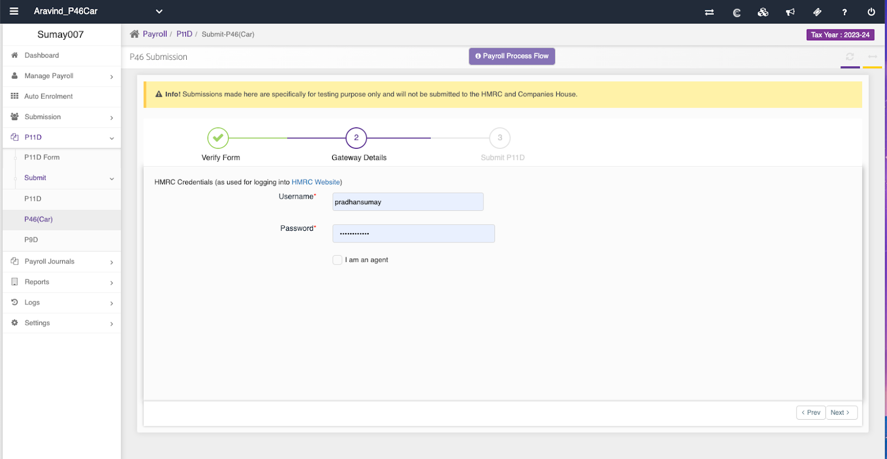

# How to generate P46 (Car) returns in Capium and submit to HMRC
	 	
			
			Print

- **Category:** Payroll
- **Folder:** Payroll Help Guide
- **Source URL:** [https://capium.freshdesk.com/support/solutions/articles/9000230659-how-to-generate-p46-car-returns-in-capium-and-submit-to-hmrc](https://capium.freshdesk.com/support/solutions/articles/9000230659-how-to-generate-p46-car-returns-in-capium-and-submit-to-hmrc)
- **Article ID:** 9000230659

## Content

Solution home 
		Payroll
		Payroll Help Guide

### How to generate P46 (Car) returns in Capium and submit to HMRC

			Print

	Modified on: Wed, 2 Aug, 2023 at  4:22 PM

		In this article we will be going through the process of generating a p46 car return for company cars provided to employees and how to submit the return to HMRC through Capium.

Please also see the video at the end of this article for a full tutorial on the P46 process.

Navigation: Payroll >>>P11d>>>Create new return

Help/Guide:

This guide will show you step by step how to generate a P46 car return and submit directly to HMRC.

1. Ensure you have already created the employee under ‘manage payroll’, if not the employee can be created first by navigating to that section and clicking on ‘Add employee’.

2. Navigate to the P11d benefit in kinds section (as seen below), and click on ‘create new return’ for the relevant employee and period and click ‘create’ once populated.

3) Navigate to the 'cars populates section F of the p11d' & click p46 (Cars). Now you can enter all the car details in the form regarding the usage of the car, the model number, date of availability and other relevant car details.

4) Once the car model and other car details have been entered and finalised, click ‘save’ as seen in the image below.

5) Then navigate to the P46 car section and you will see the populated p46. Click ‘submit p46 (car)’ and select the form which you will now see populated with the status of ‘in progress’.

Once you click the ‘submit p46’ button, you will see the P46 return you have generated which you can now select the checkbox next to the employee name and click ‘submit’.

You will then be brought to the 3 step process where you can verify the full HMRC p46 return form data before entering in your HMRC credentials on the 2nd page and finally submitting on the 3rd.

Finally, once submitted, you can change submission status from ‘In progress’ to submitted on the P11d main page by clicking on the ‘In progress’ button.

Please click on the video below to watch a full tutorial on the P46 process.

										Did you find it helpful?
								Yes
								No

Send feedback	Sorry we couldn't be helpful. Help us improve this article with your feedback.

## Screenshots & Diagrams (8)

