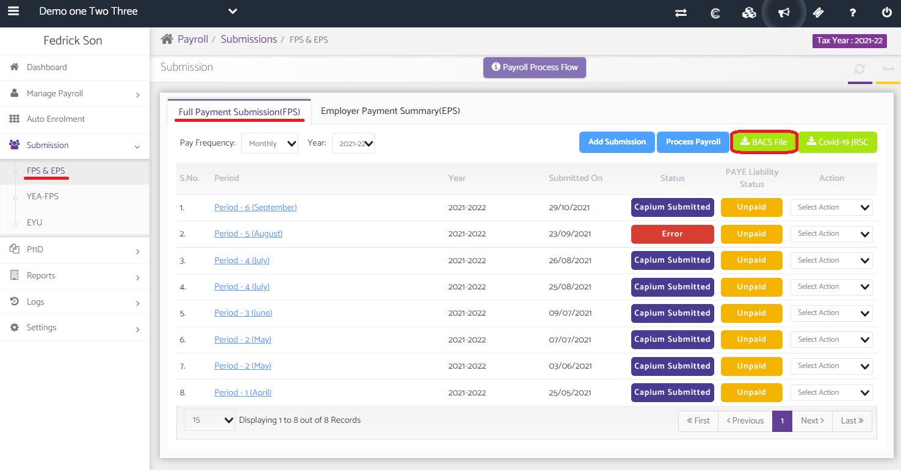

# How to setup and download a BACS file
	 	
			
			Print

- **Category:** Payroll
- **Folder:** Payroll FAQs
- **Source URL:** [https://capium.freshdesk.com/support/solutions/articles/9000236759-how-to-setup-and-download-a-bacs-file](https://capium.freshdesk.com/support/solutions/articles/9000236759-how-to-setup-and-download-a-bacs-file)
- **Article ID:** 9000236759

## Content

Solution home 
		Payroll
		Payroll FAQs

### How to setup and download a BACS file

			Print

	Modified on: Fri, 8 Mar, 2024 at 10:34 AM

Navigation: Payroll >> Select Client >>Manage Payroll>>Employees>>Action-Edit>> (5)Payment Details

Step 1:

You need to update the Payment Mode as "BACS(File)" in the Employee Profile before running the payroll for the employee.

Step 2: 

You need to update the BACS under the PAYE details for payment mode under the general settings.

Step3:

Navigation: Payroll >> Select Client >>Submissions >> FPS & EPS >> Full Payment Summary >> BACS File.

The BACS file can be downloaded after making the FPS submission to HMRC.

To download the file, click on 'BACS File'.

										Did you find it helpful?
								Yes
								No

Send feedback	Sorry we couldn't be helpful. Help us improve this article with your feedback.

## Screenshots & Diagrams (3)

