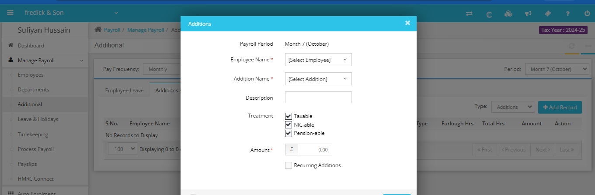
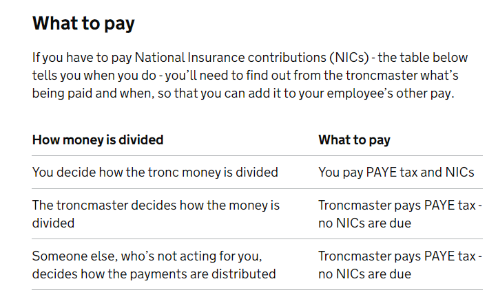

# Handling Additional Pay in Capium (Tronc/Tips/Bonuses)
	 	
			
			Print

- **Category:** Payroll
- **Folder:** Payroll FAQs
- **Source URL:** [https://capium.freshdesk.com/support/solutions/articles/9000246872-handling-additional-pay-in-capium-tronc-tips-bonuses-](https://capium.freshdesk.com/support/solutions/articles/9000246872-handling-additional-pay-in-capium-tronc-tips-bonuses-)
- **Article ID:** 9000246872

## Content

Solution home 
		Payroll
		Payroll FAQs

### Handling Additional Pay in Capium (Tronc/Tips/Bonuses)

			Print

	Modified on: Thu, 17 Oct, 2024 at 10:11 AM

		Capium’s payroll system includes an "Additional Pay" feature, which allows users to process various types of additional payments, such as bonuses, tips, or other forms of compensation.

Please  go Manage Payroll >> Additional >> Additions and Deductions >> Type >> Additions >> + Add Records

However, it’s important to use this feature carefully to ensure that the correct deductions are applied, especially in the case of allocated tips or "tronc" payments.

Key Considerations for Additional Pay:

When using the "Additional Pay" option, users must specify whether the additional payment is subject to tax, National Insurance (NIC), and pension contributions. This step is crucial, as employers are responsible for correctly deducting income tax on allocated tips before distributing them to employees.

Note: Allocated tips that are subject to income tax should not be subject to National Insurance, pensions, student loans, or attachment of earnings deductions.

The tronc payments can be treated as follows:

Currently, in Capium, the only available settings for "Additional Pay" allow users to exclude payments from National Insurance, pensions, and tax, but there is no specific option to exclude the payments from student loans or attachment of earnings deductions.

To ensure the correct handling of additional pay in Capium, it’s essential to verify the deductions applied to each type of payment. If allocated tips or other forms of additional pay should be excluded from student loans or attachment of earnings, manual adjustments may be required until a feature update addresses this gap.

We recommend reviewing each pay run carefully to ensure that all deductions are applied correctly and that you are compliant with HMRC regulations regarding tip allocations and other additional payments.

										Did you find it helpful?
								Yes
								No

Send feedback	Sorry we couldn't be helpful. Help us improve this article with your feedback.

## Screenshots & Diagrams (2)

