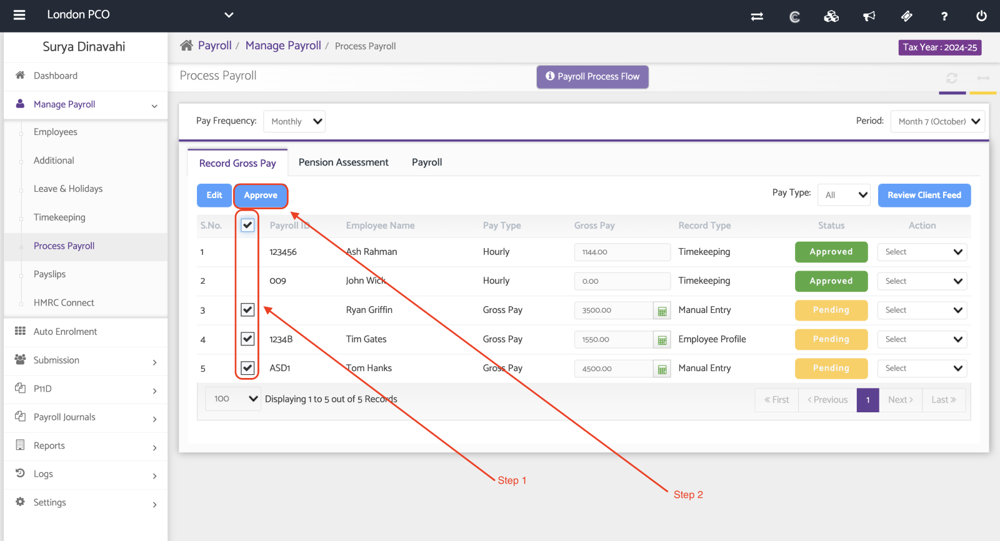
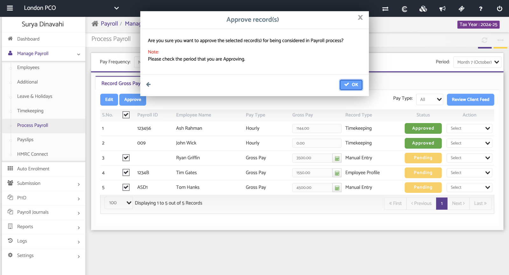
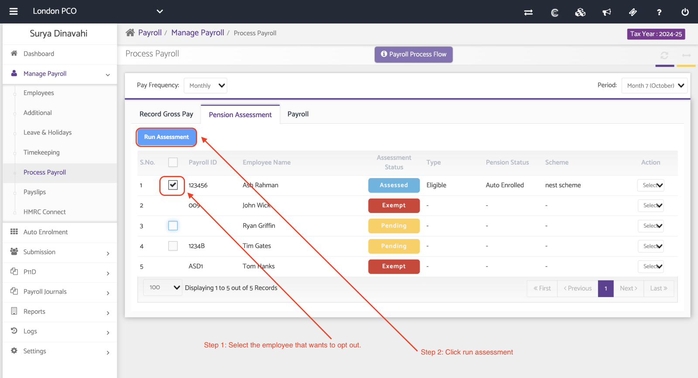
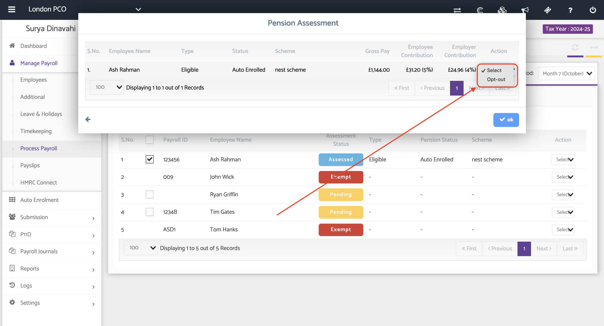
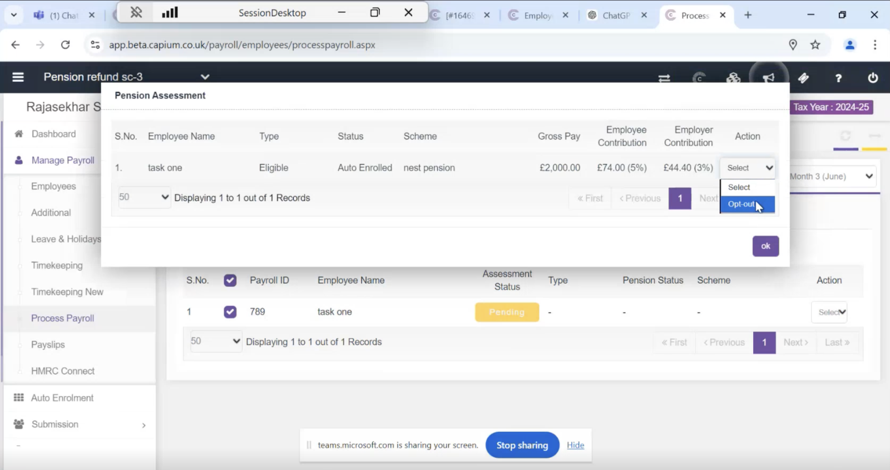
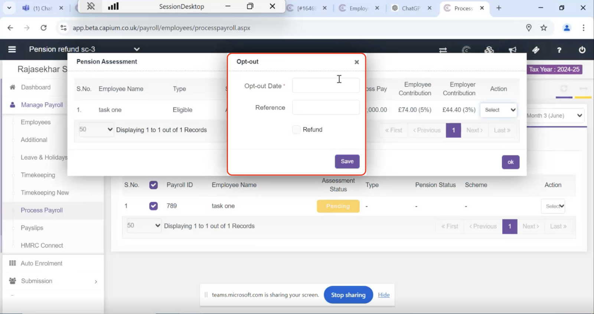

# Opting out of the payroll auto-enrolment
	 	
			
			Print

- **Category:** Payroll
- **Folder:** Payroll Help Guide
- **Source URL:** [https://capium.freshdesk.com/support/solutions/articles/9000258776-opting-out-of-the-payroll-auto-enrolment](https://capium.freshdesk.com/support/solutions/articles/9000258776-opting-out-of-the-payroll-auto-enrolment)
- **Article ID:** 9000258776

## Content

Solution home 
		Payroll
		Payroll Help Guide

### Opting out of the payroll auto-enrolment

			Print

	Modified on: Wed, 6 May, 2026 at 10:32 AM

Location: 

Payroll > Select a client > Manage Payroll> Process Payroll 

Alternatively, please click on this link to be redirected.   You can opt an employee out of their pension scheme during payroll processing by following these steps: 

Approve Gross Pay 

Select the Employee > From the employee list, choose the employee who wishes to opt out of the pension scheme. 

Click ok to approve the records. 

Please refer the below Screenshot 

Navigate > Pension Assessment  

Select the Employee > From the employee list, choose the employee who wishes to opt out of the pension scheme.  

Click Run Assessment. 

In the action dropdown menu, choose the "Opt-Out" option. 

This will reset the pension contributions made by both the employee and employer to zero. 

Please refer the below Screenshot 

From the list of the employees, please choose the employee you need to opt-out.  

Select the action button on the right-hand side and click on Opt-out, you will then be able to enter the Opt-out Date and the reference. 

You can then click on the Refund check box and the system will auto update the refund amount. 

										Did you find it helpful?
								Yes
								No

Send feedback	Sorry we couldn't be helpful. Help us improve this article with your feedback.

## Screenshots & Diagrams (6)

