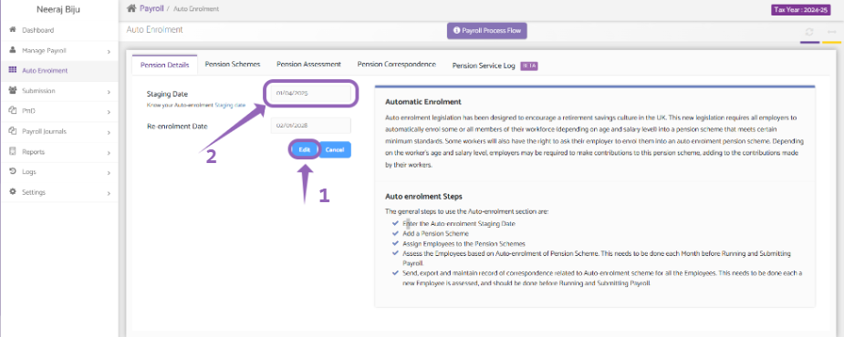
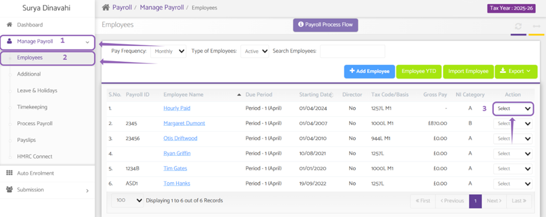
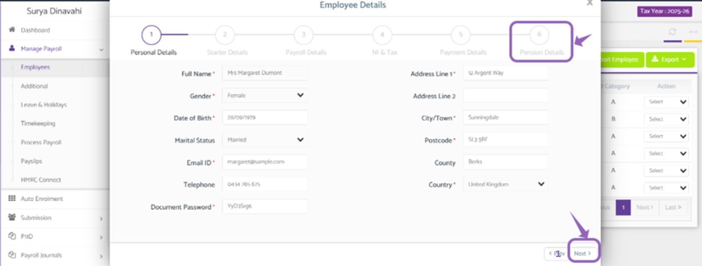
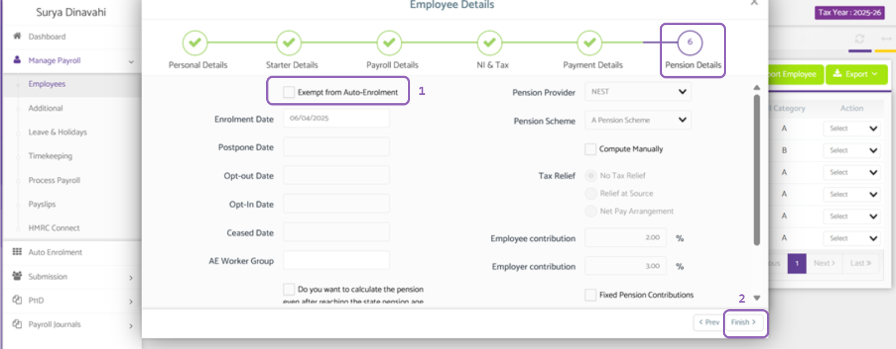

# How to make an employee exempt from Pension/Auto-Enrolment
	 	
			
			Print

- **Category:** Payroll
- **Folder:** Payroll FAQs
- **Source URL:** [https://capium.freshdesk.com/support/solutions/articles/9000267980-how-to-make-an-employee-exempt-from-pension-auto-enrolment](https://capium.freshdesk.com/support/solutions/articles/9000267980-how-to-make-an-employee-exempt-from-pension-auto-enrolment)
- **Article ID:** 9000267980

## Content

Solution home 
		Payroll
		Payroll FAQs

### How to make an employee exempt from Pension/Auto-Enrolment

			Print

	Modified on: Thu, 8 May, 2025 at 10:37 AM

		Welcome to this quick guide on how to make an employee exempt from Pension/Auto-Enrolment. This guide will walk you through the essential steps.

Auto-Enrolment

Navigation: Payroll > Client Specific > Auto-Enrolment > Pension Details

Firstly, make sure the ‘Staging Date’ is not set in the future. Make sure it’s recent date within the current month.

To edit the Staging Date click on 'Edit' and you will be able to make the necessary changes. 

Now you have updated the Staging Date navigate to Manage Payroll > Employees

Manage Payroll

Navigation: Payroll > Client Specific > Manage Payroll > Employees 

Once you're on the Employees page:

 - Click on the action drop down button, click 'Edit' for that specific employee.

 - You will now see a pop up with ‘Employee Details’, navigate to tab 6 'Pension Details’.

Now click on ‘Exempt from Auto-Enrolment’.

This Employee is now exempt from Auto-Enrolment.

										Did you find it helpful?
								Yes
								No

Send feedback	Sorry we couldn't be helpful. Help us improve this article with your feedback.

## Screenshots & Diagrams (4)

