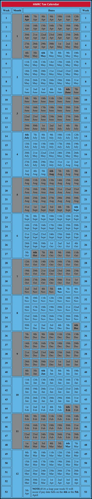

# Weekly Payroll -  HMRC &amp; Capium
	 	
			
			Print

- **Category:** Payroll
- **Folder:** Payroll FAQs
- **Source URL:** [https://capium.freshdesk.com/support/solutions/articles/9000267994-weekly-payroll-hmrc-capium](https://capium.freshdesk.com/support/solutions/articles/9000267994-weekly-payroll-hmrc-capium)
- **Article ID:** 9000267994

## Content

Solution home 
		Payroll
		Payroll FAQs

### Weekly Payroll -  HMRC & Capium

			Print

	Modified on: Fri, 2 May, 2025 at  4:15 PM

HMRC (Her Majesty’s Revenue and Customs) use their tax calendar to break payroll dates into tax weeks/months. This calendar is fixed and does not change year on year. The tax week/month is always based on the pay date for the period, eg. when the employee actually gets their pay.

• Tax Months always start on the 6th and run to the following 5th eg. Tax Month 1 – 6th April – 5th May

• Tax week 1 starts on the 6th April and runs to 12th April, subsequent weeks run on from that date.

Capium's weekly payroll is fixed in line with the first week being the 6th April and to the 12th April.

										Did you find it helpful?
								Yes
								No

Send feedback	Sorry we couldn't be helpful. Help us improve this article with your feedback.

## Screenshots & Diagrams (1)

