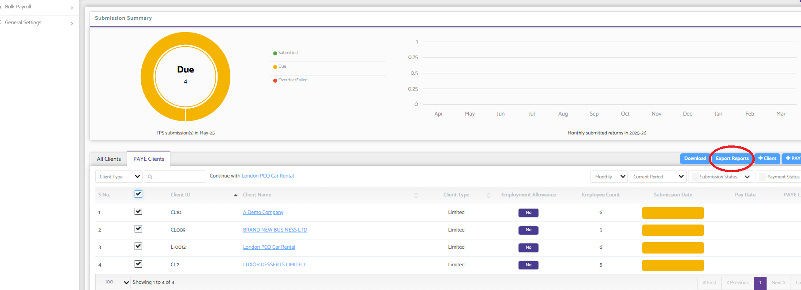
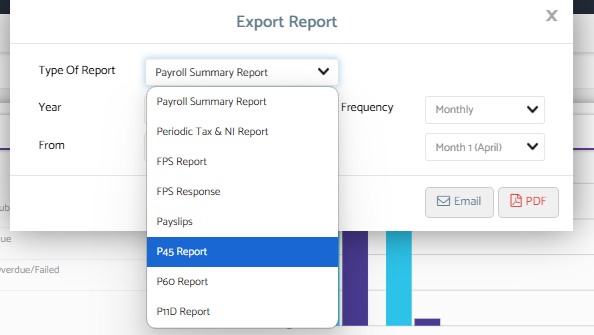

# Downloading Payroll reports for Multiple clients - via PDF or email
	 	
			
			Print

- **Category:** Payroll
- **Folder:** Payroll Help Guide
- **Source URL:** [https://capium.freshdesk.com/support/solutions/articles/9000268352-downloading-payroll-reports-for-multiple-clients-via-pdf-or-email](https://capium.freshdesk.com/support/solutions/articles/9000268352-downloading-payroll-reports-for-multiple-clients-via-pdf-or-email)
- **Article ID:** 9000268352

## Content

Solution home 
		Payroll
		Payroll Help Guide

### Downloading Payroll reports for Multiple clients - via PDF or email

			Print

	Modified on: Fri, 16 May, 2025 at  4:05 PM

		You can easily download various payroll reports and documents in bulk across multiple clients by following the steps below:

Go to the Main Payroll DashboardNavigate to the Payroll section from your main dashboard.

Click on ‘PAYE Clients’This will display a list of your payroll clients.

Apply FiltersUse the available filters to specify the criteria for the report you need — for example, tax period, client group, or report type.

Export the ReportClick on Export Report, then select the specific report or document you wish to download (e.g., payslips, P32s, or payroll summaries).

Choose Download MethodYou can either:

Download the files in PDF format (they’ll be packaged into a ZIP file), or

Opt to receive them via email.

This feature is ideal for saving time when handling reports for multiple clients at once.

										Did you find it helpful?
								Yes
								No

Send feedback	Sorry we couldn't be helpful. Help us improve this article with your feedback.

## Screenshots & Diagrams (2)

