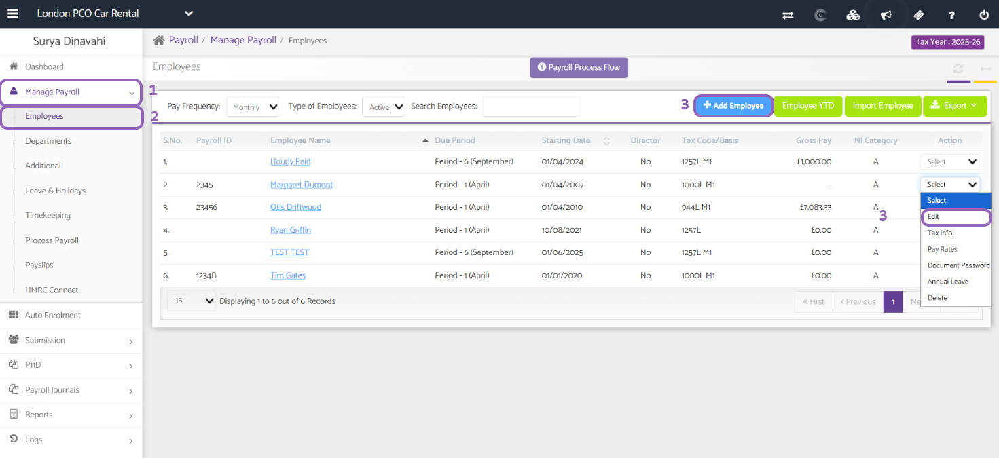
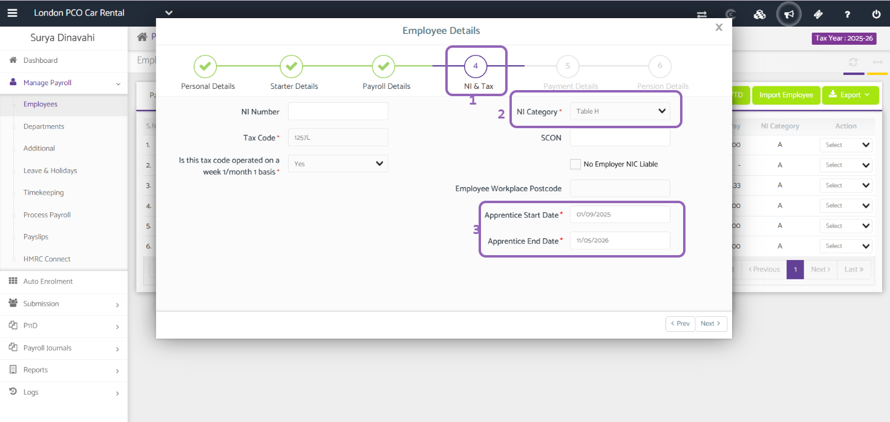
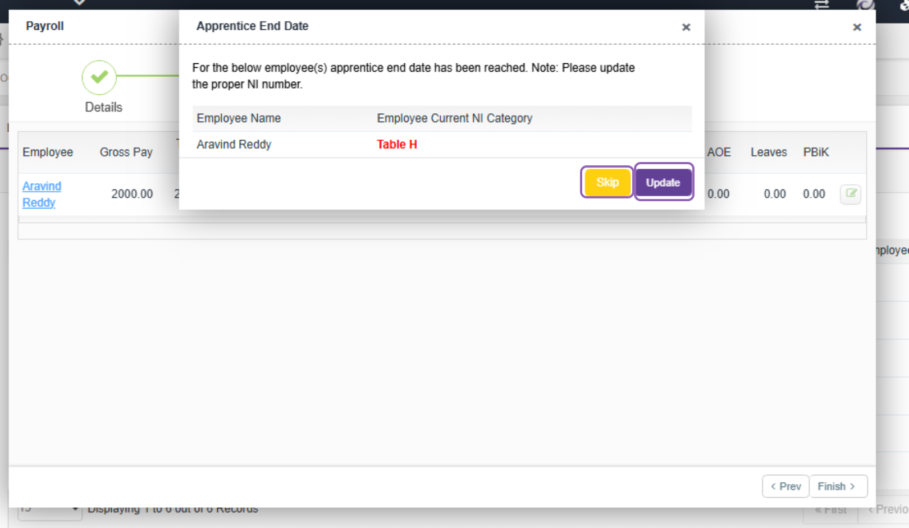

# Apprentice Start and End Date
	 	
			
			Print

- **Category:** Payroll
- **Folder:** Payroll Help Guide
- **Source URL:** [https://capium.freshdesk.com/support/solutions/articles/9000271044-apprentice-start-and-end-date](https://capium.freshdesk.com/support/solutions/articles/9000271044-apprentice-start-and-end-date)
- **Article ID:** 9000271044

## Content

Solution home 
		Payroll
		Payroll Help Guide

### Apprentice Start and End Date

			Print

	Modified on: Wed, 10 Sep, 2025 at  3:18 PM

		Welcome to this quick guide on how to input the Apprentice Start and Apprentice End Dates. This guide will outline the essential steps for you.

Apprentice Start and End Date

Navigation: Payroll > Manage Payroll > Employees

There are two ways to enter the Apprentice Start and Apprentice End Dates. You can either modify the details of an existing employee to add this information or create a new employee and provide the required details during the setup process.

This will direct you to the Employee Details tab. From there, navigate to Page 4: NI & TAX.

The initial step on this page is to adjust the NI Category to Table H.

You can now proceed to enter the Apprentice Start and Apprentice End Dates.

When the apprentice end date is reached, a pop-up will appear. You can select Update to change the employee’s NI Category, or choose Skip if you’d prefer not to update and continue running payroll.

										Did you find it helpful?
								Yes
								No

Send feedback	Sorry we couldn't be helpful. Help us improve this article with your feedback.

## Screenshots & Diagrams (3)

