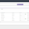
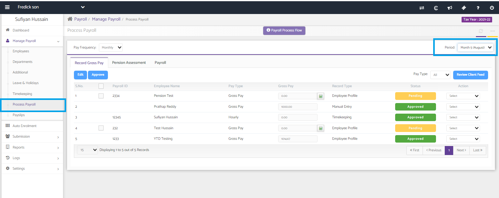

# Payroll - Employee not found
	 	
			
			Print

- **Category:** Payroll
- **Folder:** Payroll Help Guide
- **Source URL:** [https://capium.freshdesk.com/support/solutions/articles/9000271415-payroll-employee-not-found](https://capium.freshdesk.com/support/solutions/articles/9000271415-payroll-employee-not-found)
- **Article ID:** 9000271415

## Content

Solution home 
		Payroll
		Payroll Help Guide

### Payroll - Employee not found

			Print

	Modified on: Thu, 2 Oct, 2025 at  3:57 PM

		Title: Payroll - Employee not found

If you are encountering an issue where an employee is not found in the payroll system, there are a few steps you can take to resolve the issue:

1. Review the employee's record: Check to ensure that the employee's information is accurately entered into the payroll system.

2. Check for approval of gross pay: If the employee's record gross pay for the respective month has not been approved, this could be the source of the issue. To resolve this, navigate to Manage Payroll >> Process Payroll >> Record Gross Pay >> Period >> Month and approve the gross pay for the employee. (Please refer to the attached document for detailed instructions)

3. Run the payroll again: Once you have approved the gross pay for the employee, attempt to run the payroll again. If you encounter any difficulties.

By following these steps, you should be able to resolve the issue of an employee not being found in the payroll system.

		Payroll Mont... (104 KB) 

										Did you find it helpful?
								Yes
								No

Send feedback	Sorry we couldn't be helpful. Help us improve this article with your feedback.

## Screenshots & Diagrams (2)

