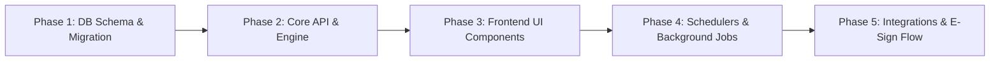

# Capium Practice Management - পূর্ণাঙ্গ মডিউল অ্যানালাইসিস ও Sansuite ইমপ্লিমেন্টেশন মাস্টার রিপোর্ট

## নির্বাহী সারাংশ (Executive Summary)

Capium Practice Management হলো একটি ক্লাউড-ভিত্তিক প্র্যাকটিস ম্যানেজমেন্ট ইকোসিস্টেম যা মূলত ইউকে-ভিত্তিক চার্টার্ড একাউন্ট্যান্ট, বুককিপার এবং ট্যাক্স অ্যাডভাইজারদের ফার্মের সার্বিক অপারেশন পরিচালনা করার জন্য ডিজাইন করা হয়েছে। 

এই অ্যানালাইসিসে Freshdesk নলেজবেসের ক্যাটাগরি **9000115348** এর অধীনে থাকা **Practice Management Help Guide** (৫০টি আর্টিকেল) এবং **Practice Management FAQs** (১৫টি আর্টিকেল) সহ সর্বমোট **৬৫টি আর্টিকেল**, সংশ্লিষ্ট সকল বিজনেস লজিক, ওয়ার্কফ্লো এবং স্ক্রিনশট পুঙ্খানুপুঙ্খভাবে বিশ্লেষণ করা হয়েছে।

আমাদের **sansuite** প্রজেক্টে এই মডিউলটি সম্পূর্ণভাবে অ্যাড এবং স্বয়ংক্রিয় করার লক্ষ্যে এই রিপোর্টে সমস্ত ফিচার, ডেটাবেজ মডেল, স্ক্রিন লেআউট, ব্যাকগ্রাউন্ড শিডিউলার এবং এপিআই ডিজাইন অন্তর্ভুক্ত করা হয়েছে।

---

## ১. সংগৃহীত ডেটাসেট ও রিসোর্স পরিসংখ্যান

| রিসোর্স টাইপ | সংখ্যা | স্টোরেজ লোকেশন | বিবরণ |
| :--- | :--- | :--- | :--- |
| সর্বমোট আর্টিকেলের সংখ্যা | **৬৫ টি** | `d:/sansuite/raw_articles/` | প্রতিটি আর্টিকেলের র' মার্কডাউন ও স্ট্রাকচার্ড JSON |
| ফুল ডেটাসেট ইনডেক্স | **১ টি** | `d:/sansuite/capium_pm_full_dataset.json` | সকল আর্টিকেলের মেটাডেটা ও কন্টেন্ট সমন্বিত JSON |
| ইউজার ইন্টারফেস স্ক্রিনশট | **৬১ টি ফোল্ডার** | `d:/sansuite/images/` | প্রতিটি ফিচারের অরিজিনাল UI স্ক্রিনশট ও ডায়াগ্রাম |
| টেকনিক্যাল আর্কিটেকচার ডকস | **৫ টি ডক** | `d:/sansuite/docs/` | ডেটা মডেল, এপিআই, UI/UX ও ইনডেক্স গাইড |

---

## ২. প্র্যাকটিস ম্যানেজমেন্ট মডিউলের মূল আর্কিটেকচারাল সাব-সিস্টেম (১৩টি কোর পিলার)

Capium Practice Management মডিউলটি নিম্নলিখিত ১৩টি মূল কার্যকরী স্তম্ভের (Functional Pillars) ওপর প্রতিষ্ঠিত:

```
+---------------------------------------------------------------------------------------------------+
|                                  SANSUITE PRACTICE MANAGEMENT HUB                                 |
+---------------------------------------------------------------------------------------------------+
| 1. Dashboard & Analytics      | 2. Client Management (CRM)   | 3. Services & Custom Workflows     |
| 4. Statutory Deadlines Engine | 5. Tasks & Scheduling Planner| 6. Unified Email Conversations & SMS|
| 7. Document Hub & Chasing     | 8. Proposals & LoE (Capisign)| 9. HMRC 64-8 & AML Compliance     |
| 10. Time Tracking & Timesheet | 11. Invoicing & Fee Billing  | 12. Team & Role Access Control     |
| 13. Reports & Audit Trail     |                              |                                    |
+---------------------------------------------------------------------------------------------------+
```

---

## ৩. বিস্তারিত সাব-মডিউল অ্যানালাইসিস ও ফিচার স্পেসিফিকেশন

### ৩.১. ড্যাশবোর্ড ও রিয়েল-টাইম অ্যানালিটিক্স (Dashboard & Real-Time Analytics)
- **উদ্দেশ্য:** ফার্মের ক্লায়েন্ট, ডেডলাইন, টাস্ক এবং টিম পারফরম্যান্সের সামগ্রিক ওভারভিউ রিয়েল-টাইমে প্রদর্শন করা।
- **ফিচার তালিকা:**
  - **KPI Cards:** টোটাল ক্লায়েন্ট সংখ্যা, বিগত ৩০ দিনে নতুন ক্লায়েন্ট, চলতি সপ্তাহে ডিউ ডেডলাইন, ওভারডিউ (Overdue) ডেডলাইনের সংখ্যা।
  - **Deadlines by Status Interactive Chart:** একটি ইন্টারেক্টিভ ডোনাট/বার চার্ট যা Due, Overdue এবং Submitted ডেডলাইন প্রদর্শন করে। যেকোনো অংশে ক্লিক করলে সংশ্লিষ্ট ডেডলাইন ফিল্টার হয়ে যায়।
  - **Tasks by Priority Chart:** হাই, মিডিয়াম এবং লো প্রায়োরিটি টাস্কের গ্রাফিক্যাল ডিসপ্লে।
  - **Team Member Task Distribution:** প্রতি স্টাফের আন্ডারে কতটি টাস্ক পেন্ডিং আছে তার হিসাব এবং সার্ভিস অনুযায়ী ফিল্টারিং।
  - **Recent Activity Stream:** চলতি সপ্তাহ এবং চলতি মাসের ফার্মের সমস্ত কার্যকলাপের লাইভ অডিট লগ।

---

### ৩.২. ক্লায়েন্ট ম্যানেজমেন্ট ও সিআরএম (Client Management & CRM)
- **উদ্দেশ্য:** ফার্মের সমস্ত ক্লায়েন্ট (লিমিটেড কোম্পানি, সোল ট্রেডার, পার্টনারশিপ, ইন্ডিভিজুয়াল ইত্যাদি) এবং প্রসপেক্টদের সেন্ট্রালাইজড রেকর্ড রাখা।
- **ফিচার তালিকা:**
  - **সাপোর্টেড ক্লায়েন্ট টাইপ:** Limited Company, Sole Trader, Partnership, LLP, Individual, Trust, Charity.
  - **Quick Add & Manual Onboarding:** দ্রুত ক্লায়েন্ট এন্ট্রি ফর্ম এবং মাল্টি-ট্যাব বিস্তারিত প্রোফাইল।
  - **Client 360-Degree Profile:**
    - *Overview:* কোম্পানি নম্বর, UTR, VAT Reg No, ইনকর্পোরেশন ডেট, রেজিস্টার্ড ঠিকানা।
    - *Services:* অ্যাসাইনকৃত সার্ভিস ও ফি।
    - *Deadlines:* কমপ্লায়েন্স ও ফাইলিং ডেটলাইন।
    - *Timeline:* ইমেইল, নোটস, কল লগ, মিটিং হিস্ট্রি। নোটে "Pin to Top" অপশন।
    - *Documents:* ভার্চুয়াল ফোল্ডার ট্রি ও ফাইল আপলোড।
  - **Onboarding Checklist & AML Checks:** অ্যান্টি-মানি লন্ডারিং (AML) ভেরিফিকেশন, আইডি প্রুফ, রিস্ক লেভেল অ্যাসেসমেন্ট (Low/Medium/High)।
  - **Global Custom Fields:** ফার্ম অ্যাডমিন কর্তৃক ডাইনামিক ফিল্ড তৈরির সুবিধা (Text, Date, Dropdown, Number)।
  - **Client Status Lifecycle:** Prospect -> Active -> Inactive -> Archived -> Reactivated.

---

### ৩.৩. সার্ভিসেস ও ওয়ার্কফ্লো কনফিগারেশন (Services & Workflow Steps)
- **উদ্দেশ্য:** ফার্ম যেসব সেবা প্রদান করে সেগুলোর স্ট্যান্ডার্ড ও কাস্টম ওয়ার্কফ্লো এবং ফি ম্যানেজ করা।
- **স্ট্যান্ডার্ড সার্ভিসেস:**
  - Accounts Production (Companies House & HMRC Annual Accounts)
  - Corporation Tax (CT600)
  - Self Assessment Tax Return (SA100)
  - VAT Returns (Quarterly / Monthly / MTD)
  - Confirmation Statement (CS01)
  - Payroll & Pension Auto-Enrolment
  - Bookkeeping & Management Accounts
  - Making Tax Digital for Income Tax (MTD IT)
- **কাস্টম ওয়ার্কফ্লো সাব-স্টেপস:** প্রতিটি সার্ভিসের জন্য সাব-স্টেপ (যেমন: ডকুমেন্ট রিকোয়েস্ট -> ট্রানজ্যাকশন রিকনসিলিয়েশন -> ড্রাফট তৈরি -> ম্যানেজার রিভিউ -> ক্লায়েন্ট ই-সাইনিং -> সাবমিশন) তৈরি ও অটোমেট করার সুবিধা।
- **ফি ও বিলিং ফ্রিকোয়েন্সি:** ফিক্সড ফি, মান্থলি রিটেইনার, আওয়ার্লি রেট এবং ওয়ান-অফ প্রজেক্ট ফি।

---

### ৩.৪. ডেডলাইন ও কমপ্লায়েন্স ইঞ্জিন (Statutory Deadlines & Compliance Engine)
- **উদ্দেশ্য:** ইউকে কোম্পানিজ হাউস এবং HMRC এর সকল লিগ্যাল ফাইলিং ডেডলাইন স্বয়ংক্রিয়ভাবে ক্যালকুলেট ও ট্র্যাকিং করা।
- **ডেডলাইন রুলস ও লজিক:**
  - **Accounts Filing:** একাউন্টিং পিরিয়ড শেষ হওয়ার ৯ মাস পর।
  - **CT600 Return:** একাউন্টিং পিরিয়ড শেষ হওয়ার ১২ মাস পর (ট্যাক্স পেমেন্ট ডেট ৯ মাস ১ দিন)।
  - **VAT Return:** ভ্যাট কোয়ার্টার শেষ হওয়ার ১ মাস ৭ দিন পর।
  - **Confirmation Statement:** রিভিউ পিরিয়ডের ১৪ দিন পর।
  - **Self Assessment:** ট্যাক্স বছর শেষের পরবর্তী ৩১শে জানুয়ারি (অনলাইন)।
- **Deadline Refresh Engine:** স্বয়ংক্রিয় এবং ম্যানুয়াল "Refresh Deadlines" ফিচার যা নতুন একাউন্টিং/ভ্যাট পিরিয়ড রোল-ফরোয়ার্ড করে এবং পরবর্তী ডেডলাইন জেনারেট করে।
- **Submissions Summary:** কোম্পানিজ হাউস এবং HMRC-তে সাবমিট করা রিটার্নসমূহের রিসিপ্ট রেফারেন্স এবং সাবমিশন ট্র্যাকার।

---

### ৩.৫. টাস্ক ও ক্যালেন্ডার শিডিউলিং (Tasks & Calendar Scheduling)
- **উদ্দেশ্য:** স্টাফদের কাজের বণ্টন, টাস্ক ডেলিগেশন এবং শিডিউলিং নিশ্চিত করা।
- **ফিচার তালিকা:**
  - টাস্ক ক্রিয়েশন (ক্লায়েন্ট, সার্ভিস অথবা ডেডলাইনের সাথে লিংকড)।
  - প্রায়োরিটি লেভেলস (Urgent, High, Medium, Low)।
  - টাস্ক সাব-স্টেপ চেকলিস্ট ও প্রোগ্রেস বার।
  - গুগল ক্যালেন্ডার ও মাইক্রোসফট আউটলুক/অফিস ৩৬৫ টু-ওয়ে সিঙ্ক।
  - ফার্মের ভিজিবল ক্যালেন্ডার ভিউ (Day, Week, Month)।

---

### ৩.৬. কমিউনিকেশন, ইমেইল ইনবক্স ও এসএমএস (Conversations & Reminders)
- **উদ্দেশ্য:** ক্লায়েন্টদের সাথে ফার্মের সমস্ত যোগাযোগ সেন্ট্রালাইজড রাখা।
- **ফিচার তালিকা:**
  - **Conversations (Email Sync):** জিমেইল বা অফিস ৩৬৫ এর মাধ্যমে ইমেইল ইনবক্স সিঙ্ক করা এবং ক্লায়েন্ট ইমেইল অ্যাড্রেস অনুযায়ী টাইমলাইনে অটো-ট্যাগ করা।
  - **Custom Email Signature:** প্রতি ইউজারের জন্য আলাদা এইচটিএমএল সিগনেচার।
  - **Automated Deadline Reminders:** ডেডলাইনের পূর্বে স্বয়ংক্রিয় ইমেইল ও এসএমএস নোটিফিকেশন (যেমন: ৩০ দিন, ১৪ দিন, ৭ দিন আগে)।
  - **Bulk Emailing with Tagging:** ক্লায়েন্ট টাইপ, অ্যাসাইনড সার্ভিস অথবা কাস্টম ট্যাগ অনুযায়ী গ্রুপ ইমেইল সেন্ড করা।
  - **SMS Gateway Integration:** ফার্মের কাস্টম Sender ID দিয়ে ক্লায়েন্টকে সরাসরি এসএমএস পাঠানো।

---

### ৩.৭. ডকুমেন্ট হাব ও ডকুমেন্ট রিকোয়েস্ট চেজার (Document Hub & Request Chaser)
- **উদ্দেশ্য:** ক্লায়েন্টদের ফাইল ও তথ্যাদি নিরাপদে সংরক্ষণ ও আদান-প্রদান করা।
- **ফিচার তালিকা:**
  - ক্লায়েন্ট-ভিত্তিক ভার্চুয়াল ফোল্ডার ট্রি (যেমন: `/2026/Accounts/`, `/2026/VAT/`)।
  - ড্র্যাগ-অ্যান্ড-ড্রপ বাল্ক আপলোড।
  - **Document Request Chaser:** ক্লায়েন্টের কাছে প্রয়োজনীয় কাগজের তালিকা (যেমন: ব্যাংক স্টেটমেন্ট, সেলস ইনভয়েস ইত্যাদি) রিকোয়েস্ট আকারে পাঠানো এবং আপলোড না করা পর্যন্ত স্বয়ংক্রিয় রিমাইন্ডার পাঠানো।
  - রেসপন্সিভ ক্লায়েন্ট আপলোড পোর্টাল।

---

### ৩.৮. প্রপোজাল, লেটার অব এনগেজমেন্ট ও ই-সাইনিং (Proposals, LoE & Capisign)
- **উদ্দেশ্য:** নতুন প্রসপেক্ট এবং বিদ্যমান ক্লায়েন্টদের লিগ্যাল এনগেজমেন্ট লেটার ও ফি প্রপোজাল তৈরি, পাঠানো এবং ডিজিটাল সিগনেচার গ্রহণ করা।
- **ফিচার তালিকা:**
  - **Template Designer:** হেডার, ফুটার, ফার্ম লোগো, টার্মস ও ডায়নামিক মার্জ ট্যাগ (`{{client_name}}`, `{{services_list}}`, `{{agreed_fee}}`) সহ টেমপ্লেট মেকার।
  - **Capisign E-Signing Portal:** ক্লায়েন্ট ডিভাইসে (মোবাইল/ডেস্কটপ) সাইনিং লিঙ্ক ওপেন করে ড্রয়িং বা টাইপ করে সিগনেচার করতে পারে।
  - **Audit Trail Certificate:** সাইনারের আইপি অ্যাড্রেস, টাইমস্ট্যাম্প, ইমেইল, ব্রাউজার ইউজার এজেন্ট এবং ডকুমেন্টের SHA-256 ক্রিপ্টোগ্রাফিক হ্যাশ সমৃদ্ধ সাইন্ড সার্টিফিকেট।
  - প্রসপেক্ট সাইন করার সাথে সাথে স্বয়ংক্রিয়ভাবে একটিভ ক্লায়েন্টে রূপান্তর।

---

### ৩.৯. এইচএমআরসি অথরাইজেশন (64-8) ও রেগুলেটরি কমপ্লায়েন্স
- **উদ্দেশ্য:** HMRC এজেন্সির জন্য ফার্মকে ট্যাক্স এজেন্ট হিসেবে অনুমোদন দেয়া।
- **ফিচার তালিকা:**
  - স্ট্যান্ডার্ড HMRC ফর্ম **64-8** জেনারেশন (Individual, Partnership & Corporate)।
  - অনলাইন অথরাইজেশন রিকোয়েস্ট ট্র্যাকিং এবং পেপার প্রিন্ট/সাইন ওয়ার্কফ্লো।

---

### ৩.১০. টাইম ট্র্যাকিং ও টাইমশিট (Time Tracking & Timesheets)
- **উদ্দেশ্য:** স্টাফদের বিলযোগ্য ও অবিলযোগ্য সময়ের সঠিক হিসাব রাখা।
- **ফিচার তালিকা:**
  - **Live Timer:** ক্লায়েন্ট ও সার্ভিস সিলেক্ট করে স্টপওয়াচ টাইমার চালানো।
  - **Manual Logging:** ঘণ্টা, মিনিট, আওয়ার্লি রেট এবং কাজের বিবরণ ম্যানুয়ালি ইনপুট দেওয়া।
  - **Timesheets Matrix:** সাপ্তাহিক ও মাসিক টাইমশিট গ্রিড এবং ওয়ান-ক্লিক ইনভয়েস জেনারেশন।

---

### ৩.১১. ইনভয়েসিং ও বিলিং ইঞ্জিন (Invoicing & Fee Billing)
- **উদ্দেশ্য:** সার্ভিস ফি এবং টাইমশিটের ভিত্তিতে ক্লায়েন্টদের ইনভয়েস ইস্যু করা।
- **ফিচার তালিকা:**
  - প্র্যাকটিস ব্যাংক ডিটেইলস (Account Number, Sort Code, IBAN) সহ ইনভয়েস টেমপ্লেট।
  - ফিক্সড সার্ভিস ফি এবং টাইমসশীট ডব্লিউআইপি (WIP) থেকে অটোমেটিক ইনভয়েস জেনারেট।
  - ইনভয়েস পিডিএফ তৈরি ও ক্লায়েন্টকে সরাসরি ইমেইলে প্রেরণ।

---

### ৩.১২. টিম মেম্বার, রোলস ও পারমিশন কন্ট্রোল (Staff & Role Access)
- **উদ্দেশ্য:** ফার্মের টিম মেম্বারদের রোল ভিত্তিক পারমিশন ও কাজের পরিধি নির্ধারণ করা।
- **ফিচার তালিকা:**
  - রোলস: Administrator, Partner, Practice Manager, Senior Accountant, Junior Staff.
  - **Visible Manager:** নির্দিষ্ট ক্লায়েন্টদের জন্য নির্দিষ্ট ম্যানেজার অ্যাসাইন করা, যার ফলে রেস্ট্রিক্টেড স্টাফরা শুধুমাত্র তাদের নিজস্ব ক্লায়েন্ট ও টাস্ক দেখতে পারবে।
  - ইউজার অ্যাক্টিভিটি অডিট লগ (কে কখন কোন ক্লায়েন্ট বা ফাইলে অ্যাক্সেস করেছে)।

---

### ৩.১৩. অ্যাডভান্সড রিপোর্টিং ও এক্সপোর্ট (Reports & BI Analytics)
- **উদ্দেশ্য:** ফার্মের সার্বিক পারফরম্যান্সের এক্সিকিউটিভ রিপোর্ট তৈরি।
- **রিপোর্ট টাইপস:**
  - ক্লায়েন্ট পোর্টফোলিও রিপোর্ট (ক্লায়েন্ট টাইপ, স্ট্যাটাস, ম্যানেজার অনুযায়ী ফিল্টার)।
  - ডেডলাইন ও কমপ্লায়েন্স স্ট্যাটাস রিপোর্ট (পরবর্তী ৩০/৬০/৯০ দিনের ফাইলিং শিডিউল)।
  - স্টাফ প্রোডাক্টিভিটি ও টাইমশিট রিপোর্ট।
  - ইনভয়েস ও রিসিভেবলস রিপোর্ট।
  - সকল রিপোর্ট সিএসভি এবং এক্সেলে এক্সপোর্ট সুবিধা।

---

## ৪. Sansuite প্রজেক্টে ইমপ্লিমেন্টেশনের জন্য স্টেপ-বাই-স্টেপ রোডম্যাপ

Sansuite প্রজেক্টে এই প্র্যাকটিস ম্যানেজমেন্ট মডিউলটি অন্তর্ভুক্ত করার জন্য নিম্নলিখিত ৫টি ধাপে কাজ সম্পন্ন করতে হবে:



### ধাপ ১: ডেটাবেজ স্কিমা ও মাইগ্রেশন (Database Migration)
- `docs/01_architecture_and_data_models.md` ফাইলে বর্ণিত সমস্ত টেবিল (`pm_clients`, `pm_services`, `pm_deadlines`, `pm_tasks`, `pm_conversations`, `pm_loe_documents`, `pm_time_entries`, `pm_invoices` ইত্যাদি) Sansuite ডেটাবেজে মাইগ্রেট করুন।

### ধাপ ২: ব্যাকএন্ড এপিআই ও বিজনেস সার্ভিসেস (Backend API & Services)
- `docs/03_api_and_system_workflows.md` অনুযায়ী কন্ট্রোলার, সার্ভিস লেয়ার এবং ভ্যালিডেশন তৈরি করুন।
- ডেডলাইন ক্যালকুলেশন এলগোরিদম (Companies House & HMRC রুলস) ইমপ্লিমেন্ট করুন।

### ধাপ ৩: ফ্রন্টএন্ড ইউআই ও কম্পোনেন্টস (Frontend UI Development)
- `docs/04_ui_ux_and_screen_flows.md` এবং `images/` ডিরেক্টরির স্ক্রিনশট রেফারেন্স ব্যবহার করে ড্যাশবোর্ড, ক্লায়েন্ট হাব, ডেডলাইন গ্রিড, টাস্ক বোর্ড এবং ই-সাইনিং পোর্টাল ডিজাইন করুন।
- গ্লোবাল **Quick Add Modal** কম্পোনেন্ট সংযুক্ত করুন।

### ধাপ ৪: ব্যাকগ্রাউন্ড শিডিউলার ও ক্রন জবস (Background Schedulers)
- দৈনিক রাত ১২:০০ টায় ডেডলাইন স্ট্যাটাস ক্যালকুলেট করার ক্রন জব (`Daily Deadline Roll-forward`) সেটআপ করুন।
- সকাল ৮:০০ টায় ক্লায়েন্ট ডেডলাইন রিমাইন্ডার ইমেইল/এসএমএস ডিসপ্যাচ করার শিডিউলার সেটআপ করুন।
- প্রতি ৫ মিনিটে ইমেইল ইনবক্স সিঙ্ক করার ওয়ার্কার চালু করুন।

### ধাপ ৫: এক্সটার্নাল ইন্টিগ্রেশন ও ই-সাইনিং পোর্টাল (Integrations & E-Sign)
- SMTP/IMAP বা OAuth (Gmail/Office 365) ইন্টিগ্রেশন কনফিগার করুন।
- Capisign ই-সাইনিং পাবলিক পোর্টাল ও ক্রিপ্টোগ্রাফিক সার্টিফিকেট জেনারেটর সক্রিয় করুন।
- HMRC 64-8 ফরম জেনারেটর যুক্ত করুন।

---

## ৫. সংগৃহীত আর্টিকেল ও রিসোর্স ডিরেক্টরি গাইড

- সমস্ত আর্টিকেল বিস্তারিত দেখার জন্য [05_article_knowledge_base_index.md](docs/05_article_knowledge_base_index.md) দেখুন।
- প্রতিটি আর্টিকেলের অরিজিনাল কন্টেন্ট ও ইমেজ লিংক `d:/sansuite/raw_articles/` ফোল্ডারে সংরক্ষিত আছে।
- সমস্ত UI স্ক্রিনশট `d:/sansuite/images/` ফোল্ডারে সুসংগঠিতভাবে আর্টিকেল আইডি অনুযায়ী ফোল্ডারে রাখা হয়েছে।

---
*রিপোর্ট প্রস্তুতকারক: Sansuite Core Engineering Team*
