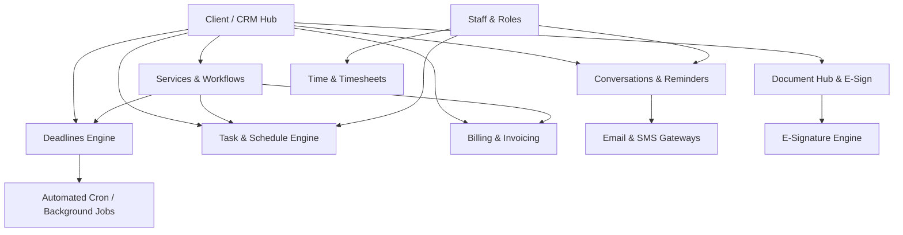

# Practice Management Module - Architecture & Data Models

## 1. System Architecture Overview

The Practice Management module serves as the central hub of Sansuite, orchestrating clients, compliance deadlines, workflows, communication, document signing, and staff workloads.



---

## 2. Relational Database Schema (SQL / PostgreSQL Compatible)

### 2.1 Clients & CRM (`pm_clients`, `pm_contacts`, `pm_prospects`)

```sql
-- Client Types Enum
CREATE TYPE client_type_enum AS ENUM (
    'LIMITED_COMPANY',
    'SOLE_TRADER',
    'PARTNERSHIP',
    'LLP',
    'INDIVIDUAL',
    'TRUST',
    'CHARITY',
    'OTHER'
);

-- Client Status Enum
CREATE TYPE client_status_enum AS ENUM (
    'PROSPECT',
    'ACTIVE',
    'INACTIVE',
    'ARCHIVED',
    'DELETED'
);

-- Clients Master Table
CREATE TABLE pm_clients (
    id UUID PRIMARY KEY DEFAULT gen_random_uuid(),
    account_id UUID NOT NULL, -- Tenant/Practice ID
    client_code VARCHAR(50) UNIQUE,
    company_name VARCHAR(255),
    client_type client_type_enum NOT NULL,
    company_number VARCHAR(50), -- Companies House Reg No
    tax_reference VARCHAR(50), -- UTR / Corporation Tax Ref
    vat_number VARCHAR(50),
    eori_number VARCHAR(50),
    status client_status_enum DEFAULT 'ACTIVE',
    visible_manager_id UUID, -- Assigned visible manager (user)
    partner_id UUID, -- Assigned partner (user)
    incorporation_date DATE,
    accounting_year_end_day INT, -- e.g. 31
    accounting_year_end_month INT, -- e.g. 3 (March)
    vat_stagger INT, -- VAT Quarter stagger (1, 2, 3)
    vat_scheme VARCHAR(50), -- Standard, Flat Rate, Cash
    address_line1 VARCHAR(255),
    address_line2 VARCHAR(255),
    city VARCHAR(100),
    postcode VARCHAR(20),
    country VARCHAR(100) DEFAULT 'United Kingdom',
    phone VARCHAR(50),
    email VARCHAR(255),
    website VARCHAR(255),
    is_aml_compliant BOOLEAN DEFAULT FALSE,
    aml_risk_score VARCHAR(20), -- 'LOW', 'MEDIUM', 'HIGH'
    onboarding_status VARCHAR(50) DEFAULT 'PENDING',
    created_at TIMESTAMP WITH TIME ZONE DEFAULT NOW(),
    updated_at TIMESTAMP WITH TIME ZONE DEFAULT NOW()
);

-- Client Contacts (Directors, Shareholders, Main Contact)
CREATE TABLE pm_client_contacts (
    id UUID PRIMARY KEY DEFAULT gen_random_uuid(),
    client_id UUID NOT NULL REFERENCES pm_clients(id) ON DELETE CASCADE,
    first_name VARCHAR(100) NOT NULL,
    last_name VARCHAR(100) NOT NULL,
    is_primary BOOLEAN DEFAULT FALSE,
    designation VARCHAR(100), -- Director, Secretary, Contact Person
    email VARCHAR(255),
    phone VARCHAR(50),
    mobile VARCHAR(50),
    ni_number VARCHAR(20),
    date_of_birth DATE,
    created_at TIMESTAMP WITH TIME ZONE DEFAULT NOW()
);

-- Custom Fields Definition (Practice Level)
CREATE TABLE pm_custom_field_definitions (
    id UUID PRIMARY KEY DEFAULT gen_random_uuid(),
    account_id UUID NOT NULL,
    field_name VARCHAR(100) NOT NULL,
    field_label VARCHAR(150) NOT NULL,
    field_type VARCHAR(50) NOT NULL, -- 'TEXT', 'NUMBER', 'DATE', 'SELECT', 'BOOLEAN'
    target_entity VARCHAR(50) NOT NULL, -- 'CLIENT', 'SERVICE', 'TASK'
    options JSONB, -- For SELECT types
    is_required BOOLEAN DEFAULT FALSE,
    sort_order INT DEFAULT 0,
    created_at TIMESTAMP WITH TIME ZONE DEFAULT NOW()
);

-- Custom Fields Values
CREATE TABLE pm_custom_field_values (
    id UUID PRIMARY KEY DEFAULT gen_random_uuid(),
    definition_id UUID NOT NULL REFERENCES pm_custom_field_definitions(id) ON DELETE CASCADE,
    entity_id UUID NOT NULL, -- References pm_clients(id) etc.
    value_text TEXT,
    value_json JSONB,
    created_at TIMESTAMP WITH TIME ZONE DEFAULT NOW(),
    updated_at TIMESTAMP WITH TIME ZONE DEFAULT NOW()
);

-- Client Timeline & Activities
CREATE TABLE pm_client_timeline (
    id UUID PRIMARY KEY DEFAULT gen_random_uuid(),
    client_id UUID NOT NULL REFERENCES pm_clients(id) ON DELETE CASCADE,
    user_id UUID, -- Actor
    activity_type VARCHAR(50) NOT NULL, -- 'NOTE', 'EMAIL', 'CALL', 'MEETING', 'DOCUMENT_UPLOAD', 'STATUS_CHANGE'
    title VARCHAR(255) NOT NULL,
    description TEXT,
    is_pinned BOOLEAN DEFAULT FALSE,
    metadata JSONB, -- Storing email headers, file links, etc.
    created_at TIMESTAMP WITH TIME ZONE DEFAULT NOW()
);
```

---

### 2.2 Services & Workflow Steps (`pm_services`, `pm_client_services`, `pm_service_steps`)

```sql
-- Master Services Catalog (Practice level & standard defaults)
CREATE TABLE pm_services (
    id UUID PRIMARY KEY DEFAULT gen_random_uuid(),
    account_id UUID NOT NULL,
    service_code VARCHAR(50) NOT NULL,
    service_name VARCHAR(150) NOT NULL, -- e.g. 'Accounts Production', 'Corporation Tax CT600', 'Bookkeeping'
    service_category VARCHAR(100), -- 'Compliance', 'Advisory', 'Payroll', 'Bookkeeping'
    is_statutory BOOLEAN DEFAULT FALSE,
    is_active BOOLEAN DEFAULT TRUE,
    default_billing_frequency VARCHAR(50) DEFAULT 'MONTHLY', -- 'MONTHLY', 'QUARTERLY', 'ANNUALLY', 'ONE_OFF'
    default_fee NUMERIC(12, 2) DEFAULT 0.00,
    currency VARCHAR(10) DEFAULT 'GBP',
    created_at TIMESTAMP WITH TIME ZONE DEFAULT NOW()
);

-- Workflow Steps Configured per Service
CREATE TABLE pm_service_steps (
    id UUID PRIMARY KEY DEFAULT gen_random_uuid(),
    service_id UUID NOT NULL REFERENCES pm_services(id) ON DELETE CASCADE,
    step_name VARCHAR(150) NOT NULL,
    step_order INT NOT NULL,
    description TEXT,
    days_before_deadline INT DEFAULT 0, -- When this step should trigger relative to deadline
    assigned_role VARCHAR(50), -- 'ACCOUNTANT', 'MANAGER', 'BOOKKEEPER'
    is_mandatory BOOLEAN DEFAULT TRUE,
    created_at TIMESTAMP WITH TIME ZONE DEFAULT NOW()
);

-- Services Assigned to Clients
CREATE TABLE pm_client_services (
    id UUID PRIMARY KEY DEFAULT gen_random_uuid(),
    client_id UUID NOT NULL REFERENCES pm_clients(id) ON DELETE CASCADE,
    service_id UUID NOT NULL REFERENCES pm_services(id) ON DELETE RESTRICT,
    assigned_manager_id UUID,
    assigned_staff_id UUID,
    agreed_fee NUMERIC(12, 2) NOT NULL DEFAULT 0.00,
    billing_frequency VARCHAR(50) DEFAULT 'MONTHLY',
    is_active BOOLEAN DEFAULT TRUE,
    start_date DATE,
    end_date DATE,
    notes TEXT,
    created_at TIMESTAMP WITH TIME ZONE DEFAULT NOW(),
    updated_at TIMESTAMP WITH TIME ZONE DEFAULT NOW(),
    UNIQUE(client_id, service_id)
);
```

---

### 2.3 Deadlines & Statutory Compliance (`pm_deadlines`, `pm_periods`)

```sql
CREATE TYPE deadline_status_enum AS ENUM (
    'UPCOMING',
    'DUE',
    'OVERDUE',
    'SUBMITTED',
    'COMPLETED',
    'WAIVED'
);

-- Accounting & VAT Periods
CREATE TABLE pm_client_periods (
    id UUID PRIMARY KEY DEFAULT gen_random_uuid(),
    client_id UUID NOT NULL REFERENCES pm_clients(id) ON DELETE CASCADE,
    period_type VARCHAR(50) NOT NULL, -- 'ACCOUNTING_YEAR', 'VAT_QUARTER', 'PAYROLL_MONTH', 'CONFIRMATION_STATEMENT'
    period_start DATE NOT NULL,
    period_end DATE NOT NULL,
    statutory_filing_deadline DATE NOT NULL,
    internal_target_deadline DATE,
    is_locked BOOLEAN DEFAULT FALSE,
    created_at TIMESTAMP WITH TIME ZONE DEFAULT NOW()
);

-- Deadlines Master Table
CREATE TABLE pm_deadlines (
    id UUID PRIMARY KEY DEFAULT gen_random_uuid(),
    client_id UUID NOT NULL REFERENCES pm_clients(id) ON DELETE CASCADE,
    service_id UUID REFERENCES pm_services(id) ON DELETE SET NULL,
    period_id UUID REFERENCES pm_client_periods(id) ON DELETE CASCADE,
    deadline_name VARCHAR(150) NOT NULL, -- 'Accounts Filing 2026', 'CT600 Return', 'VAT Return Q1'
    statutory_deadline_date DATE NOT NULL,
    internal_deadline_date DATE,
    status deadline_status_enum DEFAULT 'UPCOMING',
    assigned_user_id UUID,
    submission_reference VARCHAR(100), -- HMRC/Companies House receipt ID
    submitted_at TIMESTAMP WITH TIME ZONE,
    submitted_by UUID,
    is_statutory BOOLEAN DEFAULT TRUE,
    reminder_days_before INT[] DEFAULT ARRAY[30, 14, 7, 1], -- Reminders trigger days
    last_reminder_sent_at TIMESTAMP WITH TIME ZONE,
    created_at TIMESTAMP WITH TIME ZONE DEFAULT NOW(),
    updated_at TIMESTAMP WITH TIME ZONE DEFAULT NOW()
);
```

---

### 2.4 Tasks & Scheduling (`pm_tasks`, `pm_task_steps`, `pm_calendar_sync`)

```sql
CREATE TYPE task_priority_enum AS ENUM ('LOW', 'MEDIUM', 'HIGH', 'URGENT');
CREATE TYPE task_status_enum AS ENUM ('NOT_STARTED', 'IN_PROGRESS', 'WAITING_FOR_CLIENT', 'UNDER_REVIEW', 'COMPLETED', 'CANCELLED');

CREATE TABLE pm_tasks (
    id UUID PRIMARY KEY DEFAULT gen_random_uuid(),
    account_id UUID NOT NULL,
    client_id UUID REFERENCES pm_clients(id) ON DELETE CASCADE,
    service_id UUID REFERENCES pm_services(id) ON DELETE SET NULL,
    deadline_id UUID REFERENCES pm_deadlines(id) ON DELETE SET NULL,
    title VARCHAR(255) NOT NULL,
    description TEXT,
    priority task_priority_enum DEFAULT 'MEDIUM',
    status task_status_enum DEFAULT 'NOT_STARTED',
    assigned_to UUID NOT NULL, -- User ID
    assigned_by UUID,
    start_date DATE,
    due_date DATE NOT NULL,
    completed_at TIMESTAMP WITH TIME ZONE,
    estimated_minutes INT DEFAULT 0,
    created_at TIMESTAMP WITH TIME ZONE DEFAULT NOW(),
    updated_at TIMESTAMP WITH TIME ZONE DEFAULT NOW()
);

CREATE TABLE pm_task_substeps (
    id UUID PRIMARY KEY DEFAULT gen_random_uuid(),
    task_id UUID NOT NULL REFERENCES pm_tasks(id) ON DELETE CASCADE,
    step_title VARCHAR(255) NOT NULL,
    is_completed BOOLEAN DEFAULT FALSE,
    completed_at TIMESTAMP WITH TIME ZONE,
    completed_by UUID,
    sort_order INT DEFAULT 0
);
```

---

### 2.5 Proposals, Letters of Engagement & Capisign E-Signing

```sql
CREATE TYPE loe_status_enum AS ENUM (
    'DRAFT',
    'SENT',
    'VIEWED',
    'SIGNED',
    'REJECTED',
    'EXPIRED'
);

-- Template Master (Letter of Engagement / Proposal)
CREATE TABLE pm_loe_templates (
    id UUID PRIMARY KEY DEFAULT gen_random_uuid(),
    account_id UUID NOT NULL,
    template_name VARCHAR(150) NOT NULL,
    template_type VARCHAR(50) NOT NULL, -- 'PROPOSAL', 'LETTER_OF_ENGAGEMENT', 'AUTHORISATION_64_8'
    header_html TEXT,
    body_html TEXT NOT NULL,
    footer_html TEXT,
    logo_url VARCHAR(500),
    is_default BOOLEAN DEFAULT FALSE,
    created_at TIMESTAMP WITH TIME ZONE DEFAULT NOW(),
    updated_at TIMESTAMP WITH TIME ZONE DEFAULT NOW()
);

-- Proposals & LoE Documents Sent to Clients/Prospects
CREATE TABLE pm_loe_documents (
    id UUID PRIMARY KEY DEFAULT gen_random_uuid(),
    account_id UUID NOT NULL,
    client_id UUID REFERENCES pm_clients(id) ON DELETE SET NULL,
    prospect_name VARCHAR(255),
    prospect_email VARCHAR(255),
    template_id UUID REFERENCES pm_loe_templates(id) ON DELETE SET NULL,
    document_title VARCHAR(255) NOT NULL,
    generated_pdf_url VARCHAR(500),
    status loe_status_enum DEFAULT 'DRAFT',
    total_fee_quoted NUMERIC(12, 2) DEFAULT 0.00,
    services_included JSONB, -- Snapshot of selected services and terms
    sent_at TIMESTAMP WITH TIME ZONE,
    viewed_at TIMESTAMP WITH TIME ZONE,
    signed_at TIMESTAMP WITH TIME ZONE,
    signee_name VARCHAR(150),
    signee_ip VARCHAR(50),
    signature_data_url TEXT, -- Base64 or digital certificate token
    audit_trail JSONB, -- Logs of IP, timestamp, user agent, verification hash
    created_at TIMESTAMP WITH TIME ZONE DEFAULT NOW()
);
```

---

### 2.6 Conversations, Emails, SMS & Templates

```sql
CREATE TABLE pm_email_accounts (
    id UUID PRIMARY KEY DEFAULT gen_random_uuid(),
    user_id UUID NOT NULL,
    provider VARCHAR(50) NOT NULL, -- 'GMAIL', 'OUTLOOK365', 'IMAP_CUSTOM'
    email_address VARCHAR(255) NOT NULL,
    oauth_token_encrypted TEXT,
    oauth_refresh_token_encrypted TEXT,
    imap_host VARCHAR(150),
    imap_port INT,
    smtp_host VARCHAR(150),
    smtp_port INT,
    is_active BOOLEAN DEFAULT TRUE,
    created_at TIMESTAMP WITH TIME ZONE DEFAULT NOW()
);

CREATE TABLE pm_email_templates (
    id UUID PRIMARY KEY DEFAULT gen_random_uuid(),
    account_id UUID NOT NULL,
    template_code VARCHAR(100) UNIQUE,
    template_name VARCHAR(150) NOT NULL,
    template_type VARCHAR(50) NOT NULL, -- 'DEADLINE_REMINDER', 'DOCUMENT_REQUEST', 'TASK_NOTIFICATION', 'BULK_COMMUNICATION'
    subject_line VARCHAR(255) NOT NULL,
    body_content TEXT NOT NULL,
    available_merge_tags JSONB, -- e.g. ["{{client_name}}", "{{deadline_date}}", "{{company_number}}"]
    created_at TIMESTAMP WITH TIME ZONE DEFAULT NOW()
);

CREATE TABLE pm_conversations (
    id UUID PRIMARY KEY DEFAULT gen_random_uuid(),
    account_id UUID NOT NULL,
    client_id UUID REFERENCES pm_clients(id) ON DELETE SET NULL,
    sender_email VARCHAR(255) NOT NULL,
    recipient_emails TEXT[] NOT NULL,
    subject VARCHAR(255) NOT NULL,
    body_html TEXT,
    body_text TEXT,
    direction VARCHAR(20) NOT NULL, -- 'INBOUND', 'OUTBOUND'
    message_id_header VARCHAR(255),
    thread_id VARCHAR(255),
    has_attachments BOOLEAN DEFAULT FALSE,
    attachments JSONB,
    created_at TIMESTAMP WITH TIME ZONE DEFAULT NOW()
);
```

---

### 2.7 Documents & Client Document Requests

```sql
CREATE TABLE pm_documents (
    id UUID PRIMARY KEY DEFAULT gen_random_uuid(),
    account_id UUID NOT NULL,
    client_id UUID NOT NULL REFERENCES pm_clients(id) ON DELETE CASCADE,
    folder_path VARCHAR(255) DEFAULT '/', -- Virtual folder hierarchy
    file_name VARCHAR(255) NOT NULL,
    file_size_bytes BIGINT NOT NULL,
    mime_type VARCHAR(100) NOT NULL,
    storage_path VARCHAR(500) NOT NULL,
    uploaded_by UUID, -- User ID or Client Contact ID
    is_client_visible BOOLEAN DEFAULT TRUE,
    tags TEXT[],
    created_at TIMESTAMP WITH TIME ZONE DEFAULT NOW()
);

CREATE TABLE pm_document_requests (
    id UUID PRIMARY KEY DEFAULT gen_random_uuid(),
    client_id UUID NOT NULL REFERENCES pm_clients(id) ON DELETE CASCADE,
    service_id UUID REFERENCES pm_services(id) ON DELETE SET NULL,
    request_title VARCHAR(255) NOT NULL,
    description TEXT,
    required_items JSONB, -- List of requested documents e.g. [{"item": "Bank Statement Jan-Dec", "status": "PENDING"}]
    due_date DATE,
    status VARCHAR(50) DEFAULT 'PENDING', -- 'PENDING', 'PARTIALLY_UPLOADED', 'COMPLETED'
    requested_by UUID NOT NULL,
    created_at TIMESTAMP WITH TIME ZONE DEFAULT NOW(),
    completed_at TIMESTAMP WITH TIME ZONE
);
```

---

### 2.8 Time Tracking, Timesheets & Invoicing

```sql
CREATE TABLE pm_time_entries (
    id UUID PRIMARY KEY DEFAULT gen_random_uuid(),
    user_id UUID NOT NULL,
    client_id UUID NOT NULL REFERENCES pm_clients(id) ON DELETE CASCADE,
    service_id UUID REFERENCES pm_services(id) ON DELETE SET NULL,
    task_id UUID REFERENCES pm_tasks(id) ON DELETE SET NULL,
    entry_date DATE NOT NULL,
    duration_minutes INT NOT NULL,
    hourly_rate NUMERIC(10, 2) DEFAULT 0.00,
    is_billable BOOLEAN DEFAULT TRUE,
    is_invoiced BOOLEAN DEFAULT FALSE,
    invoice_id UUID,
    notes TEXT,
    created_at TIMESTAMP WITH TIME ZONE DEFAULT NOW()
);

CREATE TABLE pm_invoices (
    id UUID PRIMARY KEY DEFAULT gen_random_uuid(),
    account_id UUID NOT NULL,
    client_id UUID NOT NULL REFERENCES pm_clients(id) ON DELETE CASCADE,
    invoice_number VARCHAR(50) UNIQUE NOT NULL,
    invoice_date DATE NOT NULL,
    due_date DATE NOT NULL,
    subtotal NUMERIC(12, 2) NOT NULL,
    vat_rate NUMERIC(5, 2) DEFAULT 20.00,
    vat_amount NUMERIC(12, 2) DEFAULT 0.00,
    total_amount NUMERIC(12, 2) NOT NULL,
    status VARCHAR(50) DEFAULT 'DRAFT', -- 'DRAFT', 'ISSUED', 'PAID', 'OVERDUE', 'CANCELLED'
    bank_details JSONB, -- Bank Name, Account No, Sort Code, IBAN
    line_items JSONB NOT NULL, -- Array of items with description, quantity, unit_price, total
    pdf_url VARCHAR(500),
    created_at TIMESTAMP WITH TIME ZONE DEFAULT NOW()
);
```
