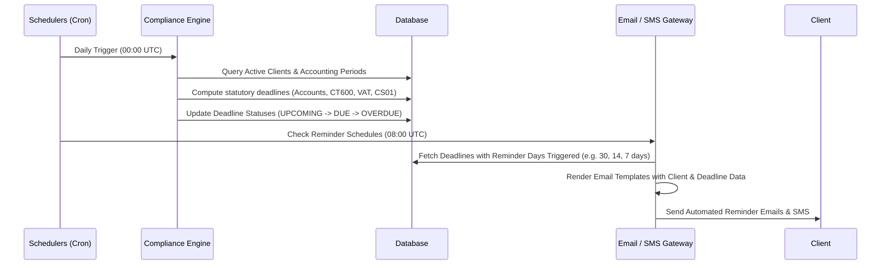

# Practice Management - API & System Workflows Specification

## 1. RESTful API Endpoints Specification

### 1.1 Client Management (`/api/v1/pm/clients`)

| Method | Endpoint | Description |
| :--- | :--- | :--- |
| `GET` | `/api/v1/pm/clients` | List clients with filtering (type, status, manager, search, page, limit) |
| `POST` | `/api/v1/pm/clients` | Create a new client profile (supports quick-add and full profile) |
| `GET` | `/api/v1/pm/clients/:id` | Get complete client details (profile, services, deadlines, timeline, contacts) |
| `PUT` | `/api/v1/pm/clients/:id` | Update client information |
| `DELETE` | `/api/v1/pm/clients/:id` | Soft-delete / archive a client |
| `POST` | `/api/v1/pm/clients/:id/reactivate` | Reactivate an archived client |
| `GET` | `/api/v1/pm/clients/:id/timeline` | Retrieve client activity timeline feed |
| `POST` | `/api/v1/pm/clients/:id/timeline` | Add note / manual activity to timeline (supports pinning) |
| `GET` | `/api/v1/pm/clients/export` | Export client dataset (CSV/Excel) |

---

### 1.2 Services & Workflows (`/api/v1/pm/services`)

| Method | Endpoint | Description |
| :--- | :--- | :--- |
| `GET` | `/api/v1/pm/services` | List all master services |
| `POST` | `/api/v1/pm/services` | Create custom service |
| `GET` | `/api/v1/pm/services/:id/steps` | List workflow steps for a service |
| `POST` | `/api/v1/pm/services/:id/steps` | Add / reorder workflow steps |
| `POST` | `/api/v1/pm/clients/:clientId/services` | Assign service to client with fee & manager |
| `DELETE` | `/api/v1/pm/clients/:clientId/services/:serviceId` | Unassign service from client |

---

### 1.3 Deadlines & Statutory Compliance (`/api/v1/pm/deadlines`)

| Method | Endpoint | Description |
| :--- | :--- | :--- |
| `GET` | `/api/v1/pm/deadlines` | List deadlines (filters: status, service, date range, assigned user) |
| `POST` | `/api/v1/pm/deadlines` | Create custom deadline |
| `PUT` | `/api/v1/pm/deadlines/:id` | Update deadline dates / status |
| `DELETE` | `/api/v1/pm/deadlines/:id` | Delete / waive a deadline |
| `POST` | `/api/v1/pm/deadlines/refresh` | Trigger statutory deadline calculation & roll-forward engine |
| `GET` | `/api/v1/pm/submissions/summary` | Get summary of all HMRC and Companies House filings |

---

### 1.4 Tasks & Scheduling (`/api/v1/pm/tasks`)

| Method | Endpoint | Description |
| :--- | :--- | :--- |
| `GET` | `/api/v1/pm/tasks` | List tasks (filters: priority, status, assigned_to, client_id, due_date) |
| `POST` | `/api/v1/pm/tasks` | Create new task (with optional checklist sub-steps) |
| `PUT` | `/api/v1/pm/tasks/:id` | Update task status, priority, or reassign |
| `PUT` | `/api/v1/pm/tasks/:id/substeps/:stepId` | Toggle sub-step completion status |
| `GET` | `/api/v1/pm/calendar/events` | Get calendar feed (compatible with iCal, Google Calendar, Outlook) |

---

### 1.5 Proposals, LoE & Capisign E-Signing (`/api/v1/pm/loe`)

| Method | Endpoint | Description |
| :--- | :--- | :--- |
| `GET` | `/api/v1/pm/loe/templates` | List Proposal and Letter of Engagement templates |
| `POST` | `/api/v1/pm/loe/templates` | Create or update template |
| `POST` | `/api/v1/pm/loe/generate` | Generate LoE / Proposal PDF for client or prospect |
| `POST` | `/api/v1/pm/loe/:id/send` | Send document for e-signature via email |
| `GET` | `/api/v1/pm/public/sign/:token` | Public endpoint for client to view document |
| `POST` | `/api/v1/pm/public/sign/:token` | Public endpoint for client to submit digital signature |
| `GET` | `/api/v1/pm/loe/:id/audit-trail` | Get full cryptographic signature audit certificate |

---

### 1.6 Conversations & Reminders (`/api/v1/pm/conversations`)

| Method | Endpoint | Description |
| :--- | :--- | :--- |
| `GET` | `/api/v1/pm/conversations` | List synced email threads |
| `POST` | `/api/v1/pm/conversations/send` | Send individual email with client linkage |
| `POST` | `/api/v1/pm/conversations/bulk-email` | Dispatch bulk email to filtered client groups |
| `POST` | `/api/v1/pm/conversations/sms/send` | Dispatch SMS message using practice Sender ID |
| `GET` | `/api/v1/pm/templates/emails` | List email templates (deadline reminders, document requests) |

---

### 1.7 Document Requests & Storage (`/api/v1/pm/documents`)

| Method | Endpoint | Description |
| :--- | :--- | :--- |
| `GET` | `/api/v1/pm/clients/:clientId/documents` | List documents in virtual folder tree |
| `POST` | `/api/v1/pm/clients/:clientId/documents/upload` | Upload single or multiple documents |
| `POST` | `/api/v1/pm/document-requests` | Create and dispatch document request checklist |
| `GET` | `/api/v1/pm/public/document-requests/:token` | Public client upload portal |

---

### 1.8 Time Tracking & Invoicing (`/api/v1/pm/time`, `/api/v1/pm/invoices`)

| Method | Endpoint | Description |
| :--- | :--- | :--- |
| `POST` | `/api/v1/pm/time/entries` | Log manual time entry or submit live timer recording |
| `GET` | `/api/v1/pm/time/timesheet` | Get weekly / monthly timesheet grid for team member |
| `GET` | `/api/v1/pm/invoices` | List generated invoices |
| `POST` | `/api/v1/pm/invoices/generate` | Generate invoice from client services / WIP timesheet |
| `POST` | `/api/v1/pm/invoices/:id/send` | Send invoice PDF to client email |

---

## 2. Background Jobs & Scheduler Workflows

1. **Daily Statutory Deadline Status Roll-Forward (00:00 UTC):**
   - Scans all active deadlines.
   - Evaluates `CURRENT_DATE` against `statutory_deadline_date` and `internal_deadline_date`.
   - Transitions statuses to `DUE` (within 30 days) and `OVERDUE` (past deadline date).

2. **Automated Reminder Dispatcher (08:00 UTC):**
   - Matches client deadline reminder preferences (30 days, 14 days, 7 days, 1 day prior).
   - Generates merged email/SMS notifications and queues them for delivery.

3. **Email Inbox Sync Worker (Every 5 minutes):**
   - Connects via OAuth/IMAP to practice user inboxes.
   - Fetches new messages and matches sender/recipient email addresses to `pm_client_contacts` and `pm_clients`.
   - Appends communication logs directly to the client's timeline.

4. **Document Request Chaser (Weekly on Mondays):**
   - Checks incomplete `pm_document_requests` where `due_date` is approaching.
   - Sends automated follow-up reminders to the client.
