# Capium Practice Management - Complete Knowledge Base Index

> Total Scraped Articles: **65** | Total Downloaded Assets: Verified

This document lists all 65 scraped Capium Practice Management knowledge base articles, categorized and linked with local image assets.

### 1. Practice Management Dashboard
- **Category/Folder:** Practice Management Help Guide
- **Article ID:** `9000165732` | **Slug:** `practice-management-dashboard`
- **Original URL:** [Freshdesk Link](https://capium.freshdesk.com/support/solutions/articles/9000165732-practice-management-dashboard)
- **Local Markdown:** [raw_articles/9000165732_practice-management-dashboard.md](../raw_articles/9000165732_practice-management-dashboard.md)
- **Images Count:** 1
- **Images:**
  - 

---

### 2. Email Conversations - Link your Email Inbox to Capium
- **Category/Folder:** Practice Management Help Guide
- **Article ID:** `9000195110` | **Slug:** `email-conversations-link-your-email-inbox-to-capium`
- **Original URL:** [Freshdesk Link](https://capium.freshdesk.com/support/solutions/articles/9000195110-email-conversations-link-your-email-inbox-to-capium)
- **Local Markdown:** [raw_articles/9000195110_email-conversations-link-your-email-inbox-to-capium.md](../raw_articles/9000195110_email-conversations-link-your-email-inbox-to-capium.md)
- **Images Count:** 7
- **Images:**
  - 
  - 
  - 
  - 
  - 
  - 
  - 

---

### 3. Adding Clients manually in Practice Management
- **Category/Folder:** Practice Management Help Guide
- **Article ID:** `9000165736` | **Slug:** `adding-clients-manually-in-practice-management`
- **Original URL:** [Freshdesk Link](https://capium.freshdesk.com/support/solutions/articles/9000165736-adding-clients-manually-in-practice-management)
- **Local Markdown:** [raw_articles/9000165736_adding-clients-manually-in-practice-management.md](../raw_articles/9000165736_adding-clients-manually-in-practice-management.md)
- **Images Count:** 2
- **Images:**
  - 
  - 

---

### 4. Letters Of Engagement &amp; Proposals (for Prospects)
- **Category/Folder:** Practice Management Help Guide
- **Article ID:** `9000169896` | **Slug:** `letters-of-engagement-proposals-for-prospects-`
- **Original URL:** [Freshdesk Link](https://capium.freshdesk.com/support/solutions/articles/9000169896-letters-of-engagement-proposals-for-prospects-)
- **Local Markdown:** [raw_articles/9000169896_letters-of-engagement-proposals-for-prospects-.md](../raw_articles/9000169896_letters-of-engagement-proposals-for-prospects-.md)
- **Images Count:** 4
- **Images:**
  - 
  - 
  - 
  - 

---

### 5. How to sign Documents sent by Accountant
- **Category/Folder:** Practice Management Help Guide
- **Article ID:** `9000178336` | **Slug:** `how-to-sign-documents-sent-by-accountant`
- **Original URL:** [Freshdesk Link](https://capium.freshdesk.com/support/solutions/articles/9000178336-how-to-sign-documents-sent-by-accountant)
- **Local Markdown:** [raw_articles/9000178336_how-to-sign-documents-sent-by-accountant.md](../raw_articles/9000178336_how-to-sign-documents-sent-by-accountant.md)
- **Images Count:** 7
- **Images:**
  - 
  - 
  - 
  - 
  - 
  - 
  - 

---

### 6. Send Letters of Engagement &amp; Proposals to existing clients
- **Category/Folder:** Practice Management Help Guide
- **Article ID:** `9000172376` | **Slug:** `send-letters-of-engagement-proposals-to-existing-clients`
- **Original URL:** [Freshdesk Link](https://capium.freshdesk.com/support/solutions/articles/9000172376-send-letters-of-engagement-proposals-to-existing-clients)
- **Local Markdown:** [raw_articles/9000172376_send-letters-of-engagement-proposals-to-existing-clients.md](../raw_articles/9000172376_send-letters-of-engagement-proposals-to-existing-clients.md)
- **Images Count:** 4
- **Images:**
  - 
  - 
  - 
  - 

---

### 7. How to set up custom templates for Letters of Engagement/Proposals
- **Category/Folder:** Practice Management Help Guide
- **Article ID:** `9000172255` | **Slug:** `how-to-set-up-custom-templates-for-letters-of-engagement-proposals`
- **Original URL:** [Freshdesk Link](https://capium.freshdesk.com/support/solutions/articles/9000172255-how-to-set-up-custom-templates-for-letters-of-engagement-proposals)
- **Local Markdown:** [raw_articles/9000172255_how-to-set-up-custom-templates-for-letters-of-engagement-proposals.md](../raw_articles/9000172255_how-to-set-up-custom-templates-for-letters-of-engagement-proposals.md)
- **Images Count:** 4
- **Images:**
  - 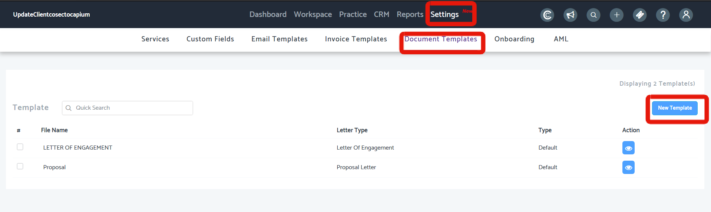
  - 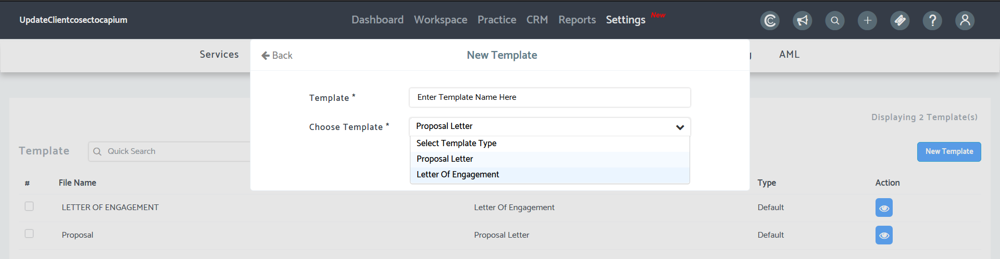
  - 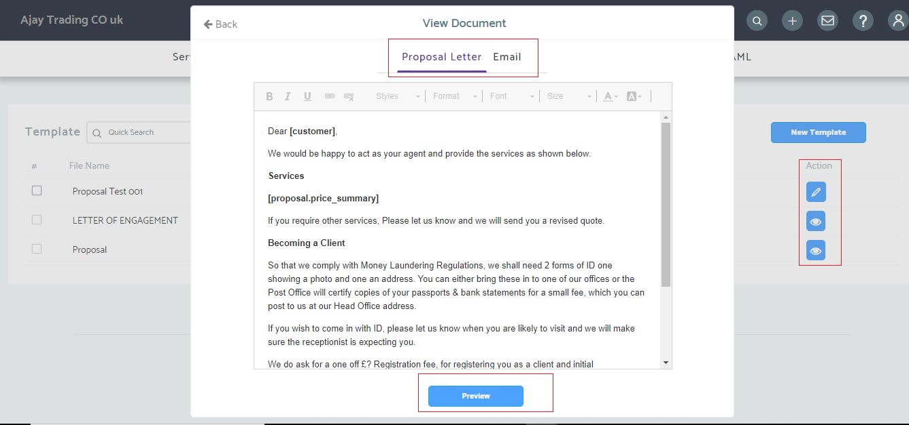
  - 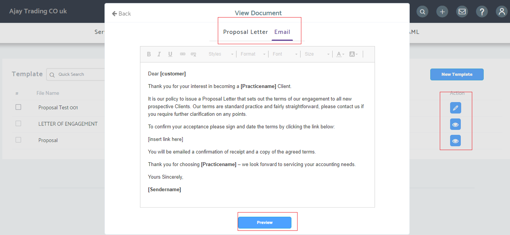

---

### 8. How to add Accounting/VAT Periods in Practice Management 
- **Category/Folder:** Practice Management Help Guide
- **Article ID:** `9000172245` | **Slug:** `how-to-add-accounting-vat-periods-in-practice-management-`
- **Original URL:** [Freshdesk Link](https://capium.freshdesk.com/support/solutions/articles/9000172245-how-to-add-accounting-vat-periods-in-practice-management-)
- **Local Markdown:** [raw_articles/9000172245_how-to-add-accounting-vat-periods-in-practice-management-.md](../raw_articles/9000172245_how-to-add-accounting-vat-periods-in-practice-management-.md)
- **Images Count:** 2
- **Images:**
  - 
  - 

---

### 9. Practice Management - Scheduling
- **Category/Folder:** Practice Management Help Guide
- **Article ID:** `9000172247` | **Slug:** `practice-management-scheduling`
- **Original URL:** [Freshdesk Link](https://capium.freshdesk.com/support/solutions/articles/9000172247-practice-management-scheduling)
- **Local Markdown:** [raw_articles/9000172247_practice-management-scheduling.md](../raw_articles/9000172247_practice-management-scheduling.md)
- **Images Count:** 2
- **Images:**
  - 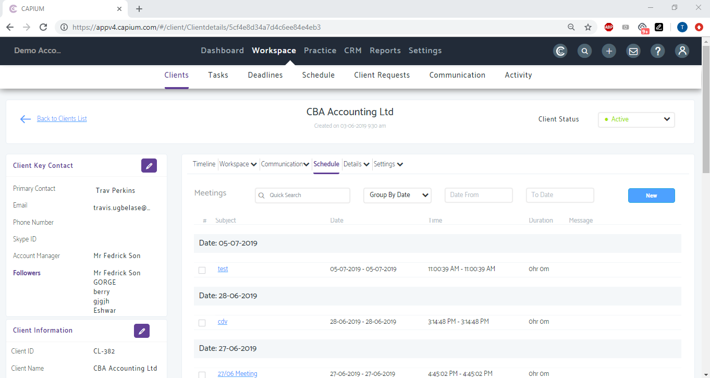
  - 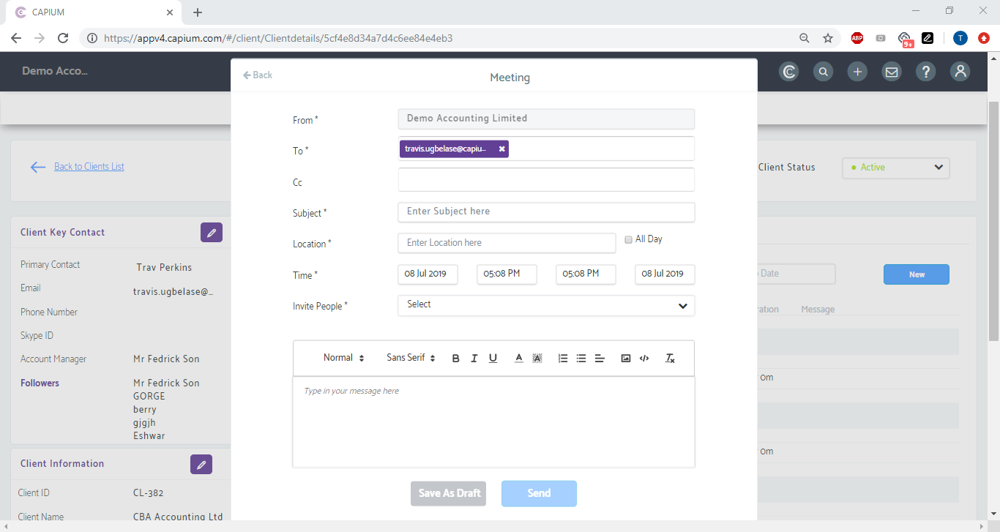

---

### 10. How to delete Deadlines in Practice Management
- **Category/Folder:** Practice Management Help Guide
- **Article ID:** `9000172244` | **Slug:** `how-to-delete-deadlines-in-practice-management`
- **Original URL:** [Freshdesk Link](https://capium.freshdesk.com/support/solutions/articles/9000172244-how-to-delete-deadlines-in-practice-management)
- **Local Markdown:** [raw_articles/9000172244_how-to-delete-deadlines-in-practice-management.md](../raw_articles/9000172244_how-to-delete-deadlines-in-practice-management.md)
- **Images Count:** 2
- **Images:**
  - 
  - 

---

### 11. How to setup and delete Deadline Email Reminders
- **Category/Folder:** Practice Management Help Guide
- **Article ID:** `9000172240` | **Slug:** `how-to-setup-and-delete-deadline-email-reminders`
- **Original URL:** [Freshdesk Link](https://capium.freshdesk.com/support/solutions/articles/9000172240-how-to-setup-and-delete-deadline-email-reminders)
- **Local Markdown:** [raw_articles/9000172240_how-to-setup-and-delete-deadline-email-reminders.md](../raw_articles/9000172240_how-to-setup-and-delete-deadline-email-reminders.md)
- **Images Count:** 6
- **Images:**
  - 
  - 
  - 
  - 
  - 
  - 

---

### 12. How to add Bank details to Invoices in Practice Management
- **Category/Folder:** Practice Management Help Guide
- **Article ID:** `9000172239` | **Slug:** `how-to-add-bank-details-to-invoices-in-practice-management`
- **Original URL:** [Freshdesk Link](https://capium.freshdesk.com/support/solutions/articles/9000172239-how-to-add-bank-details-to-invoices-in-practice-management)
- **Local Markdown:** [raw_articles/9000172239_how-to-add-bank-details-to-invoices-in-practice-management.md](../raw_articles/9000172239_how-to-add-bank-details-to-invoices-in-practice-management.md)
- **Images Count:** 3
- **Images:**
  - 
  - 
  - 

---

### 13. Practice Management - Set Up Tasks
- **Category/Folder:** Practice Management Help Guide
- **Article ID:** `9000171881` | **Slug:** `practice-management-set-up-tasks`
- **Original URL:** [Freshdesk Link](https://capium.freshdesk.com/support/solutions/articles/9000171881-practice-management-set-up-tasks)
- **Local Markdown:** [raw_articles/9000171881_practice-management-set-up-tasks.md](../raw_articles/9000171881_practice-management-set-up-tasks.md)
- **Images Count:** 6
- **Images:**
  - 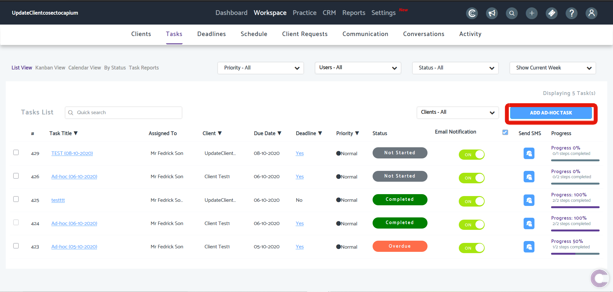
  - 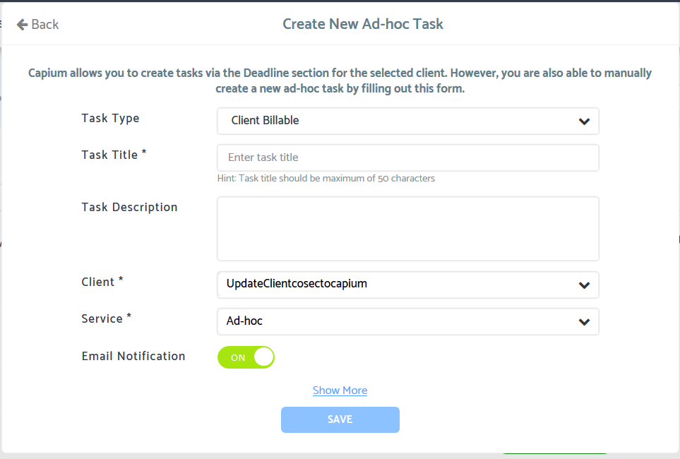
  - 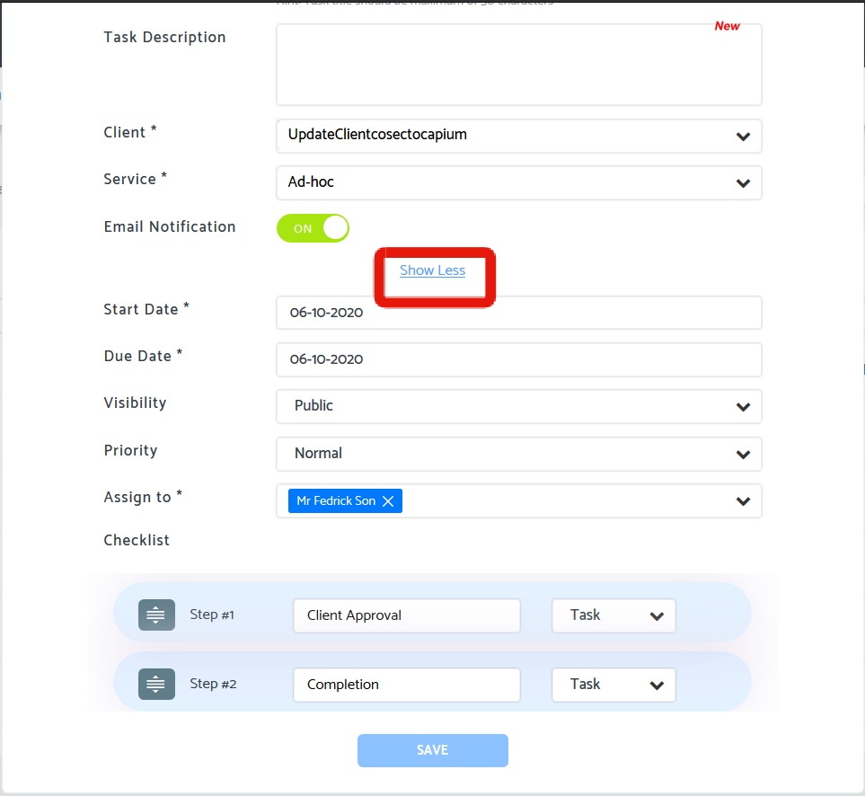
  - 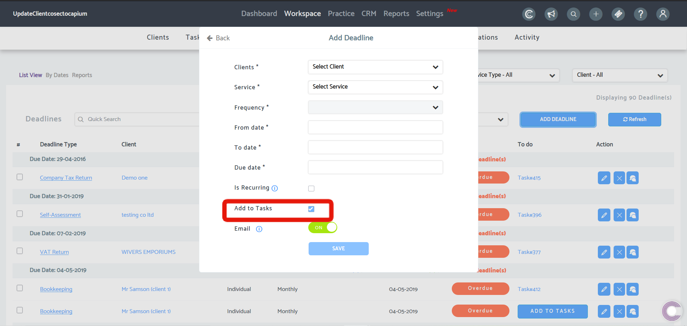
  - 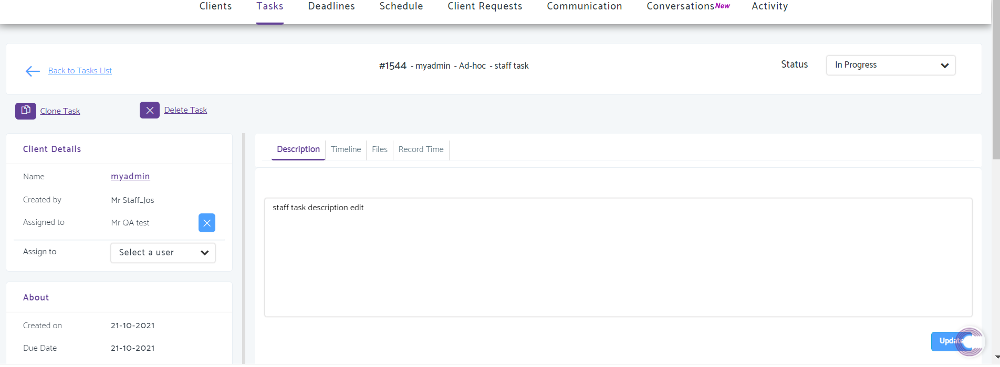
  - 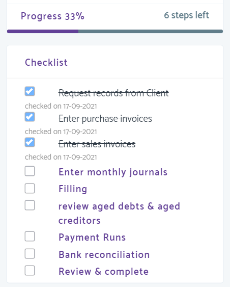

---

### 14. How to add team members
- **Category/Folder:** Practice Management Help Guide
- **Article ID:** `9000165734` | **Slug:** `how-to-add-team-members`
- **Original URL:** [Freshdesk Link](https://capium.freshdesk.com/support/solutions/articles/9000165734-how-to-add-team-members)
- **Local Markdown:** [raw_articles/9000165734_how-to-add-team-members.md](../raw_articles/9000165734_how-to-add-team-members.md)
- **Images Count:** 2
- **Images:**
  - 
  - 

---

### 15. Client On-Boarding Checklist
- **Category/Folder:** Practice Management Help Guide
- **Article ID:** `9000188953` | **Slug:** `client-on-boarding-checklist`
- **Original URL:** [Freshdesk Link](https://capium.freshdesk.com/support/solutions/articles/9000188953-client-on-boarding-checklist)
- **Local Markdown:** [raw_articles/9000188953_client-on-boarding-checklist.md](../raw_articles/9000188953_client-on-boarding-checklist.md)
- **Images Count:** 3
- **Images:**
  - 
  - 
  - 

---

### 16. Add a custom service
- **Category/Folder:** Practice Management Help Guide
- **Article ID:** `9000165742` | **Slug:** `add-a-custom-service`
- **Original URL:** [Freshdesk Link](https://capium.freshdesk.com/support/solutions/articles/9000165742-add-a-custom-service)
- **Local Markdown:** [raw_articles/9000165742_add-a-custom-service.md](../raw_articles/9000165742_add-a-custom-service.md)
- **Images Count:** 2
- **Images:**
  - 
  - 

---

### 17. Assign Services to Clients 
- **Category/Folder:** Practice Management Help Guide
- **Article ID:** `9000165770` | **Slug:** `assign-services-to-clients-`
- **Original URL:** [Freshdesk Link](https://capium.freshdesk.com/support/solutions/articles/9000165770-assign-services-to-clients-)
- **Local Markdown:** [raw_articles/9000165770_assign-services-to-clients-.md](../raw_articles/9000165770_assign-services-to-clients-.md)
- **Images Count:** 2
- **Images:**
  - 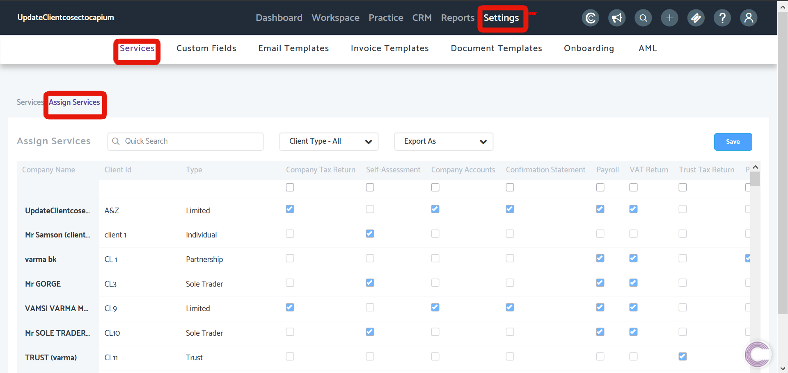
  - 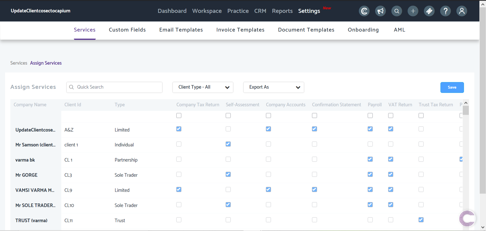

---

### 18. Add deadlines
- **Category/Folder:** Practice Management Help Guide
- **Article ID:** `9000165771` | **Slug:** `add-deadlines`
- **Original URL:** [Freshdesk Link](https://capium.freshdesk.com/support/solutions/articles/9000165771-add-deadlines)
- **Local Markdown:** [raw_articles/9000165771_add-deadlines.md](../raw_articles/9000165771_add-deadlines.md)
- **Images Count:** 2
- **Images:**
  - 
  - 

---

### 19. Global Custom Fields
- **Category/Folder:** Practice Management Help Guide
- **Article ID:** `9000179570` | **Slug:** `global-custom-fields`
- **Original URL:** [Freshdesk Link](https://capium.freshdesk.com/support/solutions/articles/9000179570-global-custom-fields)
- **Local Markdown:** [raw_articles/9000179570_global-custom-fields.md](../raw_articles/9000179570_global-custom-fields.md)
- **Images Count:** 5
- **Images:**
  - 
  - 
  - 
  - 
  - 

---

### 20. Communication-How to send and schedule emails and SMS
- **Category/Folder:** Practice Management Help Guide
- **Article ID:** `9000188513` | **Slug:** `communication-how-to-send-and-schedule-emails-and-sms`
- **Original URL:** [Freshdesk Link](https://capium.freshdesk.com/support/solutions/articles/9000188513-communication-how-to-send-and-schedule-emails-and-sms)
- **Local Markdown:** [raw_articles/9000188513_communication-how-to-send-and-schedule-emails-and-sms.md](../raw_articles/9000188513_communication-how-to-send-and-schedule-emails-and-sms.md)
- **Images Count:** 5
- **Images:**
  - 
  - 
  - 
  - 
  - 

---

### 21. Set up/Configure Invoice Templates
- **Category/Folder:** Practice Management Help Guide
- **Article ID:** `9000195170` | **Slug:** `set-up-configure-invoice-templates`
- **Original URL:** [Freshdesk Link](https://capium.freshdesk.com/support/solutions/articles/9000195170-set-up-configure-invoice-templates)
- **Local Markdown:** [raw_articles/9000195170_set-up-configure-invoice-templates.md](../raw_articles/9000195170_set-up-configure-invoice-templates.md)
- **Images Count:** 3
- **Images:**
  - 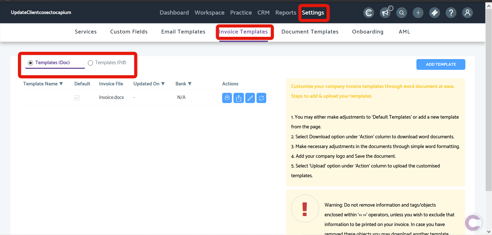
  - 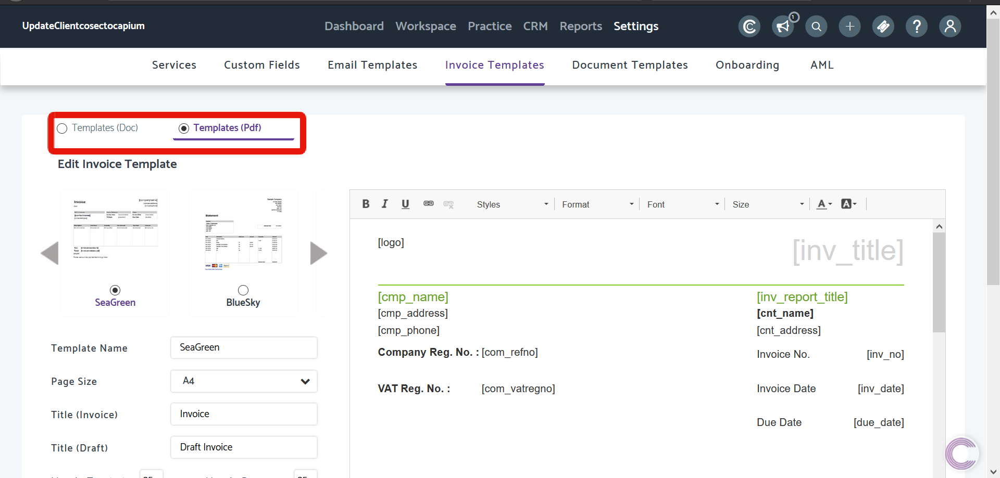
  - 

---

### 22. AML/Risk Assessment Checklist
- **Category/Folder:** Practice Management Help Guide
- **Article ID:** `9000195171` | **Slug:** `aml-risk-assessment-checklist`
- **Original URL:** [Freshdesk Link](https://capium.freshdesk.com/support/solutions/articles/9000195171-aml-risk-assessment-checklist)
- **Local Markdown:** [raw_articles/9000195171_aml-risk-assessment-checklist.md](../raw_articles/9000195171_aml-risk-assessment-checklist.md)
- **Images Count:** 3
- **Images:**
  - 
  - 
  - 

---

### 23. How to pin notes to a clients timeline in Practice Management
- **Category/Folder:** Practice Management Help Guide
- **Article ID:** `9000201273` | **Slug:** `how-to-pin-notes-to-a-clients-timeline-in-practice-management`
- **Original URL:** [Freshdesk Link](https://capium.freshdesk.com/support/solutions/articles/9000201273-how-to-pin-notes-to-a-clients-timeline-in-practice-management)
- **Local Markdown:** [raw_articles/9000201273_how-to-pin-notes-to-a-clients-timeline-in-practice-management.md](../raw_articles/9000201273_how-to-pin-notes-to-a-clients-timeline-in-practice-management.md)
- **Images Count:** 3
- **Images:**
  - 
  - 
  - 

---

### 24. How to add an email signature in Conversations in Practice Management
- **Category/Folder:** Practice Management Help Guide
- **Article ID:** `9000203130` | **Slug:** `how-to-add-an-email-signature-in-conversations-in-practice-management`
- **Original URL:** [Freshdesk Link](https://capium.freshdesk.com/support/solutions/articles/9000203130-how-to-add-an-email-signature-in-conversations-in-practice-management)
- **Local Markdown:** [raw_articles/9000203130_how-to-add-an-email-signature-in-conversations-in-practice-management.md](../raw_articles/9000203130_how-to-add-an-email-signature-in-conversations-in-practice-management.md)
- **Images Count:** 4
- **Images:**
  - 
  - 
  - 
  - 

---

### 25. Submissions Summary in Practice Management
- **Category/Folder:** Practice Management Help Guide
- **Article ID:** `9000203137` | **Slug:** `submissions-summary-in-practice-management`
- **Original URL:** [Freshdesk Link](https://capium.freshdesk.com/support/solutions/articles/9000203137-submissions-summary-in-practice-management)
- **Local Markdown:** [raw_articles/9000203137_submissions-summary-in-practice-management.md](../raw_articles/9000203137_submissions-summary-in-practice-management.md)
- **Images Count:** 3
- **Images:**
  - 
  - 
  - 

---

### 26. Recording Time and Timesheets
- **Category/Folder:** Practice Management Help Guide
- **Article ID:** `9000204723` | **Slug:** `recording-time-and-timesheets`
- **Original URL:** [Freshdesk Link](https://capium.freshdesk.com/support/solutions/articles/9000204723-recording-time-and-timesheets)
- **Local Markdown:** [raw_articles/9000204723_recording-time-and-timesheets.md](../raw_articles/9000204723_recording-time-and-timesheets.md)
- **Images Count:** 10
- **Images:**
  - 
  - 
  - 
  - 
  - 
  - 
  - 
  - 
  - 
  - 

---

### 27. How to customise your client&#39;s timeline in Practice Management
- **Category/Folder:** Practice Management Help Guide
- **Article ID:** `9000206287` | **Slug:** `how-to-customise-your-client-s-timeline-in-practice-management`
- **Original URL:** [Freshdesk Link](https://capium.freshdesk.com/support/solutions/articles/9000206287-how-to-customise-your-client-s-timeline-in-practice-management)
- **Local Markdown:** [raw_articles/9000206287_how-to-customise-your-client-s-timeline-in-practice-management.md](../raw_articles/9000206287_how-to-customise-your-client-s-timeline-in-practice-management.md)
- **Images Count:** 2
- **Images:**
  - 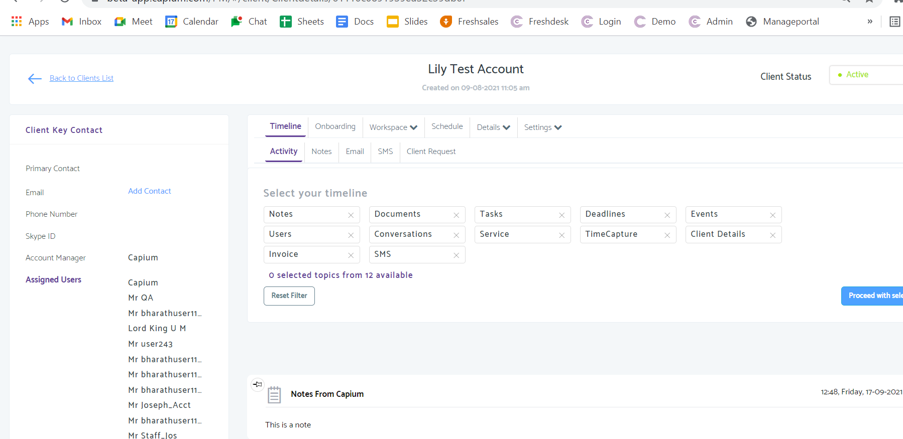
  - 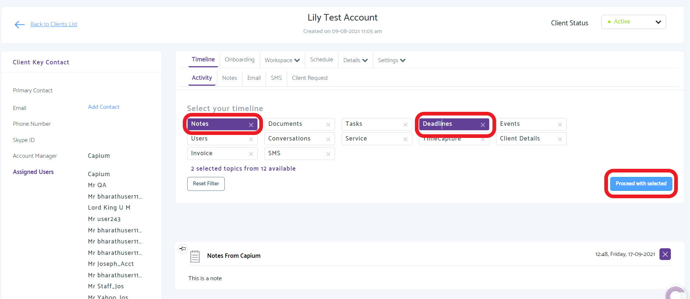

---

### 28. How to view Reports in Practice Management
- **Category/Folder:** Practice Management Help Guide
- **Article ID:** `9000207051` | **Slug:** `how-to-view-reports-in-practice-management`
- **Original URL:** [Freshdesk Link](https://capium.freshdesk.com/support/solutions/articles/9000207051-how-to-view-reports-in-practice-management)
- **Local Markdown:** [raw_articles/9000207051_how-to-view-reports-in-practice-management.md](../raw_articles/9000207051_how-to-view-reports-in-practice-management.md)
- **Images Count:** 3
- **Images:**
  - 
  - 
  - 

---

### 29. Document Sharing &amp; Storage for Accountants and Clients
- **Category/Folder:** Practice Management Help Guide
- **Article ID:** `9000209740` | **Slug:** `document-sharing-storage-for-accountants-and-clients`
- **Original URL:** [Freshdesk Link](https://capium.freshdesk.com/support/solutions/articles/9000209740-document-sharing-storage-for-accountants-and-clients)
- **Local Markdown:** [raw_articles/9000209740_document-sharing-storage-for-accountants-and-clients.md](../raw_articles/9000209740_document-sharing-storage-for-accountants-and-clients.md)
- **Images Count:** 5
- **Images:**
  - 
  - 
  - 
  - 
  - 

---

### 30. How to delete a client
- **Category/Folder:** Practice Management Help Guide
- **Article ID:** `9000214656` | **Slug:** `how-to-delete-a-client`
- **Original URL:** [Freshdesk Link](https://capium.freshdesk.com/support/solutions/articles/9000214656-how-to-delete-a-client)
- **Local Markdown:** [raw_articles/9000214656_how-to-delete-a-client.md](../raw_articles/9000214656_how-to-delete-a-client.md)
- **Images Count:** 4
- **Images:**
  - 
  - 
  - 
  - 

---

### 31. 64-8 - Authorise a tax agent
- **Category/Folder:** Practice Management Help Guide
- **Article ID:** `9000214943` | **Slug:** `64-8-authorise-a-tax-agent`
- **Original URL:** [Freshdesk Link](https://capium.freshdesk.com/support/solutions/articles/9000214943-64-8-authorise-a-tax-agent)
- **Local Markdown:** [raw_articles/9000214943_64-8-authorise-a-tax-agent.md](../raw_articles/9000214943_64-8-authorise-a-tax-agent.md)
- **Images Count:** 5
- **Images:**
  - 
  - 
  - 
  - 
  - 

---

### 32. Adding clients from the practice management module
- **Category/Folder:** Practice Management Help Guide
- **Article ID:** `9000216489` | **Slug:** `adding-clients-from-the-practice-management-module`
- **Original URL:** [Freshdesk Link](https://capium.freshdesk.com/support/solutions/articles/9000216489-adding-clients-from-the-practice-management-module)
- **Local Markdown:** [raw_articles/9000216489_adding-clients-from-the-practice-management-module.md](../raw_articles/9000216489_adding-clients-from-the-practice-management-module.md)
- **Images Count:** 2
- **Images:**
  - 
  - 

---

### 33. Calendar Integration
- **Category/Folder:** Practice Management Help Guide
- **Article ID:** `9000218653` | **Slug:** `calendar-integration`
- **Original URL:** [Freshdesk Link](https://capium.freshdesk.com/support/solutions/articles/9000218653-calendar-integration)
- **Local Markdown:** [raw_articles/9000218653_calendar-integration.md](../raw_articles/9000218653_calendar-integration.md)
- **Images Count:** 5
- **Images:**
  - 
  - 
  - 
  - 
  - 

---

### 34. Practice Management Quick add
- **Category/Folder:** Practice Management Help Guide
- **Article ID:** `9000219750` | **Slug:** `practice-management-quick-add`
- **Original URL:** [Freshdesk Link](https://capium.freshdesk.com/support/solutions/articles/9000219750-practice-management-quick-add)
- **Local Markdown:** [raw_articles/9000219750_practice-management-quick-add.md](../raw_articles/9000219750_practice-management-quick-add.md)
- **Images Count:** 1
- **Images:**
  - 

---

### 35. Practice Management Quick Additions
- **Category/Folder:** Practice Management Help Guide
- **Article ID:** `9000219857` | **Slug:** `practice-management-quick-additions`
- **Original URL:** [Freshdesk Link](https://capium.freshdesk.com/support/solutions/articles/9000219857-practice-management-quick-additions)
- **Local Markdown:** [raw_articles/9000219857_practice-management-quick-additions.md](../raw_articles/9000219857_practice-management-quick-additions.md)
- **Images Count:** 1
- **Images:**
  - 

---

### 36. How to set up and configure Invoice Templates
- **Category/Folder:** Practice Management Help Guide
- **Article ID:** `9000222508` | **Slug:** `how-to-set-up-and-configure-invoice-templates`
- **Original URL:** [Freshdesk Link](https://capium.freshdesk.com/support/solutions/articles/9000222508-how-to-set-up-and-configure-invoice-templates)
- **Local Markdown:** [raw_articles/9000222508_how-to-set-up-and-configure-invoice-templates.md](../raw_articles/9000222508_how-to-set-up-and-configure-invoice-templates.md)
- **Images Count:** 5
- **Images:**
  - 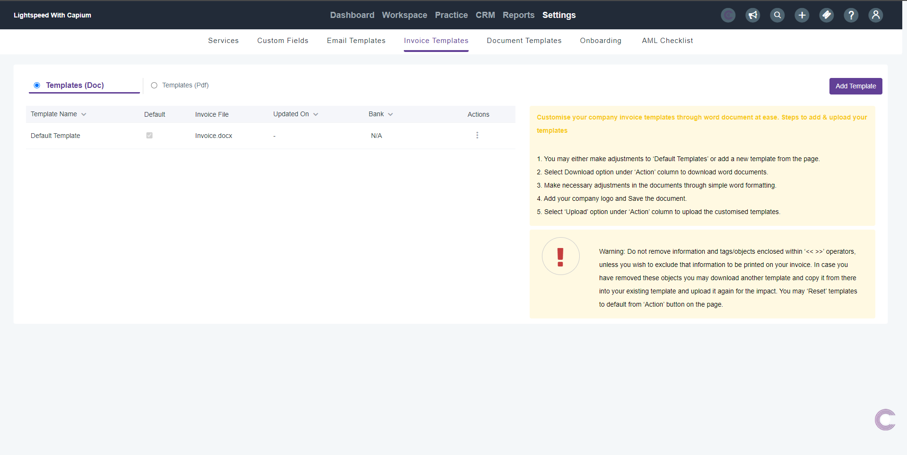
  - 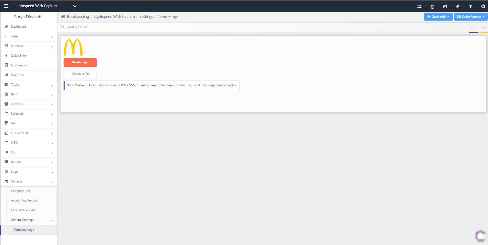
  - 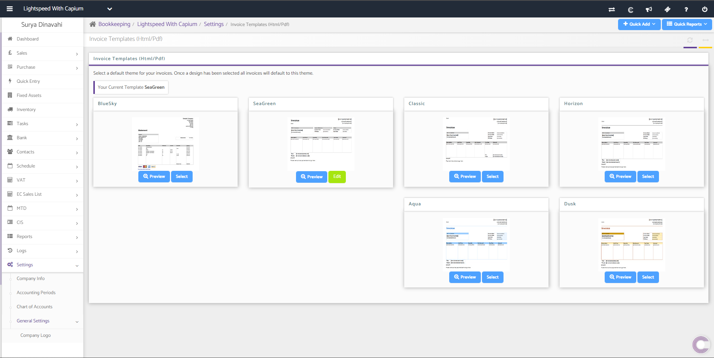
  - 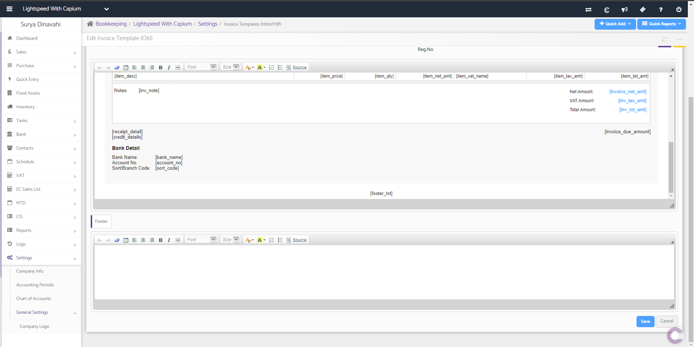
  - 

---

### 37. Practice Management - Bulk email; Email tagging &amp; Client type filter
- **Category/Folder:** Practice Management Help Guide
- **Article ID:** `9000224477` | **Slug:** `practice-management-bulk-email-email-tagging-client-type-filter`
- **Original URL:** [Freshdesk Link](https://capium.freshdesk.com/support/solutions/articles/9000224477-practice-management-bulk-email-email-tagging-client-type-filter)
- **Local Markdown:** [raw_articles/9000224477_practice-management-bulk-email-email-tagging-client-type-filter.md](../raw_articles/9000224477_practice-management-bulk-email-email-tagging-client-type-filter.md)
- **Images Count:** 2
- **Images:**
  - 
  - 

---

### 38. How to set up services, configure steps &amp; create reminders through Capium’s Practice Management
- **Category/Folder:** Practice Management Help Guide
- **Article ID:** `9000225224` | **Slug:** `how-to-set-up-services-configure-steps-create-reminders-through-capium-s-practice-management`
- **Original URL:** [Freshdesk Link](https://capium.freshdesk.com/support/solutions/articles/9000225224-how-to-set-up-services-configure-steps-create-reminders-through-capium-s-practice-management)
- **Local Markdown:** [raw_articles/9000225224_how-to-set-up-services-configure-steps-create-reminders-through-capium-s-practice-management.md](../raw_articles/9000225224_how-to-set-up-services-configure-steps-create-reminders-through-capium-s-practice-management.md)
- **Images Count:** 5
- **Images:**
  - 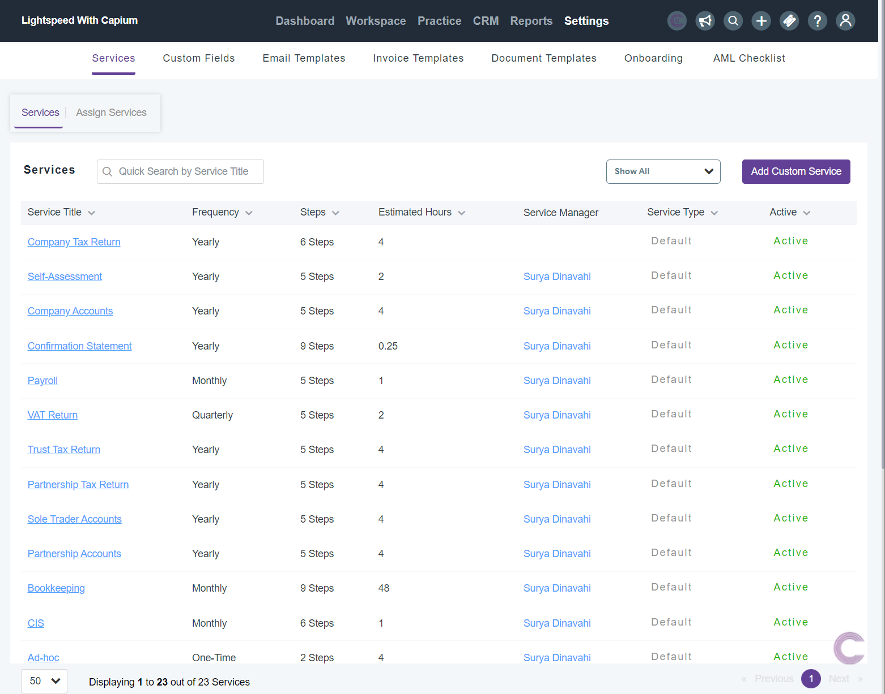
  - 
  - 
  - 
  - 

---

### 39. Create Sender ID - SMS
- **Category/Folder:** Practice Management Help Guide
- **Article ID:** `9000226161` | **Slug:** `create-sender-id-sms`
- **Original URL:** [Freshdesk Link](https://capium.freshdesk.com/support/solutions/articles/9000226161-create-sender-id-sms)
- **Local Markdown:** [raw_articles/9000226161_create-sender-id-sms.md](../raw_articles/9000226161_create-sender-id-sms.md)
- **Images Count:** 0

---

### 40. Customised Email Reminders
- **Category/Folder:** Practice Management Help Guide
- **Article ID:** `9000231489` | **Slug:** `customised-email-reminders`
- **Original URL:** [Freshdesk Link](https://capium.freshdesk.com/support/solutions/articles/9000231489-customised-email-reminders)
- **Local Markdown:** [raw_articles/9000231489_customised-email-reminders.md](../raw_articles/9000231489_customised-email-reminders.md)
- **Images Count:** 7
- **Images:**
  - 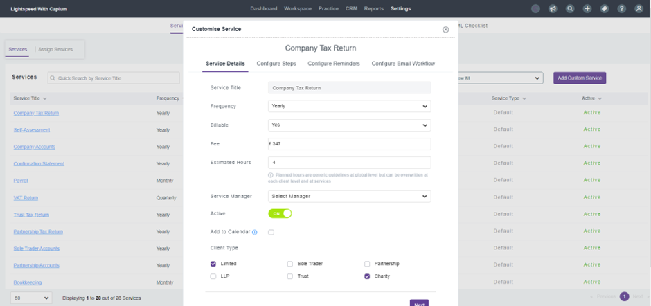
  - 
  - 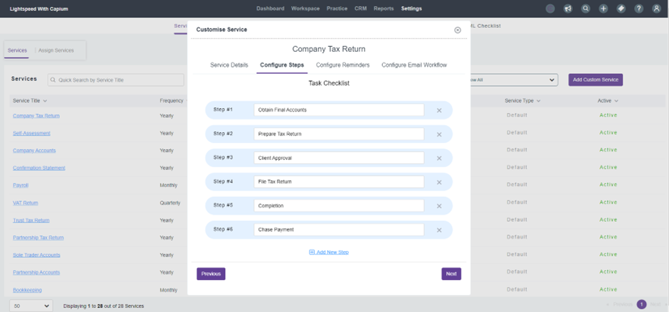
  - 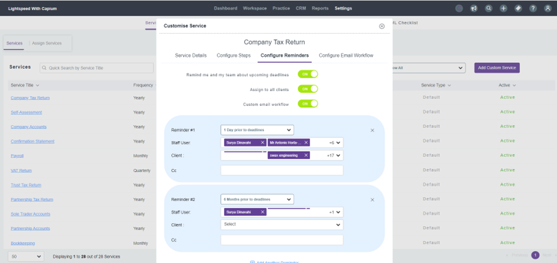
  - 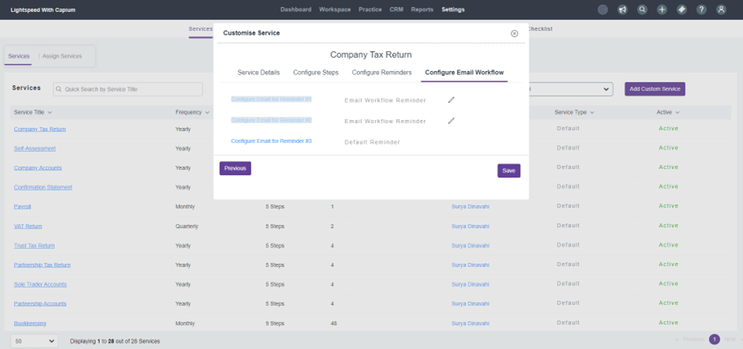
  - 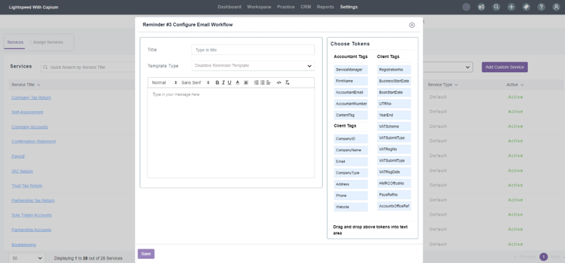
  - 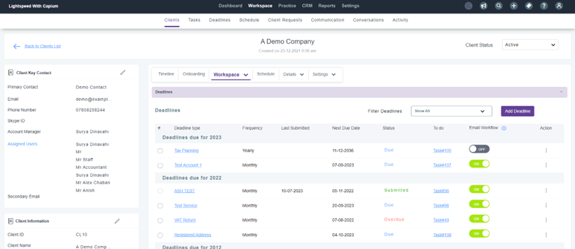

---

### 41. Uploading Multiple Documents in Practice Management
- **Category/Folder:** Practice Management Help Guide
- **Article ID:** `9000233105` | **Slug:** `uploading-multiple-documents-in-practice-management`
- **Original URL:** [Freshdesk Link](https://capium.freshdesk.com/support/solutions/articles/9000233105-uploading-multiple-documents-in-practice-management)
- **Local Markdown:** [raw_articles/9000233105_uploading-multiple-documents-in-practice-management.md](../raw_articles/9000233105_uploading-multiple-documents-in-practice-management.md)
- **Images Count:** 0

---

### 42. Introduction to CRM
- **Category/Folder:** Practice Management Help Guide
- **Article ID:** `9000235439` | **Slug:** `introduction-to-crm`
- **Original URL:** [Freshdesk Link](https://capium.freshdesk.com/support/solutions/articles/9000235439-introduction-to-crm)
- **Local Markdown:** [raw_articles/9000235439_introduction-to-crm.md](../raw_articles/9000235439_introduction-to-crm.md)
- **Images Count:** 4
- **Images:**
  - 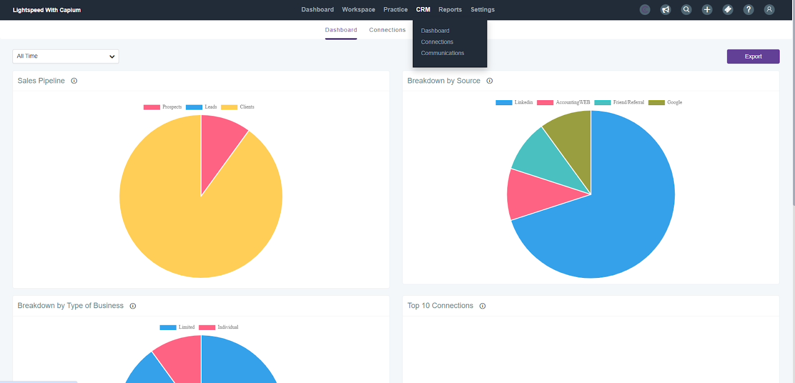
  - 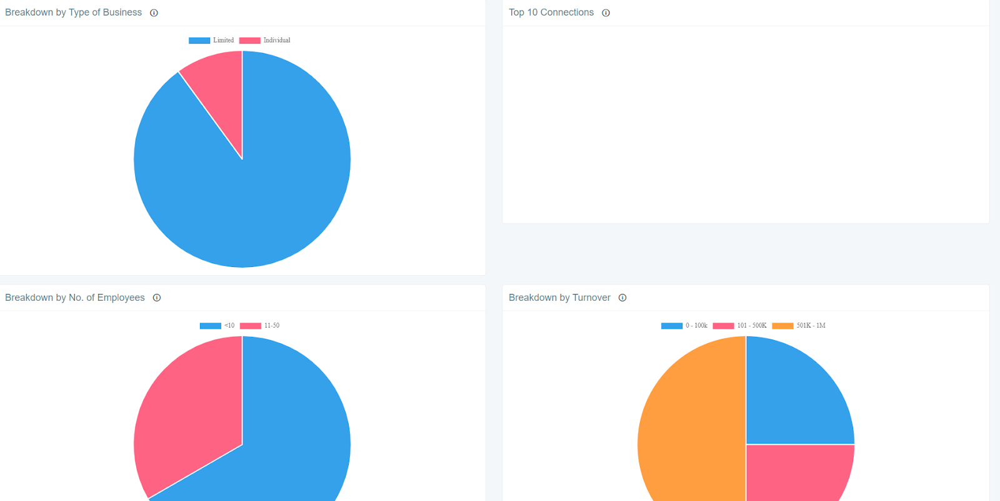
  - 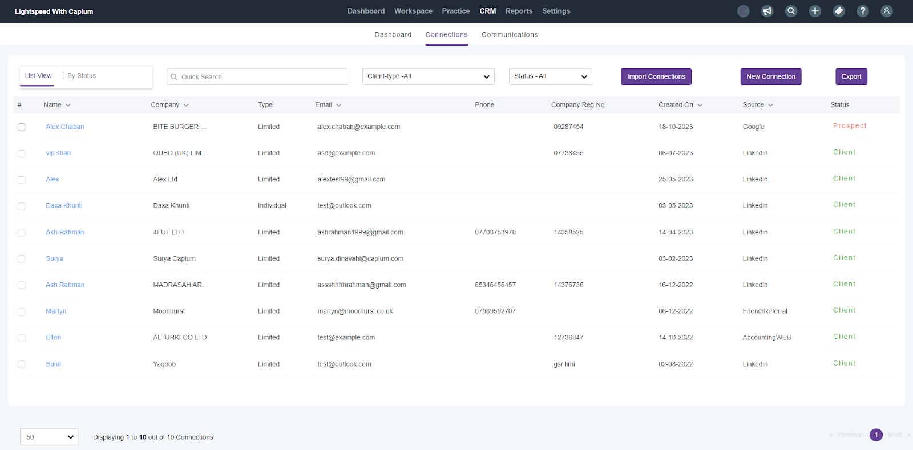
  - 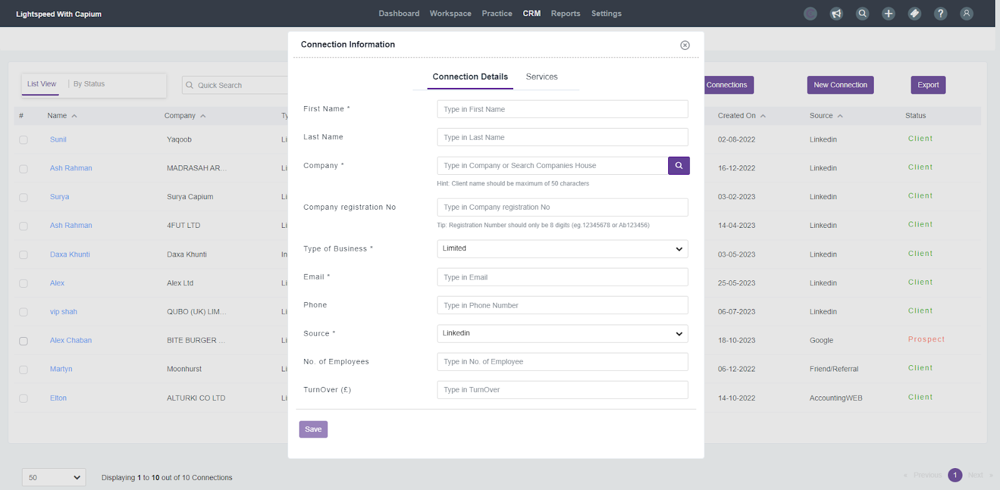

---

### 43. Risk Assessment Checks
- **Category/Folder:** Practice Management Help Guide
- **Article ID:** `9000235538` | **Slug:** `risk-assessment-checks`
- **Original URL:** [Freshdesk Link](https://capium.freshdesk.com/support/solutions/articles/9000235538-risk-assessment-checks)
- **Local Markdown:** [raw_articles/9000235538_risk-assessment-checks.md](../raw_articles/9000235538_risk-assessment-checks.md)
- **Images Count:** 12
- **Images:**
  - 
  - 
  - 
  - 
  - 
  - 
  - 
  - 
  - 
  - 
  - 
  - 

---

### 44. How to setup services and assigning services to clients 
- **Category/Folder:** Practice Management Help Guide
- **Article ID:** `9000235774` | **Slug:** `how-to-setup-services-and-assigning-services-to-clients-`
- **Original URL:** [Freshdesk Link](https://capium.freshdesk.com/support/solutions/articles/9000235774-how-to-setup-services-and-assigning-services-to-clients-)
- **Local Markdown:** [raw_articles/9000235774_how-to-setup-services-and-assigning-services-to-clients-.md](../raw_articles/9000235774_how-to-setup-services-and-assigning-services-to-clients-.md)
- **Images Count:** 10
- **Images:**
  - 
  - 
  - 
  - 
  - 
  - 
  - 
  - 
  - 
  - 

---

### 45. Practice Management – Refresh Deadlines
- **Category/Folder:** Practice Management Help Guide
- **Article ID:** `9000236557` | **Slug:** `practice-management-refresh-deadlines`
- **Original URL:** [Freshdesk Link](https://capium.freshdesk.com/support/solutions/articles/9000236557-practice-management-refresh-deadlines)
- **Local Markdown:** [raw_articles/9000236557_practice-management-refresh-deadlines.md](../raw_articles/9000236557_practice-management-refresh-deadlines.md)
- **Images Count:** 1
- **Images:**
  - 

---

### 46. Assigning a visible manager
- **Category/Folder:** Practice Management Help Guide
- **Article ID:** `9000237170` | **Slug:** `assigning-a-visible-manager`
- **Original URL:** [Freshdesk Link](https://capium.freshdesk.com/support/solutions/articles/9000237170-assigning-a-visible-manager)
- **Local Markdown:** [raw_articles/9000237170_assigning-a-visible-manager.md](../raw_articles/9000237170_assigning-a-visible-manager.md)
- **Images Count:** 1
- **Images:**
  - 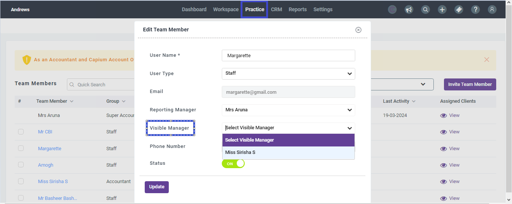

---

### 47. Letters in Practice Management
- **Category/Folder:** Practice Management Help Guide
- **Article ID:** `9000238645` | **Slug:** `letters-in-practice-management`
- **Original URL:** [Freshdesk Link](https://capium.freshdesk.com/support/solutions/articles/9000238645-letters-in-practice-management)
- **Local Markdown:** [raw_articles/9000238645_letters-in-practice-management.md](../raw_articles/9000238645_letters-in-practice-management.md)
- **Images Count:** 9
- **Images:**
  - 
  - 
  - 
  - 
  - 
  - 
  - 
  - 
  - 

---

### 48. How to adjust fees for services, assigning services to your clients, and raising invoices all within our Practice Management module.
- **Category/Folder:** Practice Management Help Guide
- **Article ID:** `9000267572` | **Slug:** `how-to-adjust-fees-for-services-assigning-services-to-your-clients-and-raising-invoices-all-within-`
- **Original URL:** [Freshdesk Link](https://capium.freshdesk.com/support/solutions/articles/9000267572-how-to-adjust-fees-for-services-assigning-services-to-your-clients-and-raising-invoices-all-within-)
- **Local Markdown:** [raw_articles/9000267572_how-to-adjust-fees-for-services-assigning-services-to-your-clients-and-raising-invoices-all-within-.md](../raw_articles/9000267572_how-to-adjust-fees-for-services-assigning-services-to-your-clients-and-raising-invoices-all-within-.md)
- **Images Count:** 20
- **Images:**
  - 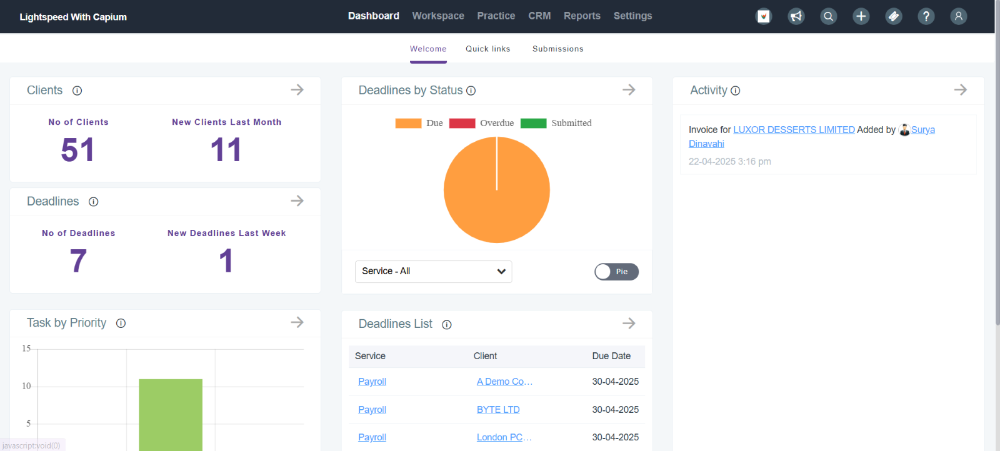
  - 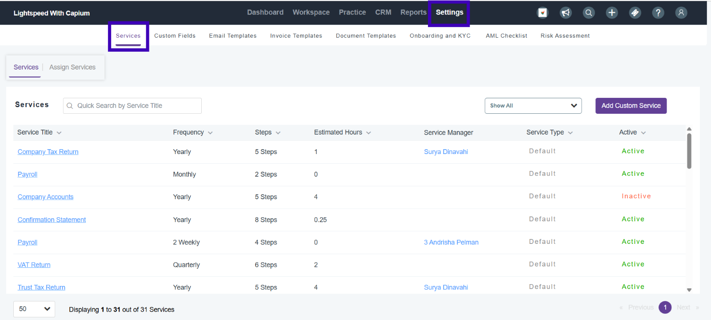
  - 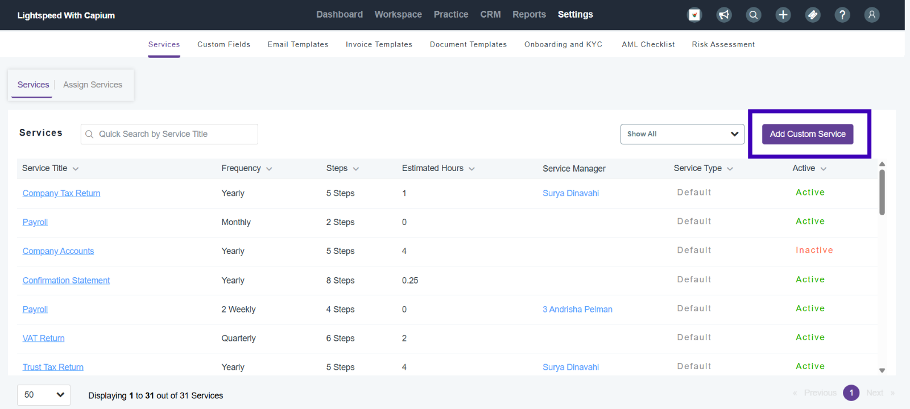
  - 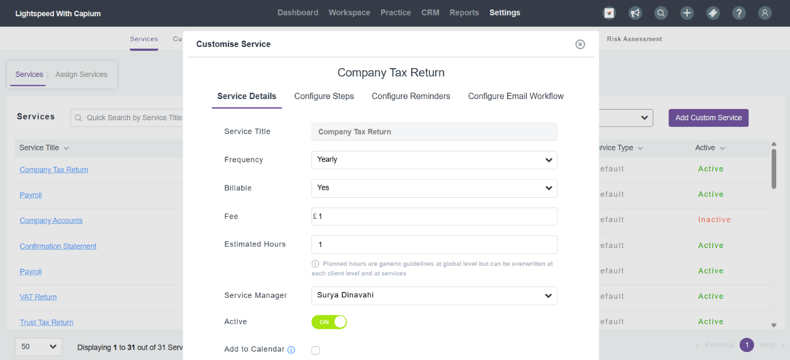
  - 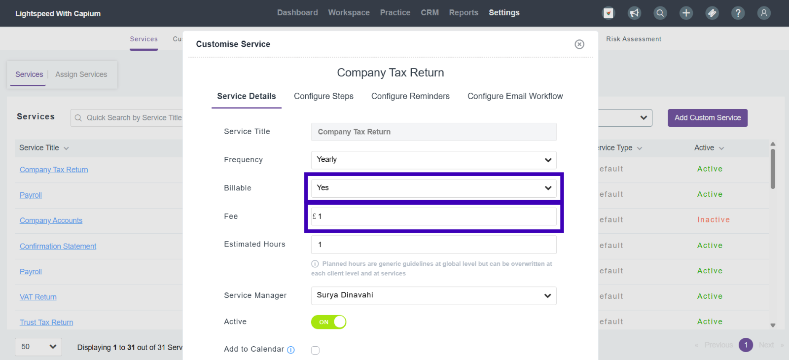
  - 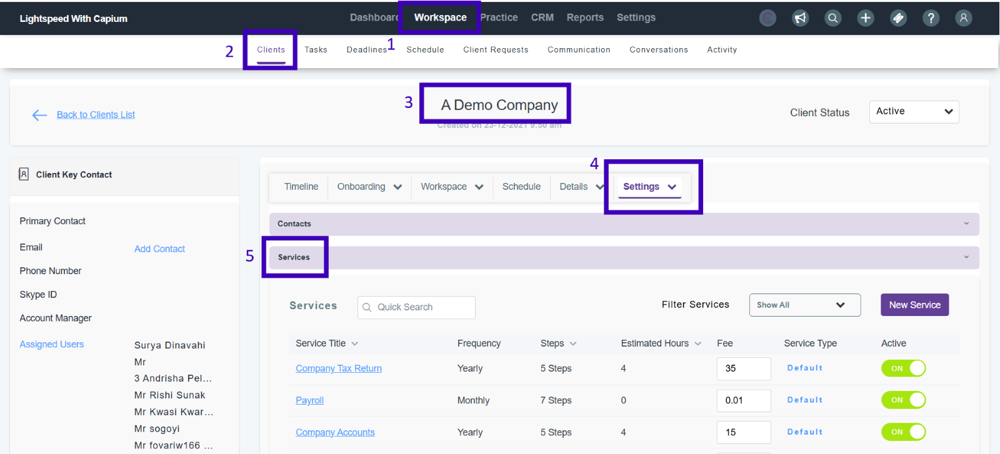
  - 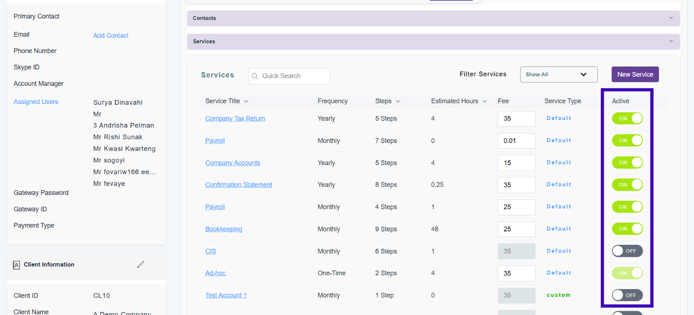
  - 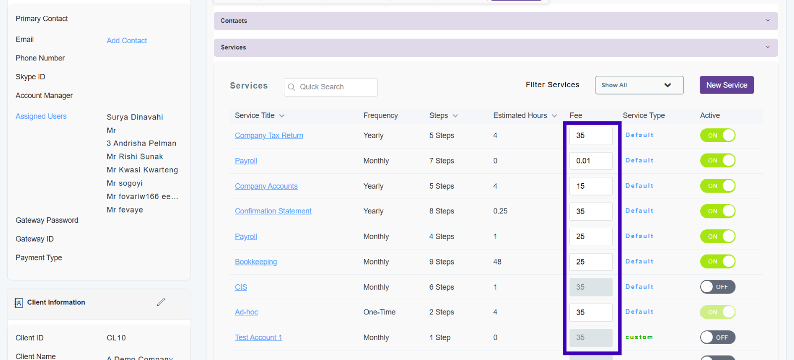
  - 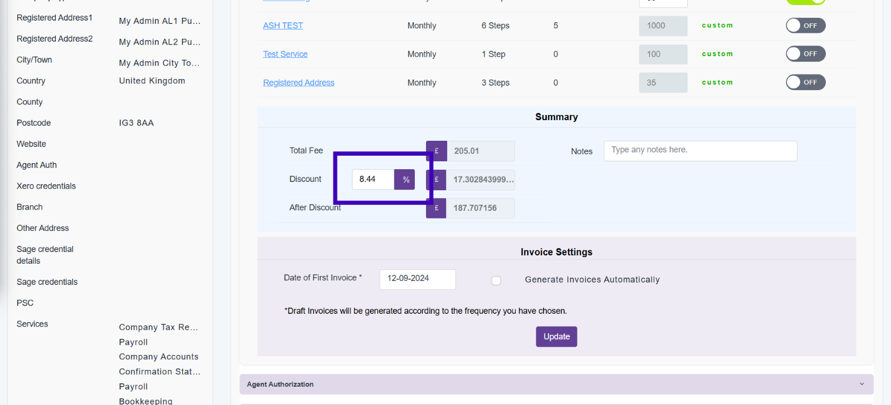
  - 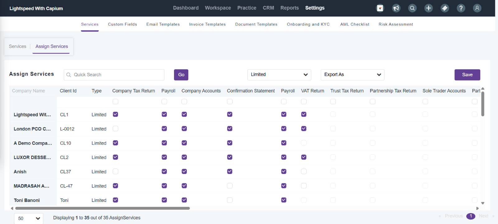
  - 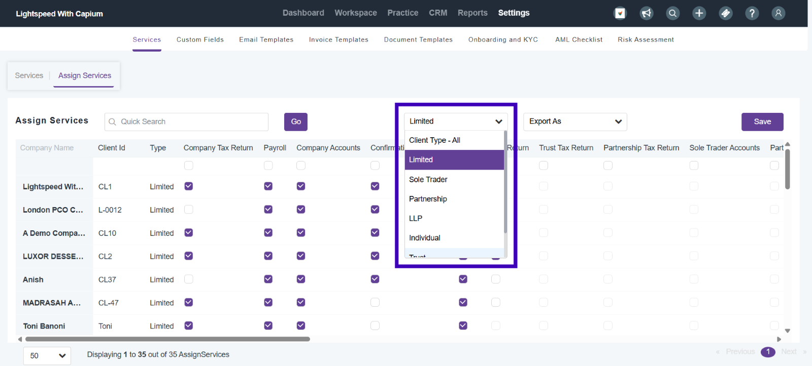
  - 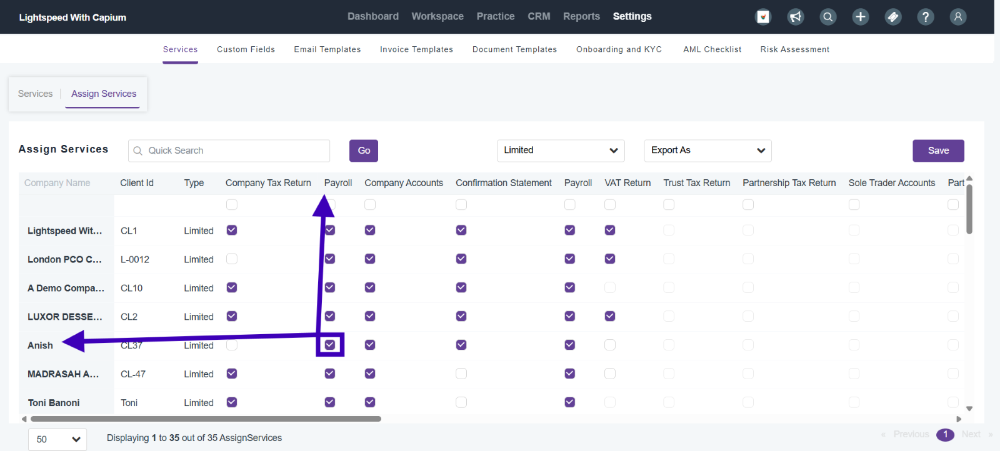
  - 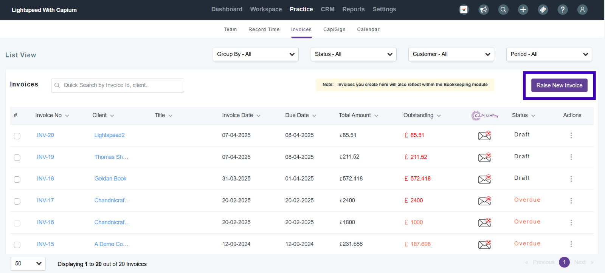
  - 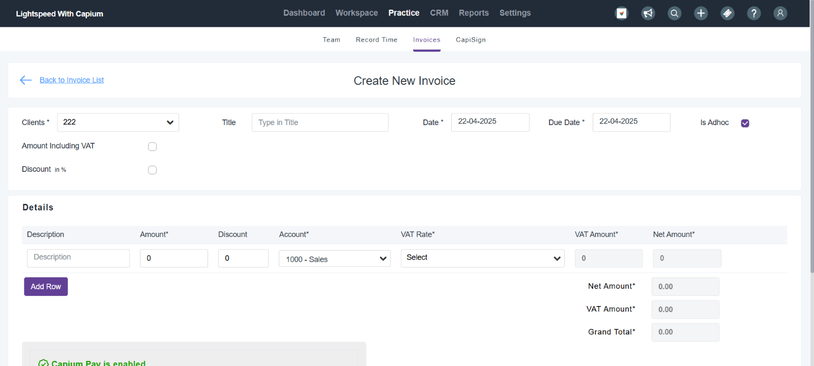
  - 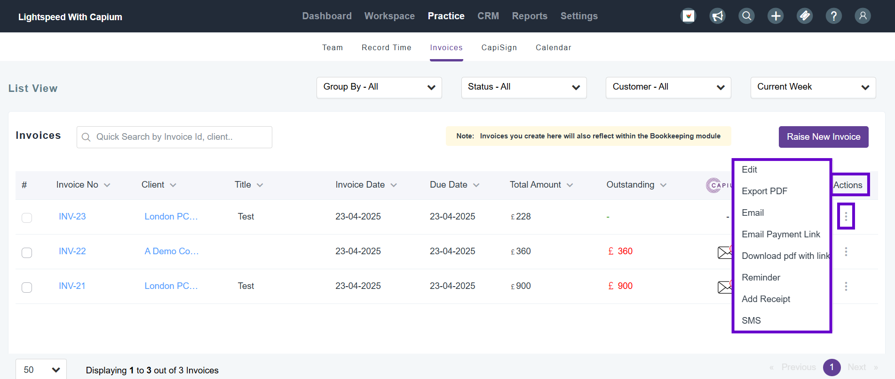
  - 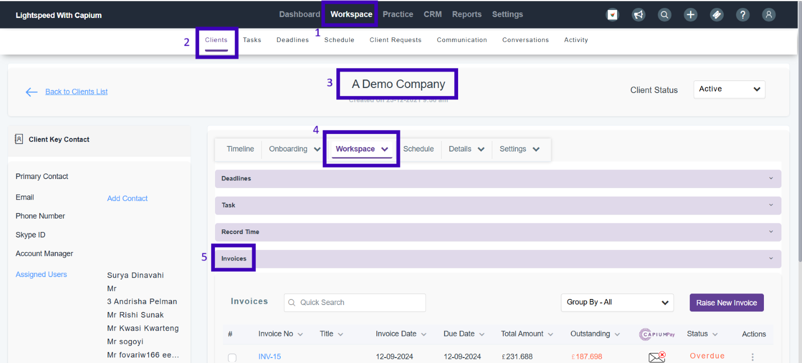
  - 
  - 
  - 
  - 

---

### 49. How to reactivate a client- My admin
- **Category/Folder:** Practice Management Help Guide
- **Article ID:** `9000271639` | **Slug:** `how-to-reactivate-a-client-my-admin`
- **Original URL:** [Freshdesk Link](https://capium.freshdesk.com/support/solutions/articles/9000271639-how-to-reactivate-a-client-my-admin)
- **Local Markdown:** [raw_articles/9000271639_how-to-reactivate-a-client-my-admin.md](../raw_articles/9000271639_how-to-reactivate-a-client-my-admin.md)
- **Images Count:** 1
- **Images:**
  - 

---

### 50. MTD IT Deadlines in Practice Management
- **Category/Folder:** Practice Management Help Guide
- **Article ID:** `9000276995` | **Slug:** `mtd-it-deadlines-in-practice-management`
- **Original URL:** [Freshdesk Link](https://capium.freshdesk.com/support/solutions/articles/9000276995-mtd-it-deadlines-in-practice-management)
- **Local Markdown:** [raw_articles/9000276995_mtd-it-deadlines-in-practice-management.md](../raw_articles/9000276995_mtd-it-deadlines-in-practice-management.md)
- **Images Count:** 5
- **Images:**
  - 
  - 
  - 
  - 
  - 

---

### 51. Top Article - How  offer services through Capium practice management platform
- **Category/Folder:** Practice Management FAQs
- **Article ID:** `9000166605` | **Slug:** `top-article-how-offer-services-through-capium-practice-management-platform`
- **Original URL:** [Freshdesk Link](https://capium.freshdesk.com/support/solutions/articles/9000166605-top-article-how-offer-services-through-capium-practice-management-platform)
- **Local Markdown:** [raw_articles/9000166605_top-article-how-offer-services-through-capium-practice-management-platform.md](../raw_articles/9000166605_top-article-how-offer-services-through-capium-practice-management-platform.md)
- **Images Count:** 5
- **Images:**
  - 
  - 
  - 
  - 
  - 

---

### 52. Electronic signing - How to E-Sign using Capisign
- **Category/Folder:** Practice Management FAQs
- **Article ID:** `9000165786` | **Slug:** `electronic-signing-how-to-e-sign-using-capisign`
- **Original URL:** [Freshdesk Link](https://capium.freshdesk.com/support/solutions/articles/9000165786-electronic-signing-how-to-e-sign-using-capisign)
- **Local Markdown:** [raw_articles/9000165786_electronic-signing-how-to-e-sign-using-capisign.md](../raw_articles/9000165786_electronic-signing-how-to-e-sign-using-capisign.md)
- **Images Count:** 7
- **Images:**
  - 
  - 
  - 
  - 
  - 
  - 
  - 

---

### 53. How do deadline reminders work?
- **Category/Folder:** Practice Management FAQs
- **Article ID:** `9000165783` | **Slug:** `how-do-deadline-reminders-work-`
- **Original URL:** [Freshdesk Link](https://capium.freshdesk.com/support/solutions/articles/9000165783-how-do-deadline-reminders-work-)
- **Local Markdown:** [raw_articles/9000165783_how-do-deadline-reminders-work-.md](../raw_articles/9000165783_how-do-deadline-reminders-work-.md)
- **Images Count:** 2
- **Images:**
  - 
  - 

---

### 54. Practice Management Client Details Screen
- **Category/Folder:** Practice Management FAQs
- **Article ID:** `9000165779` | **Slug:** `practice-management-client-details-screen`
- **Original URL:** [Freshdesk Link](https://capium.freshdesk.com/support/solutions/articles/9000165779-practice-management-client-details-screen)
- **Local Markdown:** [raw_articles/9000165779_practice-management-client-details-screen.md](../raw_articles/9000165779_practice-management-client-details-screen.md)
- **Images Count:** 2
- **Images:**
  - 
  - 

---

### 55. Configure email templates
- **Category/Folder:** Practice Management FAQs
- **Article ID:** `9000165784` | **Slug:** `configure-email-templates`
- **Original URL:** [Freshdesk Link](https://capium.freshdesk.com/support/solutions/articles/9000165784-configure-email-templates)
- **Local Markdown:** [raw_articles/9000165784_configure-email-templates.md](../raw_articles/9000165784_configure-email-templates.md)
- **Images Count:** 1
- **Images:**
  - 

---

### 56. Agent Authorisation 64-8 Request
- **Category/Folder:** Practice Management FAQs
- **Article ID:** `9000165781` | **Slug:** `agent-authorisation-64-8-request`
- **Original URL:** [Freshdesk Link](https://capium.freshdesk.com/support/solutions/articles/9000165781-agent-authorisation-64-8-request)
- **Local Markdown:** [raw_articles/9000165781_agent-authorisation-64-8-request.md](../raw_articles/9000165781_agent-authorisation-64-8-request.md)
- **Images Count:** 3
- **Images:**
  - 
  - 
  - 

---

### 57. How does task reminders work?
- **Category/Folder:** Practice Management FAQs
- **Article ID:** `9000165782` | **Slug:** `how-does-task-reminders-work-`
- **Original URL:** [Freshdesk Link](https://capium.freshdesk.com/support/solutions/articles/9000165782-how-does-task-reminders-work-)
- **Local Markdown:** [raw_articles/9000165782_how-does-task-reminders-work-.md](../raw_articles/9000165782_how-does-task-reminders-work-.md)
- **Images Count:** 3
- **Images:**
  - 
  - 
  - 

---

### 58. How to add Team members
- **Category/Folder:** Practice Management FAQs
- **Article ID:** `9000165785` | **Slug:** `how-to-add-team-members`
- **Original URL:** [Freshdesk Link](https://capium.freshdesk.com/support/solutions/articles/9000165785-how-to-add-team-members)
- **Local Markdown:** [raw_articles/9000165785_how-to-add-team-members.md](../raw_articles/9000165785_how-to-add-team-members.md)
- **Images Count:** 1
- **Images:**
  - 

---

### 59. How to send Bulk Emails in Practice Management
- **Category/Folder:** Practice Management FAQs
- **Article ID:** `9000166533` | **Slug:** `how-to-send-bulk-emails-in-practice-management`
- **Original URL:** [Freshdesk Link](https://capium.freshdesk.com/support/solutions/articles/9000166533-how-to-send-bulk-emails-in-practice-management)
- **Local Markdown:** [raw_articles/9000166533_how-to-send-bulk-emails-in-practice-management.md](../raw_articles/9000166533_how-to-send-bulk-emails-in-practice-management.md)
- **Images Count:** 0

---

### 60. How to send Document Requests to clients on Practice Management
- **Category/Folder:** Practice Management FAQs
- **Article ID:** `9000166534` | **Slug:** `how-to-send-document-requests-to-clients-on-practice-management`
- **Original URL:** [Freshdesk Link](https://capium.freshdesk.com/support/solutions/articles/9000166534-how-to-send-document-requests-to-clients-on-practice-management)
- **Local Markdown:** [raw_articles/9000166534_how-to-send-document-requests-to-clients-on-practice-management.md](../raw_articles/9000166534_how-to-send-document-requests-to-clients-on-practice-management.md)
- **Images Count:** 0

---

### 61. How do I respond to Client Requests?
- **Category/Folder:** Practice Management FAQs
- **Article ID:** `9000174901` | **Slug:** `how-do-i-respond-to-client-requests-`
- **Original URL:** [Freshdesk Link](https://capium.freshdesk.com/support/solutions/articles/9000174901-how-do-i-respond-to-client-requests-)
- **Local Markdown:** [raw_articles/9000174901_how-do-i-respond-to-client-requests-.md](../raw_articles/9000174901_how-do-i-respond-to-client-requests-.md)
- **Images Count:** 2
- **Images:**
  - 
  - 

---

### 62. How to add a logo to a Letter of Engagement/Proposal letter
- **Category/Folder:** Practice Management FAQs
- **Article ID:** `9000201481` | **Slug:** `how-to-add-a-logo-to-a-letter-of-engagement-proposal-letter`
- **Original URL:** [Freshdesk Link](https://capium.freshdesk.com/support/solutions/articles/9000201481-how-to-add-a-logo-to-a-letter-of-engagement-proposal-letter)
- **Local Markdown:** [raw_articles/9000201481_how-to-add-a-logo-to-a-letter-of-engagement-proposal-letter.md](../raw_articles/9000201481_how-to-add-a-logo-to-a-letter-of-engagement-proposal-letter.md)
- **Images Count:** 3
- **Images:**
  - 
  - 
  - 

---

### 63. How to view your users activity in My Admin and Practice Management
- **Category/Folder:** Practice Management FAQs
- **Article ID:** `9000203352` | **Slug:** `how-to-view-your-users-activity-in-my-admin-and-practice-management`
- **Original URL:** [Freshdesk Link](https://capium.freshdesk.com/support/solutions/articles/9000203352-how-to-view-your-users-activity-in-my-admin-and-practice-management)
- **Local Markdown:** [raw_articles/9000203352_how-to-view-your-users-activity-in-my-admin-and-practice-management.md](../raw_articles/9000203352_how-to-view-your-users-activity-in-my-admin-and-practice-management.md)
- **Images Count:** 3
- **Images:**
  - 
  - 
  - 

---

### 64. How to export the client list from practice management?
- **Category/Folder:** Practice Management FAQs
- **Article ID:** `9000236608` | **Slug:** `how-to-export-the-client-list-from-practice-management-`
- **Original URL:** [Freshdesk Link](https://capium.freshdesk.com/support/solutions/articles/9000236608-how-to-export-the-client-list-from-practice-management-)
- **Local Markdown:** [raw_articles/9000236608_how-to-export-the-client-list-from-practice-management-.md](../raw_articles/9000236608_how-to-export-the-client-list-from-practice-management-.md)
- **Images Count:** 2
- **Images:**
  - 
  - 

---

### 65. Refreshing deadlines in Practice Management
- **Category/Folder:** Practice Management FAQs
- **Article ID:** `9000247184` | **Slug:** `refreshing-deadlines-in-practice-management`
- **Original URL:** [Freshdesk Link](https://capium.freshdesk.com/support/solutions/articles/9000247184-refreshing-deadlines-in-practice-management)
- **Local Markdown:** [raw_articles/9000247184_refreshing-deadlines-in-practice-management.md](../raw_articles/9000247184_refreshing-deadlines-in-practice-management.md)
- **Images Count:** 2
- **Images:**
  - 
  - 

---

