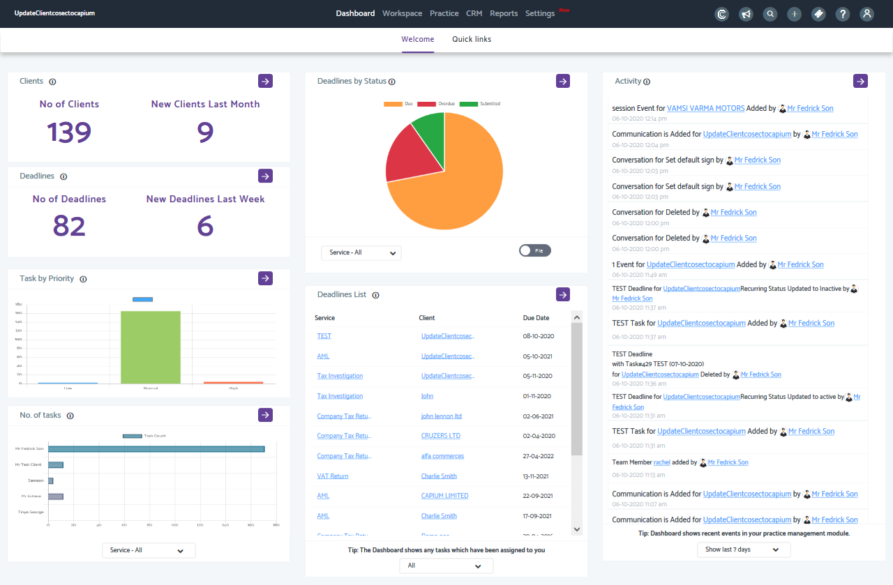

# Practice Management Dashboard
	 	
			
			Print

- **Folder:** Practice Management Help Guide
- **Source URL:** [https://capium.freshdesk.com/support/solutions/articles/9000165732-practice-management-dashboard](https://capium.freshdesk.com/support/solutions/articles/9000165732-practice-management-dashboard)
- **Article ID:** 9000165732

## Content

Solution home 
		Practice Management 
		Practice Management Help Guide

### Practice Management Dashboard

			Print

	Modified on: Tue, 6 Oct, 2020 at  5:26 PM

		Location: Practice Management module > Dashboard

You can see Number of clients and new Clients last month as well as number of Deadlines and new Deadlines last week. You will also be able to see a Deadlines by status chart, Tasks by Priority Chart, No of Tasks chart, Deadlines list and an Activity list. 

Tasks

● Total number of tasks by priority

● No of Tasks in each team member's list which can be filtered by Service 

Deadlines

● Deadlines by Status chart - interactive chart which allows you to go configure the Deadlines, then to click on the filter  (Due, Overdue, Submitted) to view the full deadlines list 

● Deadlines list with the ability to filter by All, Upcoming or Overdue

Activity

● Recent activities list for the current week

● Recent activities list for the current month

Watch the video to see the Practice Management Dashboard Overview.

										Did you find it helpful?
								Yes
								No

Send feedback	Sorry we couldn't be helpful. Help us improve this article with your feedback.

## Images & Screenshots (1)

