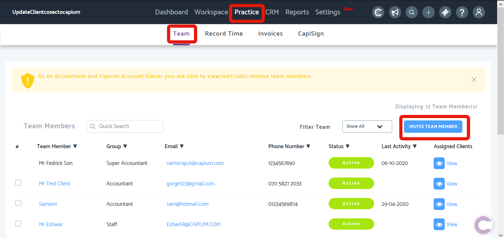
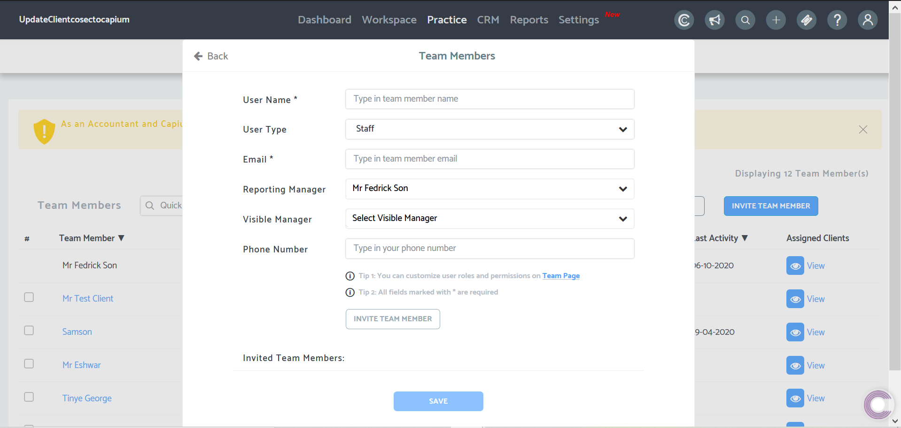

# How to add team members
	 	
			
			Print

- **Folder:** Practice Management Help Guide
- **Source URL:** [https://capium.freshdesk.com/support/solutions/articles/9000165734-how-to-add-team-members](https://capium.freshdesk.com/support/solutions/articles/9000165734-how-to-add-team-members)
- **Article ID:** 9000165734

## Content

Solution home 
		Practice Management 
		Practice Management Help Guide

### How to add team members

			Print

	Modified on: Tue, 6 Oct, 2020 at  5:11 PM

		Location: Practice Management module > Practice > Team

As an Accountant and Capium Account Owner you can view/edit/add/remove team members.

Refer to the link

Help/Guide:
● You can search for a specific team member using a quick search option available.
● You can filter the list view by team members roles as an accountant and staff
● You can filter the list view by team member’s status as active or Inactive

Invite team members by email address 

Watch the video on how to add team members here

										Did you find it helpful?
								Yes
								No

Send feedback	Sorry we couldn't be helpful. Help us improve this article with your feedback.

## Images & Screenshots (2)

