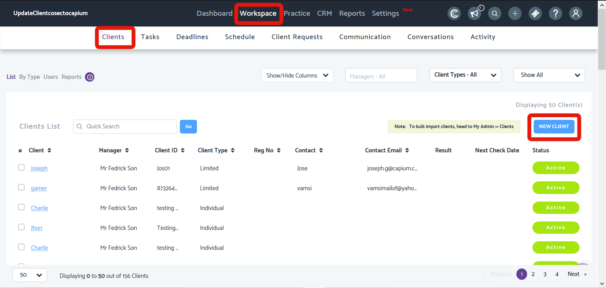
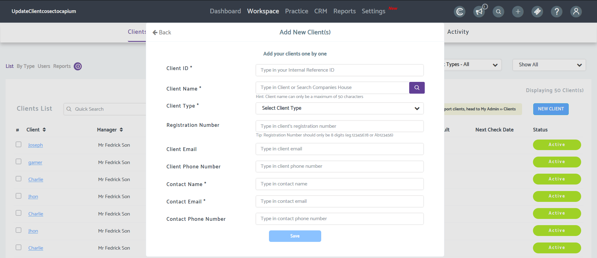

# Adding Clients manually in Practice Management
	 	
			
			Print

- **Folder:** Practice Management Help Guide
- **Source URL:** [https://capium.freshdesk.com/support/solutions/articles/9000165736-adding-clients-manually-in-practice-management](https://capium.freshdesk.com/support/solutions/articles/9000165736-adding-clients-manually-in-practice-management)
- **Article ID:** 9000165736

## Content

Solution home 
		Practice Management 
		Practice Management Help Guide

### Adding Clients manually in Practice Management

			Print

	Modified on: Mon, 12 Oct, 2020 at  5:21 PM

		Location: Practice Management module > Workspace > Clients

Refer to the link

Clients added in Practice Management will also reflect globally across Capium

Help/Guide:

You can view clients by list, by services, by status, Contacts, reports

You can search for specific clients using quick search option available

You can filter the list view by Clients Type as Limited, Partnership, Sole Trader, Limited Liability Partnership, Individual, Charity, and Trust.

You can filter the list view by clients’ status as active or Inactive and Active in last 30 days & Active in last 90 days.

You can update client status and you can delete a client by selecting them using the checkbox

										Did you find it helpful?
								Yes
								No

Send feedback	Sorry we couldn't be helpful. Help us improve this article with your feedback.

## Images & Screenshots (2)

