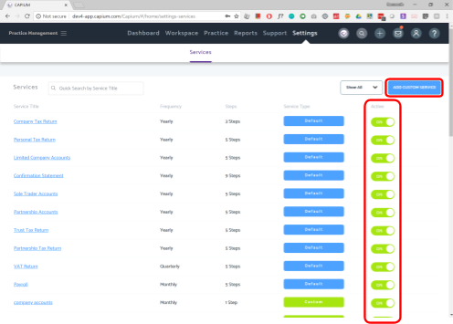
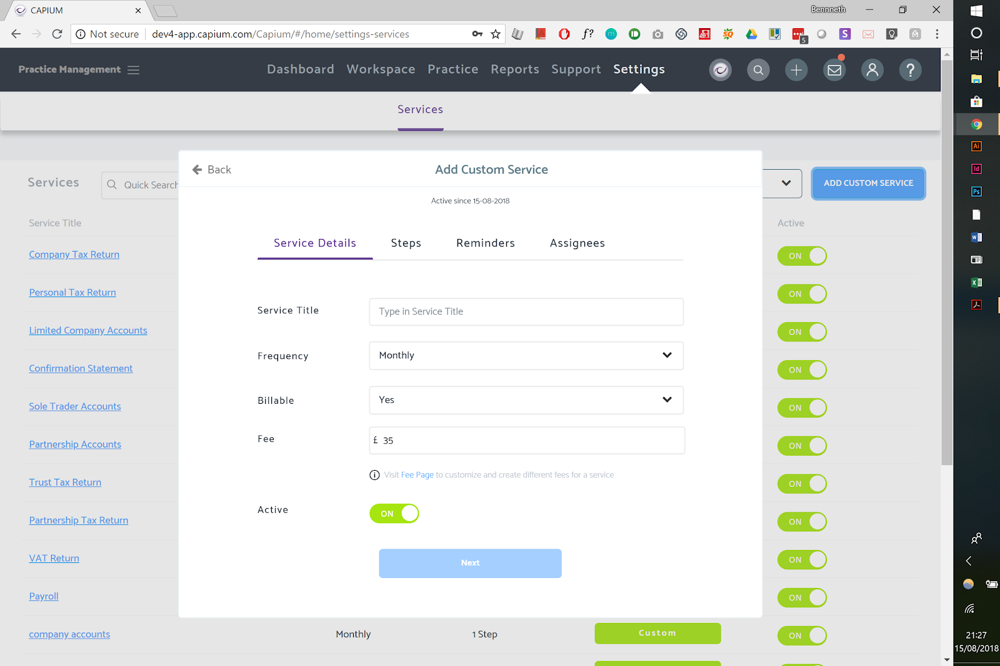

# Add a custom service
	 	
			
			Print

- **Folder:** Practice Management Help Guide
- **Source URL:** [https://capium.freshdesk.com/support/solutions/articles/9000165742-add-a-custom-service](https://capium.freshdesk.com/support/solutions/articles/9000165742-add-a-custom-service)
- **Article ID:** 9000165742

## Content

Solution home 
		Practice Management 
		Practice Management Help Guide

### Add a custom service

			Print

	Modified on: Fri, 29 Nov, 2019 at  5:27 PM

		Location: Practice Management module > Settings > Services

Refer to the link

Help/Guide:

• You can activate different types of services you are providing to your clients in the settings page for global services by using the toggles on the right [highlighted in the red box below].

### Adding new custom service

										Did you find it helpful?
								Yes
								No

Send feedback	Sorry we couldn't be helpful. Help us improve this article with your feedback.

## Images & Screenshots (2)

