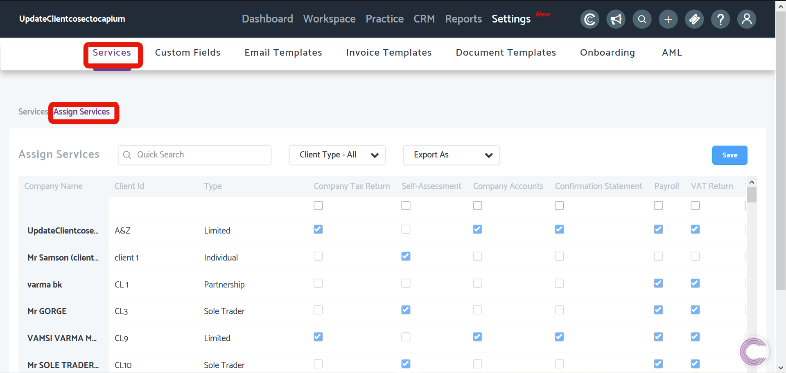
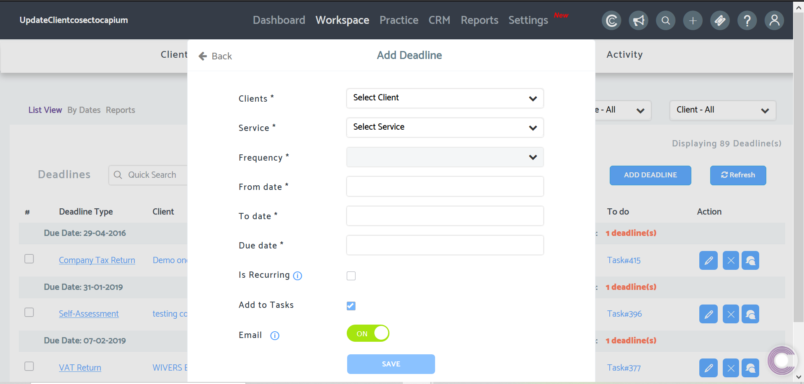

# Add deadlines
	 	
			
			Print

- **Folder:** Practice Management Help Guide
- **Source URL:** [https://capium.freshdesk.com/support/solutions/articles/9000165771-add-deadlines](https://capium.freshdesk.com/support/solutions/articles/9000165771-add-deadlines)
- **Article ID:** 9000165771

## Content

Solution home 
		Practice Management 
		Practice Management Help Guide

### Add deadlines

			Print

	Modified on: Mon, 5 Oct, 2020 at  5:27 PM

		Location: Practice Management module > Workspace > Deadlines

### Help Guide

Before adding a deadline, you must assign the relevant Service to your clients from Settings > Services > Assign Services. In this section, you will find a grid view of your clients to the left and the services above, simply tick the checkboxes to assign those services to your clients.

Note: Practice Management will automatically create your Company Accounts and Confirmation Statement Deadlines as long as you have assigned the respective Services to your clients as well as having already entered the Company Reg No's for each client.

Once you have assigned relevant the service(s), you can now begin the process of setting up Deadlines. Head to Deadlines under Workspace and click Add Deadline once there.

Then fill the form in by selecting a client and Service (if you are trying to setup a VAT or Company Tax Deadline, you will need to create an Accounting/VAT Period - click here to see how to do so). Once done, the frequency and dates will be automatically populated based on the selected deadline.

You then have the options to set the deadline up as recurring so that the it will automatically create the next one as well as create a Task based on that deadline.

Lastly, you have a Email toggle function which will enable or disable email notifcations for any activity regarding the deadline you are creating.

										Did you find it helpful?
								Yes
								No

Send feedback	Sorry we couldn't be helpful. Help us improve this article with your feedback.

## Images & Screenshots (2)

