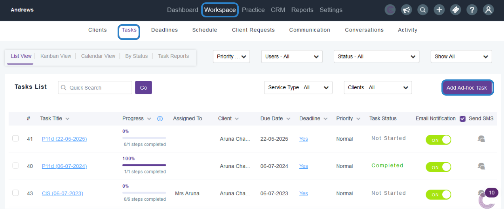
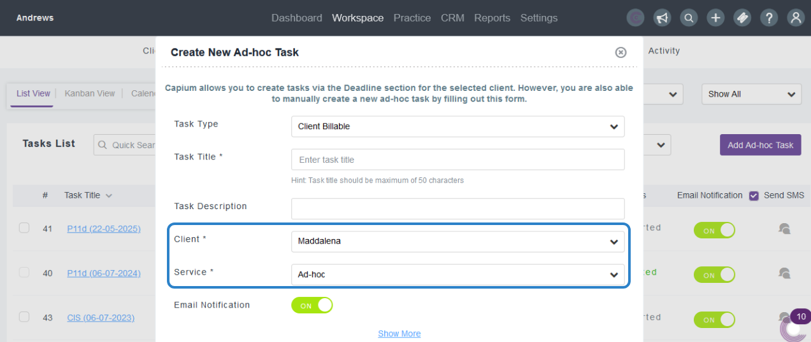
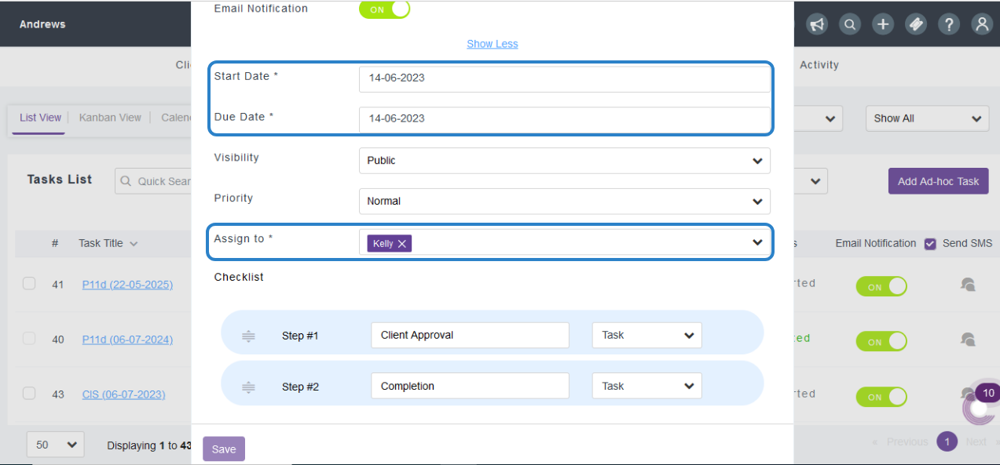

# How does task reminders work?
	 	
			
			Print

- **Folder:** Practice Management FAQs
- **Source URL:** [https://capium.freshdesk.com/support/solutions/articles/9000165782-how-does-task-reminders-work-](https://capium.freshdesk.com/support/solutions/articles/9000165782-how-does-task-reminders-work-)
- **Article ID:** 9000165782

## Content

Solution home 
		Practice Management 
		Practice Management FAQs

### How does task reminders work?

			Print

	Modified on: Wed, 14 Jun, 2023 at  3:56 PM

		Location: Practice Management module > Workspace > Tasks > Click Adhoc TaskHelp Guide:You can set up a Task from the above-mentioned path where there are mandatory fields to be updated.Through the notifications when enabled the accountants and the assigned staff members to the task will receive an email reminder.As you Click on Show More option there will be start and Due Dates to be updated and based on dates system will generate an auto Email notifications. In this step only you can assign this particular task to any of staff User.

										Did you find it helpful?
								Yes
								No

Send feedback	Sorry we couldn't be helpful. Help us improve this article with your feedback.

## Images & Screenshots (3)

