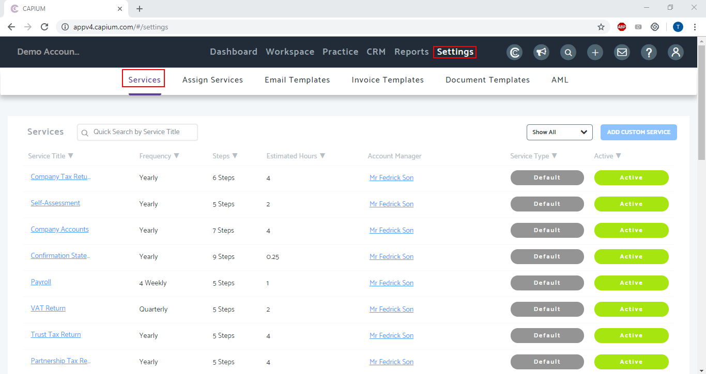
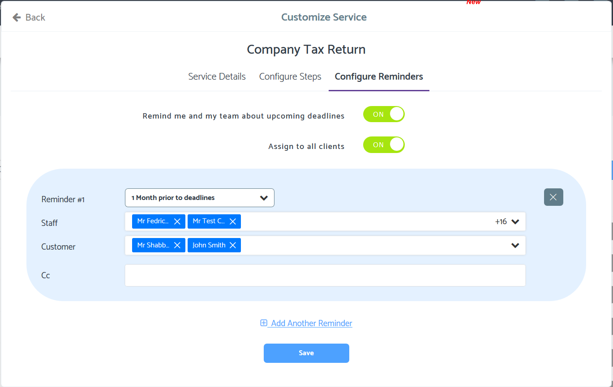

# How do deadline reminders work?
	 	
			
			Print

- **Folder:** Practice Management FAQs
- **Source URL:** [https://capium.freshdesk.com/support/solutions/articles/9000165783-how-do-deadline-reminders-work-](https://capium.freshdesk.com/support/solutions/articles/9000165783-how-do-deadline-reminders-work-)
- **Article ID:** 9000165783

## Content

Solution home 
		Practice Management 
		Practice Management FAQs

### How do deadline reminders work?

			Print

	Modified on: Tue, 28 Apr, 2020 at 12:59 PM

		Location: Practice Management module > Settings > Services > Select Service > Configure Reminders

You can add/view the reminders to the tasks.

Help/Guide:

 - You can add/view reminders to the services.
 - There will be a radio button to activate the deadline reminders
 - You may choose the period of how many days/weeks/months before you would like to get the reminder.
 - Here we have two ways to get the reminders. - Through the notifications on the top right-hand side
 - The accountants and the staff members assigned to the service will receive an email reminder.

Also, you can add multiple reminders for different periods.

										Did you find it helpful?
								Yes
								No

Send feedback	Sorry we couldn't be helpful. Help us improve this article with your feedback.

## Images & Screenshots (2)

