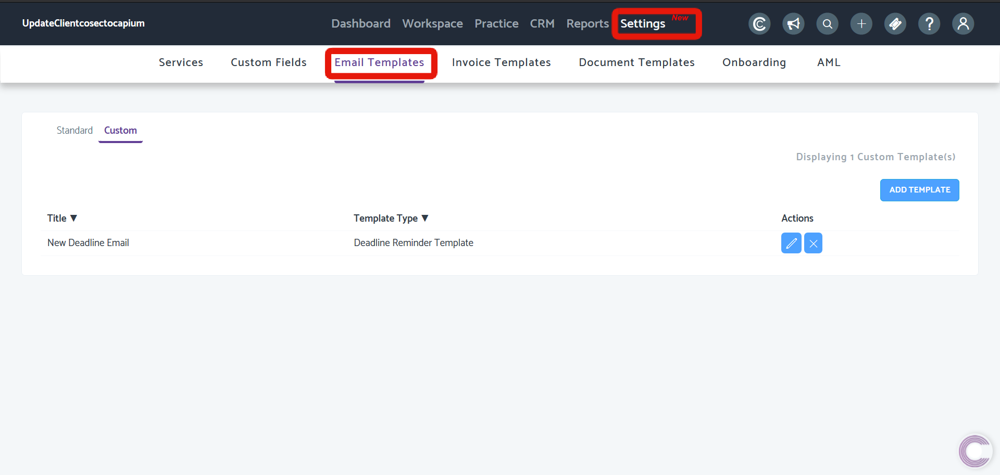

# Configure email templates
	 	
			
			Print

- **Folder:** Practice Management FAQs
- **Source URL:** [https://capium.freshdesk.com/support/solutions/articles/9000165784-configure-email-templates](https://capium.freshdesk.com/support/solutions/articles/9000165784-configure-email-templates)
- **Article ID:** 9000165784

## Content

Solution home 
		Practice Management 
		Practice Management FAQs

### Configure email templates

			Print

	Modified on: Thu, 22 Oct, 2020 at  5:15 PM

		Location: Practice Management module > Settings > Email Templates

You can view/ add/edit the Email Templates.

Note: The email templates in this section relate to Task and Deadline emails only.

Help/Guide:

 - You can add/edit the email templates to the communications section. 
 - Here you can create an email template as desired.
 - To add a template, you may simply click on New Email Template button available.
 - From the Template help section, you may simply click on the desired tags and change their position accordingly.
 - Once the Template is created you may even customise as per requirement.

										Did you find it helpful?
								Yes
								No

Send feedback	Sorry we couldn't be helpful. Help us improve this article with your feedback.

## Images & Screenshots (1)

